# Hướng dẫn Bố cục và Thiết kế Biểu đồ (Draw.io) cho Báo cáo Tốt nghiệp

Tài liệu này quy định các quy chuẩn thiết kế, kích thước (dimension) và cách bố trí (layout) các biểu đồ Hoạt động (Activity Diagram - AD) và biểu đồ Tuần tự (Sequence Diagram - SD) trong dự án **KidX**. Mục tiêu là giúp biểu đồ cân đối, đẹp mắt, và duy trì độ sắc nét, dễ đọc tối đa khi cắt dán vào tài liệu Microsoft Word (khổ giấy A4).

---

## 1. Quy tắc chung (General Rules)
- **Tối ưu hóa không gian**: Giảm thiểu tối đa các khoảng trắng thừa. Thu hẹp khoảng cách giữa các bước theo cả chiều dọc và chiều ngang để tổng diện tích biểu đồ nhỏ gọn nhất có thể. Khi diện tích biểu đồ nhỏ, hình ảnh chèn vào Word sẽ không bị tự động co nhỏ lại, giúp chữ bên trong hiển thị to và rõ ràng.
- **Mã màu chuẩn (Chỉ áp dụng cho Biểu đồ hoạt động - AD)**:
  - **Phía Người dùng / Boundary**: Sử dụng tông màu Xanh dương (`fillColor=#dae8fc`, `strokeColor=#6c8ebf`, `fontColor=#000000`).
  - **Phía Hệ thống / Control & Entity**: Sử dụng tông màu Vàng/Cam nhạt (`fillColor=#ffe6cc`, `strokeColor=#d79b00`, `fontColor=#000000`).
  - **Nút quyết định (Decision - Rhombus)**: Sử dụng tông màu Tím nhạt (`fillColor=#e1d5e7`, `strokeColor=#9673a6`, `fontColor=#000000`).
- **Mã màu chuẩn cho Biểu đồ tuần tự (SD) và Biểu đồ lớp phân tích (CD)**:
  - Giữ nguyên màu sắc tông xám cổ điển (`fillColor=#f5f5f5`, `strokeColor=#b3b3b3`, `fontColor=#333333`) cho tất cả các lớp (Boundary, Control, Entity) và Lifeline Headers để đồng bộ với định dạng báo cáo cũ.
  - Các mũi tên liên lạc dùng nét vẽ màu đen/xám đậm (`strokeColor=#333333`). Các nét rẽ hoặc thông điệp ngoại lệ dùng nét đứt màu đỏ (`strokeColor=#cc0000`, `fontColor=#cc0000`).
- **Phông chữ**: Sử dụng phông chữ không chân (`Arial` hoặc `Helvetica`), cỡ chữ từ **11pt - 12pt** cho các node nội dung, **14pt (Bold)** cho tiêu đề phân làn.

---

## 2. Quy chuẩn biểu đồ hoạt động phân làn (Swimlane AD)

Để sơ đồ phân làn hiển thị tối ưu trong tài liệu Word, cấu trúc tọa độ cần tuân thủ các thông số sau:

### 2.1. Kích thước làn (Swimlane Dimensions)
- **Độ rộng mỗi làn (Width)**: Khuyến nghị **270px** (tổng 2 làn là **540px**).
- **Độ cao làn (Height)**: Phụ thuộc vào số bước xử lý, dao động từ **500px - 700px**.
- **Chiều cao tiêu đề làn (Header Height)**: **40px**.
- **Tọa độ trục X**:
  - Làn 1 (Người dùng): X chạy từ `50` đến `320`. (Điểm giữa là `185`).
  - Làn 2 (Hệ thống): X chạy từ `320` đến `590`. (Điểm giữa là `455`).

### 2.2. Kích thước các Node (Node Dimensions)
- **Hộp hành động (Action Box)**: 
  - Chiều rộng cố định: **210px** (căn giữa làn, chừa lại 30px biên mỗi bên).
  - Chiều cao điều chỉnh theo lượng chữ:
    - Text có 1-2 dòng: Cao **50px - 55px**.
    - Text có 3 dòng: Cao **65px - 70px** (tránh lỗi chữ tràn ra ngoài viền hộp).
- **Nút rẽ nhánh quyết định (Rhombus Decision)**:
  - Chiều rộng: **110px**.
  - Chiều cao: **75px**.
- **Điểm bắt đầu/kết thúc (Start/End State)**:
  - Đường kính: **20px**.

### 2.3. Quy tắc khoảng cách dọc (Vertical Spacing)
- **Khoảng cách tối thiểu giữa các Node liên tiếp**: Không bao giờ đặt các node quá gần nhau (ví dụ: gap 15px - 20px). Khoảng cách dọc (vertical gap) giữa đáy của node trước và đỉnh của node sau phải đạt từ **35px - 45px** (khuyến nghị cố định **40px**).
- **Lý do**:
  - Đảm bảo các mũi tên nối thẳng đứng đủ dài, hiển thị rõ ràng và đẹp mắt khi cắt ảnh dán vào Word.
  - Cung cấp đủ không gian hiển thị cho các nhãn nhánh (như "Có", "Không") mà không bị chồng đè lên nét vẽ hoặc viền node.
  - Khi tăng khoảng cách dọc giữa các node, hãy nhớ tăng chiều cao tương ứng của các khung làn (Swimlane Bodies) để bao trọn toàn bộ các node (ví dụ: tăng chiều cao làn từ `600px` lên `680px` hoặc `780px` để tránh node tràn ra ngoài).

### 2.4. Quy tắc nhãn trên đường nối (Connector Labels)
Để tránh hiện tượng nhãn nhánh ("Có", "Không", "Đúng", "Sai") hiển thị đè lên đường nối hoặc lệch vị trí gây mất thẩm mỹ:
- **Cấu trúc XML chuẩn**: Tất cả nhãn phải là phần tử con độc lập (`mxCell`) trực thuộc thẻ `<root>` với thuộc tính `parent` trỏ tới ID của connector (không lồng thẻ label bên trong thẻ edge).
  *Ví dụ:*
  ```xml
  <mxCell id="lbl_yes" value="Có" style="edgeLabel;html=1;align=center;verticalAlign=middle;resizable=0;points=[];fontSize=11;fontColor=#333333;" vertex="1" connectable="0" parent="edge7">
    <mxGeometry x="0" relative="1" as="geometry">
      <mxPoint x="15" y="0" as="offset" />
    </mxGeometry>
  </mxCell>
  ```
- **Căn chỉnh nhãn trên nét dọc (Vertical Line)**:
  - Đặt `relative="1"` và `x="0"` (chính giữa đường nối) hoặc `x="-0.6"` (gần phía đầu bắt đầu).
  - Sử dụng dịch ngang trong offset: `x="15"` hoặc `x="-15"` để đẩy chữ ra khỏi đường kẻ đứng, giúp chữ không bị gạch ngang qua.
- **Căn chỉnh nhãn trên nét ngang (Horizontal Line)**:
  - Sử dụng dịch dọc trong offset: `y="-10"` để chữ hiển thị lơ lửng ngay phía trên đường nối ngang.

### 2.5. Quy tắc vẽ đường nối (Connectors)
- Sử dụng kiểu đường nối vuông góc (`style="edgeStyle=orthogonalEdgeStyle;rounded=0;..."`).
- **Không bao giờ dùng cú pháp sai chuẩn** như `Array points="..."`.
- **Cú pháp bẻ góc chuẩn XML của Draw.io**:
  ```xml
  <mxGeometry relative="1" as="geometry">
    <Array as="points">
      <mxPoint x="X_COORDINATE" y="Y_COORDINATE" />
    </Array>
  </mxGeometry>
  ```
- **Ràng buộc lề của đường Loop (Vòng lặp ngược)**:
  - Đường loop quay ngược từ Nút quyết định (ở làn Người dùng) về bước thao tác trước đó phải đi sát biên trong của làn.
  - *Ví dụ thực tế:* Nếu làn bắt đầu từ X=50 và hộp nội dung bắt đầu từ X=80, đường loop đi lên phải có tọa độ X trung gian là **65px**. Điều này đảm bảo mũi tên nằm trọn vẹn trong container của làn Người dùng, không bị đè lên hay vượt ra ngoài biên trái (X < 50).

---

## 3. Quy chuẩn biểu đồ tuần tự (Sequence Diagram - SD)

Biểu đồ tuần tự được viết trực tiếp dưới dạng mã nguồn PlantUML (`.puml`) để dễ quản lý phiên bản, chỉnh sửa nhanh chóng và đồng bộ hóa giao diện xám cổ điển chuyên nghiệp.

### 3.1. Cấu trúc Skinparameters chuẩn của PlantUML
Tất cả các biểu đồ tuần tự cần khai báo cấu hình giao diện xám/trắng cổ điển ở đầu file như sau:

```plantuml
@startuml SD_TenUsecase
skinparam defaultFontName Arial
skinparam defaultFontSize 18
skinparam shadowing false

skinparam sequence {
  ParticipantBorderColor Black
  ParticipantBackgroundColor White
  ActorBorderColor Black
  ActorBackgroundColor White
  LifeLineBorderColor Black
  LifeLineBorderThickness 2
  LifeLineBackgroundColor White
  ArrowColor Black
  GroupBorderColor Black
  GroupBackgroundColor White
  ActivationBorderColor Black
  ActivationBackgroundColor #EEEEEE
}
...
@enduml
```


### 3.2. Nguyên tắc phân làn và thiết kế
- **Rút gọn cột**: Luôn gom các thực thể lưu trữ phụ trợ (ví dụ: UserDefaults, FileManager, API Service) thành một thực thể duy nhất đặt tên là `entity "Cơ sở dữ liệu cục bộ" as DB` (hoặc `entity "Cơ sở dữ liệu" as CSDL`).
- **Giới hạn số Lifelines tối đa**: Hạn chế số lượng thực thể dưới **4-5 cột** (Actor, Boundary, Control, Entity/DB) để chiều rộng biểu đồ cân đối trên khổ giấy A4 dọc.
- **Biểu diễn luồng ngoại lệ**: Sử dụng khối `alt ... else ... end` để thể hiện rõ ràng các kịch bản lỗi hệ thống hoặc ngoại lệ của người dùng. Với các mũi tên phản hồi lỗi hoặc cảnh báo thất bại, sử dụng nét vẽ đứt và có thể tô màu đỏ bằng cú pháp `--[#red]>` để làm nổi bật.

### 3.3. Quy chuẩn thiết kế bố cục đứng (A4 Portrait Layout)
Để biểu đồ tuần tự hiển thị đẹp mắt, rõ chữ, và không bị kéo dẹt hay thu nhỏ quá mức khi chèn vào trang văn bản Word khổ giấy A4, cần tuân thủ cấu hình bố cục đứng sau:
- **Tăng cỡ chữ mặc định (FontSize)**: Sử dụng `skinparam defaultFontSize 24` để chữ hiển thị đủ lớn và dễ đọc khi in ấn hoặc hiển thị trong báo cáo.
- **Thu hẹp khoảng cách ngang giữa các cột**:
  * Thiết lập `skinparam ParticipantPadding 10` (hoặc tối đa `15`) để dồn sát các Lifelines lại gần nhau.
  * Thiết lập `skinparam BoxPadding 5` (hoặc tối đa `10`).
- **Ngắt dòng văn bản mô tả (Line Wrapping)**:
  * Tất cả các mô tả dài trên mũi tên hoặc hành động tự gọi của thực thể bắt buộc phải sử dụng ký tự xuống dòng `\n` (ví dụ: `Chọn thực hiện nhiệm vụ\n& chụp/chọn ảnh` thay vì viết liền một dòng). Điều này ngăn các cột bị kéo giãn rộng ra theo chiều ngang.
- **Kéo giãn chiều cao bằng các khoảng trống dọc (Vertical Spacing)**:
  * Chèn các thẻ khoảng trống dọc dạng `||20||` (hoặc tối đa `||25||`) giữa các bước thông điệp liên tiếp hoặc sau mỗi khối kích hoạt.
  * Khoảng trống lý tưởng là `||20||`. Không đặt khoảng trống quá lớn (như `||45||` trở lên) vì sẽ làm loãng luồng dữ liệu, và không bỏ qua vì sơ đồ sẽ bị nén dẹt theo chiều dọc.

---

## 4. Danh sách kiểm tra trước khi xuất sơ đồ (Checklist)
1. [ ] Chữ trong hộp có bị tràn viền dưới hoặc bị cắt bớt không? (Nếu có, tăng chiều cao hộp thêm 10px).
2. [ ] Các đường mũi tên có thẳng hàng và vuông góc (Orthogonal) không?
3. [ ] Có đường nối nào bị lệch ra ngoài khung bao (container) của Swimlane không? (Kiểm tra tọa độ X của điểm bẻ góc).
4. [ ] Cỡ chữ trên toàn sơ đồ đã đồng nhất chưa? (Tiêu đề 14pt Bold, nội dung 11-12pt Regular).
5. [ ] Tổng kích thước canvas có gọn gàng không? (Hạn chế tối đa các khoảng trắng rìa sơ đồ trước khi xuất ảnh).
