# CHƯƠNG 2: PHÂN TÍCH VÀ THIẾT KẾ HỆ THỐNG

## 2.1 Khảo sát yêu cầu

### 2.1.1 Khảo sát hệ thống tương tự
Trong quá trình nghiên cứu phát triển ứng dụng **KidX**, tác giả đã tiến hành khảo sát và đánh giá một số ứng dụng giáo dục sớm dành cho trẻ em nổi bật trên thị trường hiện nay nhằm tìm ra những điểm ưu việt cần kế thừa cũng như các mặt hạn chế cần khắc phục:

1. **Monkey Junior / Monkey Stories:**
   - *Ưu điểm:* Cung cấp kho nội dung học tiếng Anh phong phú với truyện tranh tương tác song ngữ, giọng đọc bản xứ chuẩn và hình vẽ sinh động.
   - *Nhược điểm:* Sự tương tác chủ yếu là một chiều thông qua việc "chạm và nghe" hoặc chọn các câu hỏi trắc nghiệm đơn giản. Ứng dụng chưa tích hợp công nghệ trí tuệ nhân tạo để nhận diện tương tác thực tế từ thế giới xung quanh của trẻ. Bên cạnh đó, dung lượng cài đặt rất lớn và yêu cầu tài nguyên cao để lưu trữ video.
2. **Duolingo ABC:**
   - *Ưu điểm:* Ứng dụng cơ chế Game hóa (Gamification) rất tốt, giao diện lôi cuốn và kích thích sự ham học của trẻ thông qua các trò chơi ghép chữ, phát âm cơ bản.
   - *Nhược điểm:* Đòi hỏi kết nối internet để tải dữ liệu bài học liên tục. Ứng dụng chưa hỗ trợ dạy tư duy toán học và thiếu tính năng kết nối với camera để nhận diện các đồ vật thực tế xung quanh trẻ.
3. **Khan Academy Kids:**
   - *Ưu điểm:* Chương trình học hoàn toàn miễn phí, tích hợp cả toán, tiếng Anh và kỹ năng logic với hệ thống nhân vật hoạt hình dễ thương, độ tương tác cao.
   - *Nhược điểm:* Nội dung giảng dạy hoàn toàn bằng tiếng Anh, chưa được bản địa hóa tối ưu cho trẻ em Việt Nam bắt đầu làm quen với song ngữ. Đồng thời ứng dụng chưa tích hợp các mô hình AI chạy trực tiếp trên thiết bị (on-device).

**=> Giải pháp đề xuất của KidX:** 
Ứng dụng hướng tới sự kết hợp độc đáo giữa **Giáo dục sớm song ngữ (Anh - Việt)** và **Tư duy Toán học trực quan** dựa trên nền tảng **Trí tuệ nhân tạo chạy hoàn toàn ngoại tuyến (Offline-first AI)**. Trẻ không chỉ tương tác với màn hình mà còn tương tác trực tiếp với thế giới thực qua ống kính camera (Smart Vocabulary) và rèn luyện kỹ năng viết tay số học trên bảng vẽ thông minh (Digital Math Canvas). Điều này giúp ứng dụng vừa sinh động, vừa bảo mật tối đa dữ liệu của trẻ.

---

### 2.1.2 Thu thập yêu cầu phía người dùng
Qua khảo sát thực tế hành vi sử dụng thiết bị di động của trẻ em và mong muốn của các bậc phụ huynh, các yêu cầu của hệ thống được xác định cụ thể cho hai nhóm đối tượng chính:

#### 1. Yêu cầu đối với nhóm người dùng Trẻ em (User)
* **Yêu cầu giao diện (UI/UX):** Giao diện phải sinh động, rực rỡ, sử dụng các gam màu bắt mắt phù hợp với tâm lý trẻ em dưới 8 tuổi. Các nút bấm, khu vực tương tác cần thiết kế to, rõ ràng và có âm thanh phản hồi vui nhộn. Các hiệu ứng hoạt hình (animations) phải chuyển động mượt mà để duy trì sự chú ý của trẻ.
* **Yêu cầu tính năng:** 
  - Cho phép học từ vựng một cách trực quan qua thẻ học (Flashcards) có âm thanh phát âm song ngữ Anh - Việt.
  - Cho phép tham gia trò chơi "Săn tìm đồ vật" bằng cách cầm điện thoại chụp ảnh các vật thể thực tế trong nhà, hệ thống AI sẽ tự động phân tích và phản hồi xem trẻ đã tìm đúng hay chưa.
  - Cho phép luyện viết số tay trên bảng vẽ kỹ thuật số và tham gia giải các câu đố toán học nhanh bằng nét vẽ trực tiếp.

#### 2. Yêu cầu đối với nhóm người dùng Phụ huynh (Admin / Parent)
* **Cổng bảo mật phụ huynh (Parental Gate):** Ngăn chặn trẻ em tự ý thoát ra màn hình cài đặt hoặc thực hiện các tác vụ quản lý tài khoản. Phụ huynh cần vượt qua một bài toán xác minh nhỏ để truy cập vùng quản trị.
* **Yêu cầu thống kê và quản lý:**
  - Cho phép quản lý tài khoản (Đăng ký, Đăng nhập, Đăng xuất) và đồng bộ dữ liệu tiến trình học tập của con lên đám mây.
  - Xem biểu đồ thống kê kết quả học tập chi tiết của trẻ theo thời gian thực (số sao tích lũy, số từ vựng đã mở khóa, tiến độ hoàn thành các thử thách toán học).
  - Quản lý cấu hình và danh sách các nhiệm vụ học tập (Missions) đồng bộ từ Firebase.

---

### 2.1.3 Xác định các USE CASE chính của hệ thống
Hệ thống **KidX** được xây dựng dựa trên sự tương tác giữa hai tác nhân (Actors) chính: **Người dùng Trẻ em** (tương tác với các tính năng học tập, AI) và **Phụ huynh / Quản trị viên** (quản lý tài khoản, cấu hình dữ liệu và theo dõi thống kê).

Dưới đây là bảng danh sách mô tả chi tiết các Use Case chính của ứng dụng KidX:

#### Bảng 2.1: Danh sách các usecase chính trong ứng dụng KidX

| STT | Tác nhân | Tính năng chính | Chi tiết tính năng / Use Case |
| :---: | :--- | :--- | :--- |
| **1** | **Phụ huynh / Quản trị viên** | **Quản lý tài khoản** | - Đăng ký tài khoản mới. - Đăng nhập hệ thống (bằng Email hoặc Google Sign-In). - Đăng xuất tài khoản. - Đồng bộ và lưu trữ tiến trình học tập của trẻ lên Firebase. |
| | | **Cổng bảo mật (Parental Gate)** | - Yêu cầu xác minh phép tính số học dành riêng cho phụ huynh trước khi truy cập các tính năng quản lý. |
| | | **Quản lý dữ liệu nhiệm vụ học tập** | - Xem danh sách nhiệm vụ săn tìm đồ vật (Missions) được đồng bộ từ Firebase Realtime Database. - Cập nhật dữ liệu từ khóa nhận diện từ hệ thống. |
| | | **Xem thống kê & Báo cáo** | - Xem biểu đồ phân tích thời gian học tập của trẻ (DGCharts). - Xem thống kê số lượng từ vựng trẻ đã tìm thấy. - Xem tiến độ và tỷ lệ hoàn thành thử thách toán học theo tuần. |
| **2** | **Trẻ em (Người dùng)** | **Học từ vựng song ngữ (Flashcards)** | - Chọn chủ đề học từ vựng (Con vật, Trái cây, Đồ dùng...). - Nghe phát âm tiếng Anh - tiếng Việt chuẩn (AVFoundation). - Xem hình ảnh minh họa sinh động. |
| | | **Khám phá thế giới qua Camera AI** | - Nhận nhiệm vụ săn tìm đồ vật thực tế. - Sử dụng Camera chụp ảnh vật thể. - Mô hình AI (MobileNet) nhận diện và so khớp từ khóa để chấm điểm hoàn thành. |
| | | **Luyện viết số & Học toán (Math Canvas)** | - Thực hành viết số tay theo nét vẽ trên bảng vẽ thông minh. - Mô hình AI (mnistCNN) nhận diện nét vẽ số tự động. - Tham gia giải các phép tính cộng, trừ toán học bằng cách viết đáp án trực tiếp lên màn hình. |
| | | Xem bộ sưu tập và huy hiệu thành tích | - Xem danh sách các hình ảnh đồ vật thực tế bé đã tự tay chụp và nhận diện thành công. - Xem các huy hiệu danh dự đã đạt được (như Tráng sĩ Toán học, Nhà thám hiểm...) để thúc đẩy động lực học tập. |

---

### 2.1.4 Đặc tả chi tiết Use Case "Thêm mới thẻ ghi nhớ"

*   **Tên Use Case:** Thêm mới thẻ ghi nhớ
*   **Tác nhân (Actor):** Quản trị viên (Admin / Phụ huynh)
*   **Mức:** 2 (Mức người dùng - User Goal)
*   **Điều kiện tiên quyết:** Quản trị viên đăng nhập vào hệ thống.
*   **Điều kiện kích hoạt:** Sau khi đã chọn một chủ đề, Quản trị viên chọn chức năng "Thêm mới thẻ ghi nhớ".
*   **Điều kiện thành công:** Thông tin của thẻ từ song ngữ mới được thêm vào CSDL.
*   **Điều kiện thất bại:** Hệ thống loại bỏ các thông tin đã thêm và quay lui lại bước trước.
*   **Chuỗi sự kiện chính:**
    Hệ thống hiển thị giao diện thêm mới thẻ ghi nhớ
    Quản trị viên nhập thông tin thẻ từ song ngữ, gồm:
    - Từ tiếng anh
    - Từ tiếng việt
    - Ảnh minh hoạ
    Quản trị viên nhấn lưu.
    Hệ thống kiểm tra thông tin và xác nhận hợp lệ.
    Hệ thống nhập thông tin mới vào CSDL.
    Hệ thống thông báo đã thêm mới thành công.

*   **Luồng sự kiện ngoại lệ:**
    *   **Ngoại lệ 1: Thiếu thông tin hoặc ảnh minh họa**
        - Hệ thống phát hiện thông tin nhập vào bị trống.
        - Hệ thống hiển thị cảnh báo lỗi thiếu thông tin.
        - Hệ thống giữ nguyên dữ liệu đã nhập và yêu cầu bổ sung.
    *   **Ngoại lệ 2: Thẻ ghi nhớ đã tồn tại**
        - Hệ thống phát hiện từ vựng đã tồn tại trong CSDL.
        - Hệ thống hiển thị cảnh báo lỗi trùng lặp từ vựng.
        - Hệ thống giữ nguyên dữ liệu đã nhập và yêu cầu chỉnh sửa.
    *   **Ngoại lệ 3: Ghi dữ liệu vào CSDL thất bại**
        - Hệ thống phát hiện lỗi ghi dữ liệu hoặc lỗi kết nối.
        - Hệ thống hiển thị thông báo lưu thất bại.
        - Hệ thống hủy bỏ thông tin đã thêm và quay lui lại bước trước.

---

### 2.1.5 Đặc tả chi tiết Use Case "Sửa thẻ ghi nhớ"

**Tên Usecase**
Sửa thẻ ghi nhớ

**Tác nhân**
Quản trị viên

**Mức**
2

**Tiền điều kiện**
Quản trị viên đăng nhập vào hệ thống và đang ở màn hình danh sách thẻ ghi nhớ.

**Đảm bảo tối thiểu**
Hệ thống giữ nguyên thông tin thẻ ghi nhớ cũ và hủy bỏ các thay đổi đã thực hiện.

**Đảm bảo thành công**
Thông tin thay đổi của thẻ ghi nhớ đã được cập nhật thành công vào CSDL.

**Kích hoạt**
Quản trị viên chọn một thẻ ghi nhớ cần chỉnh sửa và nhấn nút "Sửa thẻ ghi nhớ".

**Luồng sự kiện chính**
Hệ thống hiển thị giao diện sửa thẻ ghi nhớ kèm theo thông tin hiện tại của thẻ
Quản trị viên thay đổi các thông tin thẻ từ song ngữ, gồm:
- Từ tiếng anh mới (nếu có)
- Từ tiếng việt mới (nếu có)
- Ảnh minh hoạ mới (nếu có)
Quản trị viên nhấn lưu.
Hệ thống kiểm tra thông tin và xác nhận hợp lệ.
Hệ thống cập nhật thông tin thay đổi vào CSDL.
Hệ thống thông báo đã cập nhật thành công.

**Luồng sự kiện ngoại lệ**
*   **Ngoại lệ 1: Thiếu thông tin hoặc ảnh minh họa**
    - Hệ thống phát hiện thông tin nhập vào bị trống.
    - Hệ thống hiển thị cảnh báo lỗi thiếu thông tin.
    - Hệ thống giữ nguyên dữ liệu đã sửa và yêu cầu bổ sung.
*   **Ngoại lệ 2: Thẻ ghi nhớ bị trùng với từ vựng khác đã tồn tại**
    - Hệ thống phát hiện từ vựng sửa mới trùng lặp với một từ vựng khác trong CSDL.
    - Hệ thống hiển thị cảnh báo lỗi trùng lặp từ vựng.
    - Hệ thống giữ nguyên dữ liệu đã sửa và yêu cầu chỉnh sửa.
*   **Ngoại lệ 3: Ghi dữ liệu vào CSDL thất bại**
    - Hệ thống phát hiện lỗi ghi dữ liệu hoặc lỗi kết nối.
    - Hệ thống hiển thị thông báo lưu thất bại.
    - Hệ thống hủy bỏ các thông tin đã sửa và khôi phục lại trạng thái cũ của thẻ.

---

### 2.1.6 Đặc tả chi tiết Use Case "Xóa thẻ ghi nhớ"

**Tên Usecase**
Xóa thẻ ghi nhớ

**Tác nhân**
Quản trị viên

**Mức**
2

**Tiền điều kiện**
Quản trị viên đăng nhập vào hệ thống và đang ở màn hình danh sách thẻ ghi nhớ.

**Đảm bảo tối thiểu**
Hệ thống không thực hiện xóa thẻ và giữ nguyên dữ liệu CSDL.

**Đảm bảo thành công**
Thông tin thẻ ghi nhớ được xóa khỏi CSDL và tệp hình ảnh được gỡ bỏ khỏi bộ nhớ thiết bị.

**Kích hoạt**
Quản trị viên chọn một thẻ ghi nhớ cần xóa và nhấn nút "Xóa thẻ ghi nhớ".

**Luồng sự kiện chính**
Hệ thống hiển thị hộp thoại xác nhận xóa thẻ ghi nhớ
Quản trị viên nhấn nút xác nhận xóa.
Hệ thống kiểm tra tính hợp lệ của yêu cầu xóa.
Hệ thống thực hiện xóa thông tin thẻ trong CSDL và gỡ bỏ tệp ảnh liên quan.
Hệ thống thông báo đã xóa thành công và cập nhật danh sách hiển thị.

**Luồng sự kiện ngoại lệ**
*   **Ngoại lệ 1: Quản trị viên hủy bỏ yêu cầu xóa**
    - Hệ thống phát hiện Quản trị viên nhấn nút "Hủy" trên hộp thoại xác nhận.
    - Hệ thống đóng hộp thoại xác nhận.
    - Hệ thống quay lui lại màn hình danh sách thẻ và giữ nguyên dữ liệu.
*   **Ngoại lệ 2: Lỗi xóa dữ liệu trong CSDL hoặc xóa ảnh thất bại**
    - Hệ thống phát hiện lỗi ghi dữ liệu hoặc lỗi kết nối.
    - Hệ thống hiển thị thông báo xóa thất bại.
    - Hệ thống khôi phục dữ liệu thẻ và quay lui lại trạng thái cũ.
---

### 2.1.7 Đặc tả chi tiết Use Case "Thêm mới thử thách"

**Tên Usecase**
Thêm mới thử thách

**Tác nhân**
Quản trị viên

**Mức**
2

**Tiền điều kiện**
Quản trị viên đăng nhập vào hệ thống quản lý.

**Đảm bảo tối thiểu**
Hệ thống loại bỏ các thông tin đã nhập lỗi và quay lại giao diện quản lý danh sách thử thách.

**Đảm bảo thành công**
Thông tin thử thách mới (tiêu đề, mô tả bằng hai ngôn ngữ Anh-Việt, biểu tượng SF Symbol, mã màu và từ khóa nhận diện) được lưu thành công lên Firebase Realtime Database.

**Kích hoạt**
Quản trị viên chọn chức năng "Thêm mới thử thách" từ trang quản lý danh sách thử thách.

**Luồng sự kiện chính**
Hệ thống hiển thị giao diện thêm mới thử thách
Quản trị viên nhập thông tin thử thách mới, gồm:
- Tiêu đề (tiếng Anh và tiếng Việt)
- Mô tả chi tiết (tiếng Anh và tiếng Việt)
- Tên biểu tượng (SF Symbol) và Màu nền biểu tượng (Mã màu Hex)
- Các từ khóa nhận diện AI (Keywords)
Quản trị viên nhấn lưu.
Hệ thống kiểm tra thông tin và xác nhận hợp lệ.
Hệ thống nhập thông tin mới vào Firebase Realtime Database.
Hệ thống thông báo đã thêm mới thành công.

**Luồng sự kiện ngoại lệ**
*   **Ngoại lệ 1: Thiếu thông tin bắt buộc**
    - Hệ thống phát hiện thông tin nhập vào bị trống.
    - Hệ thống hiển thị cảnh báo lỗi thiếu thông tin.
    - Hệ thống giữ nguyên dữ liệu đã nhập và yêu cầu bổ sung.
*   **Ngoại lệ 2: Ghi dữ liệu vào Firebase thất bại**
    - Hệ thống phát hiện lỗi ghi dữ liệu hoặc lỗi kết nối.
    - Hệ thống hiển thị thông báo lưu thất bại.
    - Hệ thống hủy bỏ thông tin đã thêm và quay lui lại bước trước.

---

### 2.1.8 Đặc tả chi tiết Use Case "Sửa thử thách"

**Tên Usecase**
Sửa thử thách

**Tác nhân**
Quản trị viên

**Mức**
2

**Tiền điều kiện**
Quản trị viên đăng nhập vào hệ thống quản lý và đang ở giao diện danh sách thử thách.

**Đảm bảo tối thiểu**
Hệ thống giữ nguyên thông tin thử thách cũ và hủy bỏ các thay đổi đã thực hiện.

**Đảm bảo thành công**
Thông tin thay đổi của thử thách (tiêu đề, mô tả bằng hai ngôn ngữ Anh-Việt, biểu tượng SF Symbol, mã màu và từ khóa nhận diện) được cập nhật thành công lên Firebase Realtime Database.

**Kích hoạt**
Quản trị viên chọn một thử thách từ danh sách và nhấn nút "Sửa thử thách".

**Luồng sự kiện chính**
Hệ thống hiển thị giao diện sửa thử thách kèm theo các thông tin hiện tại của thử thách
Quản trị viên thay đổi các thông tin cần thiết của thử thách, gồm:
- Tiêu đề mới (tiếng Anh và tiếng Việt - nếu có)
- Mô tả chi tiết mới (tiếng Anh và tiếng Việt - nếu có)
- Tên biểu tượng (SF Symbol - nếu có) và Màu nền biểu tượng (Mã màu Hex - nếu có)
- Các từ khóa nhận diện AI mới (Keywords - nếu có)
Quản trị viên nhấn lưu.
Hệ thống kiểm tra thông tin và xác nhận hợp lệ.
Hệ thống cập nhật thông tin đã thay đổi vào Firebase Realtime Database.
Hệ thống thông báo đã cập nhật thành công.

**Luồng sự kiện ngoại lệ**
*   **Ngoại lệ 1: Thiếu thông tin bắt buộc**
    - Hệ thống phát hiện thông tin nhập vào bị trống.
    - Hệ thống hiển thị cảnh báo lỗi thiếu thông tin.
    - Hệ thống giữ nguyên dữ liệu đã sửa và yêu cầu bổ sung.
*   **Ngoại lệ 2: Ghi dữ liệu vào Firebase thất bại**
    - Hệ thống phát hiện lỗi ghi dữ liệu hoặc lỗi kết nối.
    - Hệ thống hiển thị thông báo lưu thất bại.
    - Hệ thống hủy bỏ thông tin đã sửa và khôi phục lại trạng thái cũ của thử thách.

---

### 2.1.9 Đặc tả chi tiết Use Case "Xóa thử thách"

**Tên Usecase**
Xóa thử thách

**Tác nhân**
Quản trị viên

**Mức**
2

**Tiền điều kiện**
Quản trị viên đăng nhập vào hệ thống quản lý và đang ở giao diện danh sách thử thách.

**Đảm bảo tối thiểu**
Hệ thống không thực hiện xóa thử thách và giữ nguyên dữ liệu CSDL.

**Đảm bảo thành công**
Thông tin thử thách được gỡ bỏ hoàn toàn khỏi Firebase Realtime Database.

**Kích hoạt**
Quản trị viên chọn một thử thách cần xóa từ danh sách và nhấn nút "Xóa thử thách".

**Luồng sự kiện chính**
Hệ thống hiển thị hộp thoại xác nhận xóa thử thách.
Quản trị viên nhấn nút xác nhận xóa.
Hệ thống kiểm tra tính hợp lệ của yêu cầu xóa.
Hệ thống thực hiện xóa node thông tin thử thách tương ứng trên Firebase Realtime Database.
Hệ thống thông báo đã xóa thử thách thành công và cập nhật lại giao diện danh sách hiển thị.

**Luồng sự kiện ngoại lệ**
*   **Ngoại lệ 1: Quản trị viên hủy bỏ yêu cầu xóa**
    - Hệ thống phát hiện Quản trị viên nhấn nút "Hủy" trên hộp thoại xác nhận.
    - Hệ thống đóng hộp thoại xác nhận.
    - Hệ thống quay lại màn hình danh sách thử thách và giữ nguyên dữ liệu.
*   **Ngoại lệ 2: Lỗi kết nối hoặc Firebase xóa thất bại**
    - Hệ thống phát hiện lỗi mạng hoặc Firebase Realtime Database từ chối quyền ghi/xóa.
    - Hệ thống hiển thị thông báo lỗi xóa thất bại.
    - Hệ thống khôi phục lại trạng thái hiển thị của thử thách trên danh sách và quay lui lại trạng thái cũ.

---

### 2.1.10 Đặc tả chi tiết Use Case "Học từ vựng qua thẻ ghi nhớ"

**Tên Usecase**
Học từ vựng qua thẻ ghi nhớ

**Tác nhân**
Người dùng

**Mức**
1

**Điều kiện tiên quyết**
Người dùng đã mở màn hình chọn chủ đề học tập.

**Điều kiện kích hoạt**
Người dùng chọn một chủ đề học tập cụ thể từ giao diện danh sách chủ đề.

**Điều kiện thành công**
Kết quả lượt học từ vựng (danh sách các từ đã thuộc và các từ cần ôn tập) được ghi nhận và lưu trữ thành công vào tiến trình học tập cục bộ của người dùng.

**Điều kiện thất bại**
Không tải được danh sách thẻ ghi nhớ.
Phiên học bị gián đoạn hoặc người dùng thoát giữa chừng khiến tiến trình học tập không được lưu.

**Luồng sự kiện chính**
Hệ thống hiển thị giao diện học từ vựng với thẻ ghi nhớ đầu tiên (hiển thị hình ảnh minh họa và từ tiếng Anh).
Người dùng tương tác học tập với thẻ ghi nhớ:
- Lật thẻ - xem khái niệm: Người dùng chạm vào thẻ ghi nhớ để lật mặt sau, xem nghĩa tiếng Việt tương ứng và nghe phát âm tiếng Việt.
- Vuốt trái - đánh dấu là không nhớ/ không biết: Người dùng vuốt thẻ ghi nhớ sang bên trái để hệ thống ghi nhận từ vựng này chưa thuộc và đưa vào danh sách ôn tập.
- Bấm nút phát âm thanh: Người dùng nhấn nút loa trên giao diện để hệ thống phát lại âm thanh tiếng Anh hoặc tiếng Việt của thẻ hiện tại (tùy thuộc mặt thẻ đang hiển thị).
- Vuốt phải - đánh dấu là nhớ/ đã biết: Người dùng vuốt thẻ ghi nhớ sang bên phải để hệ thống ghi nhận từ vựng này đã được thuộc lòng.
Hệ thống ghi nhận kết quả ghi nhớ của thẻ hiện tại và tự động chuyển sang thẻ tiếp theo trong danh sách.
Người dùng hoàn thành việc học toàn bộ thẻ trong chủ đề.
Hệ thống hiển thị màn hình báo cáo kết quả lượt học.
Hệ thống lưu tiến trình học tập của người dùng.

**Luồng sự kiện ngoại lệ**
*   **Ngoại lệ 1: Chủ đề chưa có dữ liệu bài học**
    - Hệ thống phát hiện danh sách thẻ ghi nhớ của chủ đề đã chọn trống.
    - Hệ thống hiển thị thông báo chưa có dữ liệu thẻ ghi nhớ.
    - Hệ thống quay lui lại màn hình chọn chủ đề học tập.
*   **Ngoại lệ 2: Người dùng thoát khi chưa hoàn thành**
    - Người dùng nhấn nút quay lại trước khi học hết số thẻ ghi nhớ.
    - Hệ thống hiển thị hộp thoại xác nhận hủy phiên học hiện tại.
    - Người dùng chọn đồng ý thoát: Hệ thống đóng giao diện học tập, hủy bỏ tiến trình lượt học hiện tại và quay về màn hình chọn chủ đề.

---

### 2.1.11 Biểu đồ hoạt động (Activity Diagram)

#### 1. Biểu đồ hoạt động tính năng "Thêm mới thẻ ghi nhớ"
Biểu đồ hoạt động mô tả quy trình các bước nghiệp vụ diễn ra tuyến tính khi Quản trị viên thêm một thẻ từ vựng song ngữ mới vào ứng dụng:
- Bắt đầu: Quản trị viên chọn chức năng "Thêm mới thẻ ghi nhớ".
- Hệ thống hiển thị biểu mẫu trống.
- Quản trị viên nhập từ tiếng Anh, tiếng Việt và chọn ảnh minh họa từ camera hoặc thư viện thiết bị.
- Quản trị viên nhấn Lưu.
- Hệ thống thực hiện kiểm tra nghiệp vụ và xác thực dữ liệu hợp lệ.
- Hệ thống tải tệp ảnh lên bộ nhớ cục bộ (`FileManager`) và lưu metadata vào CSDL (`UserDefaults`).
- Hệ thống hiển thị thông báo thành công và kết thúc luồng.

*Lưu ý:* File thiết kế chi tiết đã được lưu tại [activity_diagram_add_flashcard.drawio](file:///Users/mitie/tlu-app/KidX/docs/activity_diagram_add_flashcard.drawio).

#### 2. Biểu đồ hoạt động tính năng "Sửa thẻ ghi nhớ"
Quy trình hoạt động chỉnh sửa thông tin thẻ từ song ngữ cũ diễn ra tuần tự như sau:
- Bắt đầu: Quản trị viên chọn một thẻ ghi nhớ hiện có trên danh sách và nhấn nút "Sửa".
- Hệ thống tải dữ liệu hiện tại và hiển thị biểu mẫu chỉnh sửa.
- Quản trị viên thay đổi từ tiếng Anh, tiếng Việt hoặc cập nhật ảnh minh họa mới.
- Quản trị viên nhấn Lưu.
- Hệ thống kiểm tra tính hợp lệ của dữ liệu đã sửa.
- Hệ thống lưu các thay đổi mới vào CSDL (cập nhật thông tin và tệp ảnh).
- Hệ thống thông báo cập nhật thành công và kết thúc luồng.

*Lưu ý:* File thiết kế chi tiết đã được lưu tại [activity_diagram_edit_flashcard.drawio](file:///Users/mitie/tlu-app/KidX/docs/activity_diagram_edit_flashcard.drawio).

#### 3. Biểu đồ hoạt động tính năng "Xóa thẻ ghi nhớ"
Quy trình hoạt động xóa thẻ ghi nhớ song ngữ được thực hiện tuần tự như sau:
- Bắt đầu: Quản trị viên chọn một thẻ ghi nhớ hiện có trên danh sách và nhấn nút "Xóa".
- Hệ thống hiển thị hộp thoại cảnh báo và yêu cầu xác nhận xóa thẻ.
- Quản trị viên nhấn nút xác nhận đồng ý xóa.
- Hệ thống kiểm tra và thực hiện xóa thông tin thẻ khỏi CSDL, đồng thời gỡ bỏ tệp tin hình ảnh tương ứng trên thiết bị di động.
- Hệ thống hiển thị thông báo xóa thành công, tự động cập nhật lại danh sách trên màn hình giao diện chính và kết thúc luồng.

*Lưu ý:* File thiết kế chi tiết đã được lưu tại [activity_diagram_delete_flashcard.drawio](file:///Users/mitie/tlu-app/KidX/docs/activity_diagram_delete_flashcard.drawio).

#### 4. Biểu đồ hoạt động tính năng "Thêm mới thử thách"
Quy trình hoạt động khi Quản trị viên khởi tạo và xuất bản một thử thách săn tìm đồ vật mới lên hệ thống:
- Bắt đầu: Quản trị viên chọn chức năng "Thêm mới thử thách" từ giao diện quản trị.
- Hệ thống hiển thị biểu mẫu trống.
- Quản trị viên nhập các thông tin của thử thách mới (tiêu đề, mô tả bằng hai ngôn ngữ Anh-Việt, mã màu nền và các từ khóa AI tương ứng để MobileNet đối chiếu).
- Quản trị viên nhấn Lưu.
- Hệ thống thực hiện kiểm tra và xác nhận tính hợp lệ của dữ liệu đầu vào.
- Hệ thống lưu thông tin thử thách mới vào cơ sở dữ liệu.
- Hệ thống thông báo thêm mới thành công, hiển thị thử thách mới lên màn hình danh sách và kết thúc luồng.

*Lưu ý:* File thiết kế chi tiết đã được lưu tại [activity_diagram_add_mission.drawio](file:///Users/mitie/tlu-app/KidX/docs/activity_diagram_add_mission.drawio).

#### 5. Biểu đồ hoạt động tính năng "Sửa thử thách"
Quy trình hoạt động khi Quản trị viên cập nhật thông tin thử thách đã tồn tại trên hệ thống:
- Bắt đầu: Quản trị viên chọn một thử thách cần chỉnh sửa từ danh sách và nhấn nút "Sửa".
- Hệ thống tải dữ liệu hiện tại của thử thách và hiển thị biểu mẫu chỉnh sửa.
- Quản trị viên thay đổi các thông tin mong muốn (tiêu đề, mô tả, biểu tượng/mã màu nền hoặc các từ khóa AI).
- Quản trị viên nhấn Lưu.
- Hệ thống thực hiện kiểm tra và xác nhận tính hợp lệ của dữ liệu đầu vào.
- Hệ thống cập nhật các thay đổi mới vào Firebase Realtime Database.
- Hệ thống thông báo cập nhật thành công, tự động cập nhật lại danh sách trên màn hình giao diện quản lý và kết thúc luồng.

*Lưu ý:* File thiết kế chi tiết đã được lưu tại [activity_diagram_edit_mission.drawio](file:///Users/mitie/tlu-app/KidX/docs/activity_diagram_edit_mission.drawio).

#### 6. Biểu đồ hoạt động tính năng "Xóa thử thách"
Quy trình hoạt động khi Quản trị viên thực hiện xóa một thử thách khỏi hệ thống:
- Bắt đầu: Quản trị viên chọn một thử thách cần xóa từ danh sách và nhấn nút "Xóa".
- Hệ thống hiển thị hộp thoại cảnh báo và yêu cầu xác nhận xóa thử thách.
- Quản trị viên nhấn nút xác nhận đồng ý xóa.
- Hệ thống thực hiện xóa node thông tin thử thách tương ứng trên Firebase Realtime Database.
- Hệ thống hiển thị thông báo xóa thành công, tự động cập nhật lại danh sách trên giao diện quản trị và kết thúc luồng.

*Lưu ý:* File thiết kế chi tiết đã được lưu tại [activity_diagram_delete_mission.drawio](file:///Users/mitie/tlu-app/KidX/docs/activity_diagram_delete_mission.drawio).

#### 7. Biểu đồ hoạt động tính năng "Học từ vựng qua thẻ ghi nhớ"
Quy trình hoạt động khi Người dùng (bé) học từ vựng qua thẻ ghi nhớ:
- Bắt đầu: Người dùng chọn một chủ đề học tập từ giao diện danh sách chủ đề.
- Hệ thống hiển thị thẻ ghi nhớ đầu tiên (hình ảnh minh họa + từ tiếng Anh) và tự động phát âm thanh tiếng Anh.
- Người dùng tương tác học tập (lật thẻ để xem khái niệm nghĩa tiếng Việt, nghe lại phát âm thanh).
- Người dùng vuốt thẻ (vuốt trái: chưa thuộc/ ôn tập, vuốt phải: đã thuộc) để hệ thống đánh dấu trạng thái ghi nhớ.
- Hệ thống ghi nhận kết quả và tự động chuyển sang thẻ tiếp theo trong hàng đợi cho đến hết danh sách thẻ.
- Hệ thống hiển thị màn hình báo cáo kết quả lượt học (thống kê số thẻ đã nhớ và cần ôn tập).
- Hệ thống lưu kết quả tiến trình học tập cục bộ của người dùng và kết thúc luồng.

*Lưu ý:* File thiết kế chi tiết đã được lưu tại [activity_diagram_learn_flashcard.drawio](file:///Users/mitie/tlu-app/KidX/docs/activity_diagram_learn_flashcard.drawio).

---

## 2.2 Tạo biểu đồ lớp phân tích (Analysis Class Diagram)

### 2.2.1 Giới thiệu về lớp phân tích
Trong phân tích và thiết kế hệ thống hướng đối tượng theo mô hình Robustness Analysis, các lớp của hệ thống được phân chia thành 3 nhóm chức năng chính (Stereotypes):
1. **Lớp Biên (Boundary Class - «boundary»):** Đại diện cho các thành phần giao diện người dùng (UI) tương tác trực tiếp với Tác nhân (Actor). Lớp biên tiếp nhận các sự kiện đầu vào từ người dùng và hiển thị kết quả xử lý từ hệ thống.
2. **Lớp Điều khiển (Control Class - «control»):** Chứa logic nghiệp vụ, điều phối luồng thông tin giữa lớp biên và lớp thực thể. Lớp này chịu trách nhiệm kiểm tra tính hợp lệ của dữ liệu, gọi các service lưu trữ và xử lý logic của Use Case.
3. **Lớp Thực thể (Entity Class - «entity»):** Đại diện cho các đối tượng dữ liệu lõi của hệ thống được lưu trữ lâu dài trong cơ sở dữ liệu (ví dụ: thông tin thẻ ghi nhớ, kết quả học tập).

### 2.2.2 Biểu đồ lớp phân tích Use Case "Thêm mới thẻ ghi nhớ"

---

title: 2.2.2. Biểu đồ lớp phân tích chức năng thêm mới thẻ ghi nhớ

---

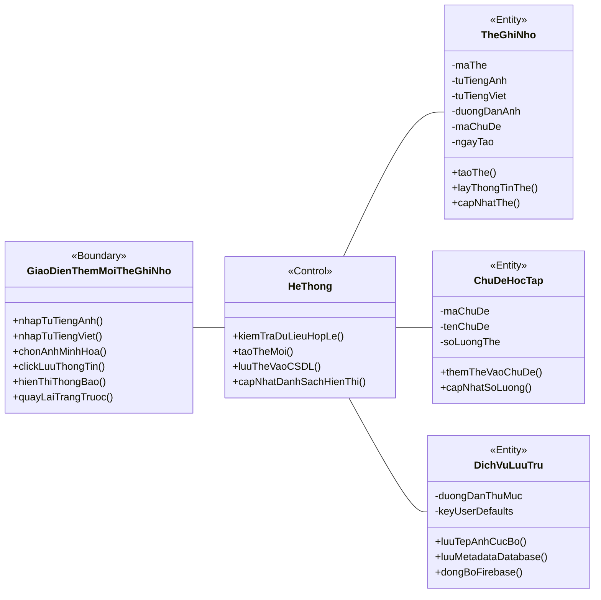

*Lưu ý cho việc vẽ sơ đồ:* Sơ đồ lớp phân tích chi tiết đã được cập nhật và đồng bộ dưới dạng tệp tin Draw.io tại đường dẫn [analysis_class_diagram.drawio](file:///Users/mitie/tlu-app/KidX/docs/analysis_class_diagram.drawio) tương ứng với cấu trúc trên. Người dùng có thể kéo thả tệp này vào trang Web `draw.io` để xuất ảnh đồ họa chèn vào báo cáo.

---

### 2.2.3 Biểu đồ lớp phân tích Use Case "Sửa thẻ ghi nhớ"

---

title: 2.2.3. Biểu đồ lớp phân tích chức năng sửa thẻ ghi nhớ

---

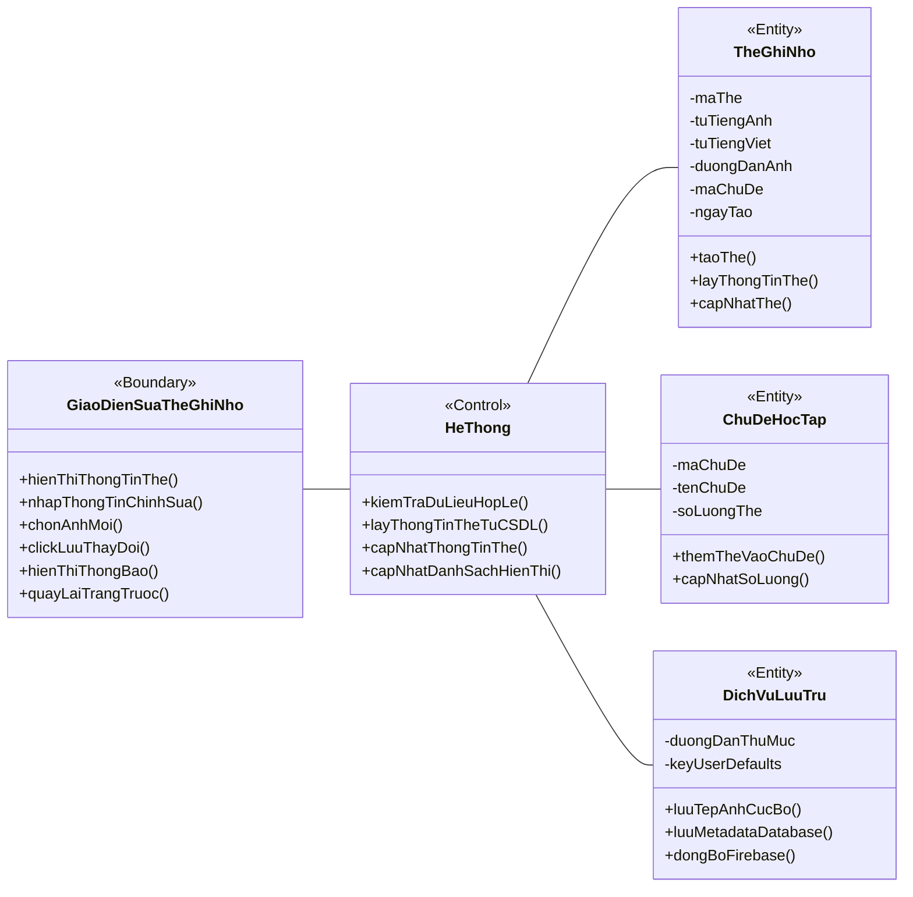

*Lưu ý cho việc vẽ sơ đồ:* Sơ đồ lớp phân tích chi tiết đã được khởi tạo và lưu dưới dạng tệp tin Draw.io tại đường dẫn [analysis_class_diagram_edit.drawio](file:///Users/mitie/tlu-app/KidX/docs/analysis_class_diagram_edit.drawio). Người dùng có thể kéo thả tệp này vào trang Web `draw.io` để xuất ảnh đồ họa chèn vào báo cáo.

---

### 2.2.4 Biểu đồ lớp phân tích Use Case "Xóa thẻ ghi nhớ"

---

title: 2.2.4. Biểu đồ lớp phân tích chức năng xóa thẻ ghi nhớ

---

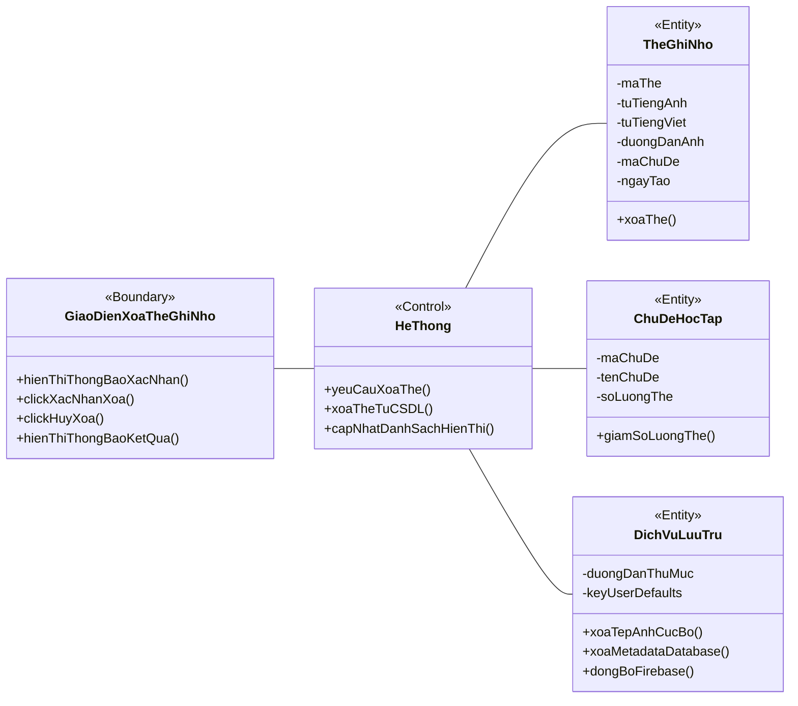

*Lưu ý cho việc vẽ sơ đồ:* Sơ đồ lớp phân tích chi tiết đã được khởi tạo và lưu dưới dạng tệp tin Draw.io tại đường dẫn [analysis_class_diagram_delete.drawio](file:///Users/mitie/tlu-app/KidX/docs/analysis_class_diagram_delete.drawio). Người dùng có thể kéo thả tệp này vào trang Web `draw.io` để xuất ảnh đồ họa chèn vào báo cáo.

---

### 2.2.5 Biểu đồ lớp phân tích Use Case "Thêm mới thử thách"

---

title: 2.2.5. Biểu đồ lớp phân tích chức năng thêm mới thử thách

---

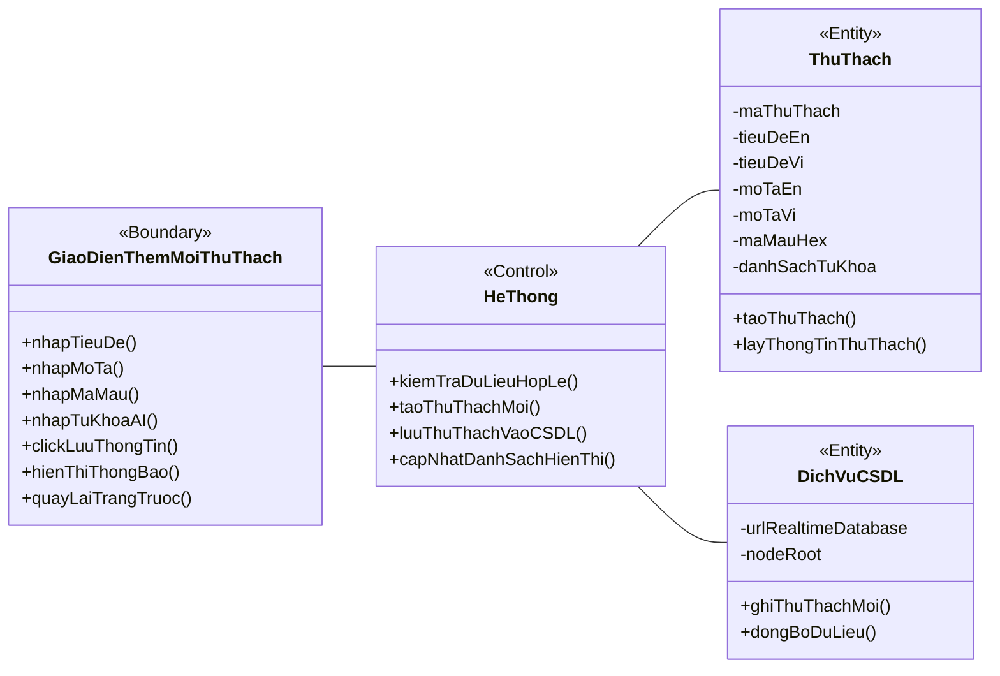

*Lưu ý cho việc vẽ sơ đồ:* Sơ đồ lớp phân tích chi tiết đã được khởi tạo và lưu dưới dạng tệp tin Draw.io tại đường dẫn [analysis_class_diagram_add_mission.drawio](file:///Users/mitie/tlu-app/KidX/docs/analysis_class_diagram_add_mission.drawio). Người dùng có thể kéo thả tệp này vào trang Web `draw.io` để xuất ảnh đồ họa chèn vào báo cáo.

---

### 2.2.6 Biểu đồ lớp phân tích Use Case "Sửa thử thách"

---

title: 2.2.6. Biểu đồ lớp phân tích chức năng sửa thử thách

---

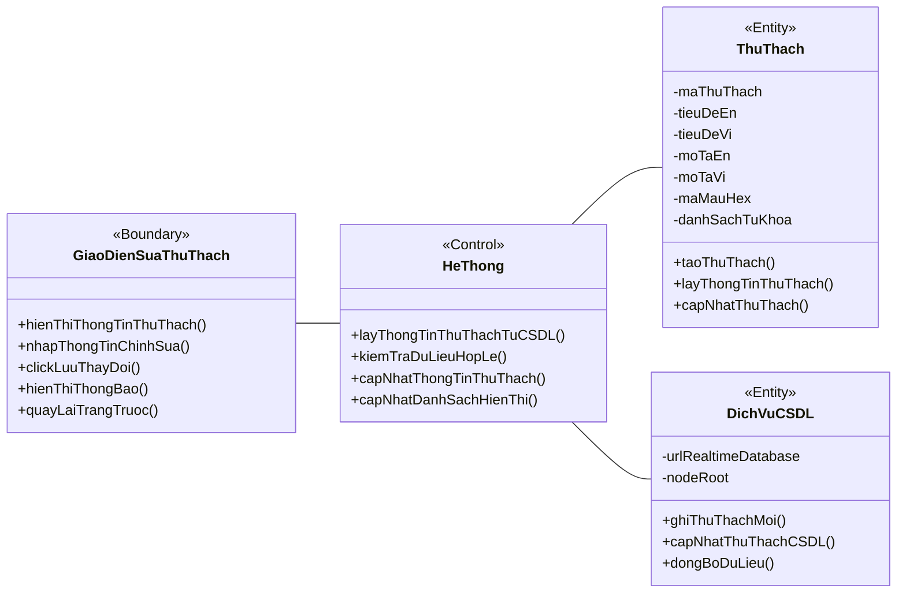

*Lưu ý cho việc vẽ sơ đồ:* Sơ đồ lớp phân tích chi tiết đã được khởi tạo và lưu dưới dạng tệp tin Draw.io tại đường dẫn [analysis_class_diagram_edit_mission.drawio](file:///Users/mitie/tlu-app/KidX/docs/analysis_class_diagram_edit_mission.drawio). Người dùng có thể kéo thả tệp này vào trang Web `draw.io` để xuất ảnh đồ họa chèn vào báo cáo.

---

### 2.2.7 Biểu đồ lớp phân tích Use Case "Xóa thử thách"

---

title: 2.2.7. Biểu đồ lớp phân tích chức năng xóa thử thách

---

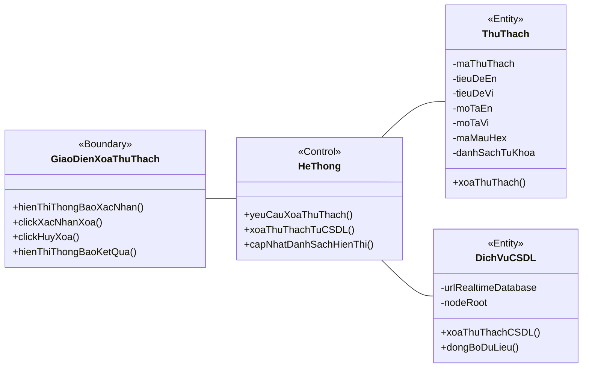

*Lưu ý cho việc vẽ sơ đồ:* Sơ đồ lớp phân tích chi tiết đã được khởi tạo và lưu dưới dạng tệp tin Draw.io tại đường dẫn [analysis_class_diagram_delete_mission.drawio](file:///Users/mitie/tlu-app/KidX/docs/analysis_class_diagram_delete_mission.drawio). Người dùng có thể kéo thả tệp này vào trang Web `draw.io` để xuất ảnh đồ họa chèn vào báo cáo.

---

### 2.3.2 Mã UML (PlantUML) cho biểu đồ Sequence rút gọn

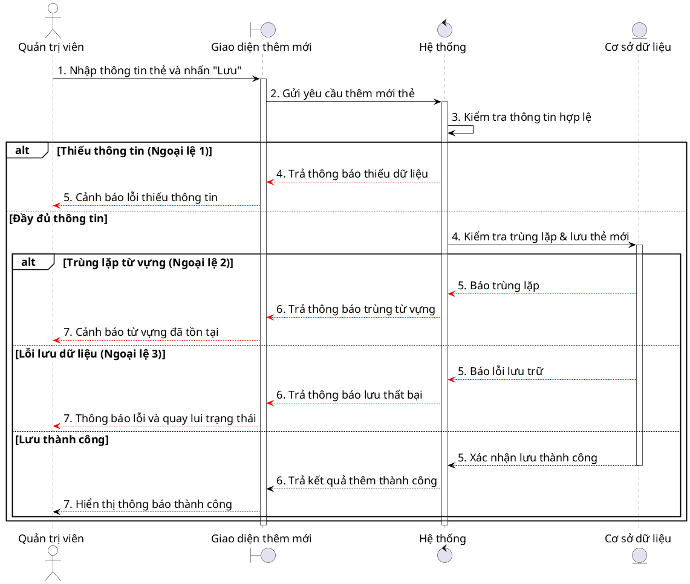

*Lưu ý cho việc vẽ sơ đồ:* Sơ đồ tuần tự tương ứng đã được cập nhật và lưu dưới dạng tệp tin Draw.io tại đường dẫn [sequence_diagram_add_flashcard.drawio](file:///Users/mitie/tlu-app/KidX/docs/sequence_diagram_add_flashcard.drawio).

---

### 2.3.3 Mã UML (PlantUML) cho biểu đồ Sequence rút gọn chức năng sửa thẻ ghi nhớ

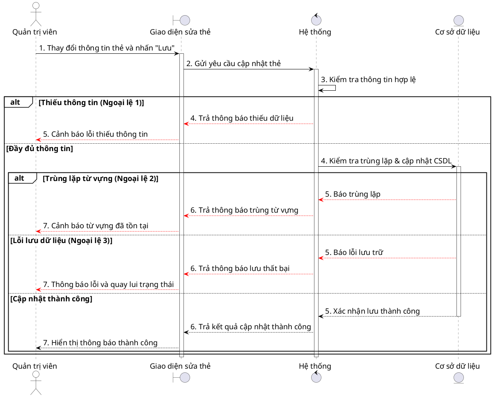

*Lưu ý cho việc vẽ sơ đồ:* Sơ đồ tuần tự tương ứng đã được khởi tạo và lưu dưới dạng tệp tin Draw.io tại đường dẫn [sequence_diagram_edit_flashcard.drawio](file:///Users/mitie/tlu-app/KidX/docs/sequence_diagram_edit_flashcard.drawio).

---

### 2.3.4 Mã UML (PlantUML) cho biểu đồ Sequence rút gọn chức năng xóa thẻ ghi nhớ

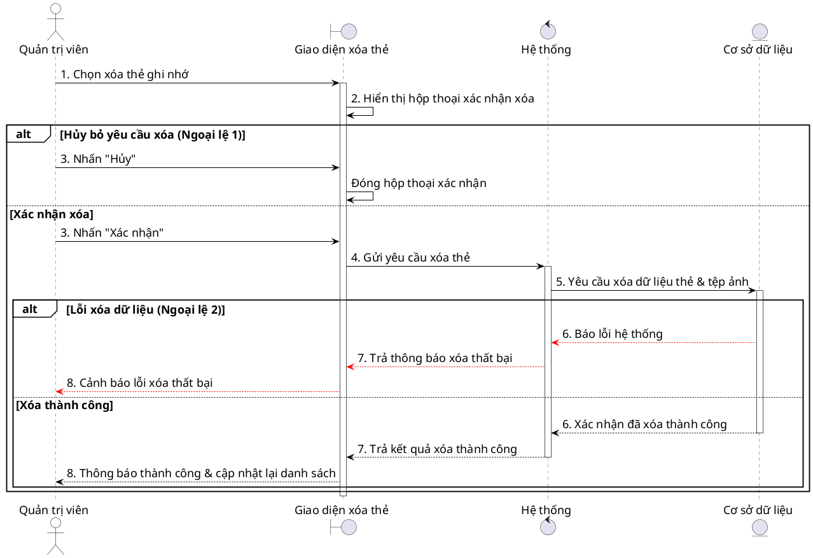

*Lưu ý cho việc vẽ sơ đồ:* Sơ đồ tuần tự tương ứng đã được khởi tạo và lưu dưới dạng tệp tin Draw.io tại đường dẫn [sequence_diagram_delete_flashcard.drawio](file:///Users/mitie/tlu-app/KidX/docs/sequence_diagram_delete_flashcard.drawio).

---

### 2.3.5 Mã UML (PlantUML) cho biểu đồ Sequence rút gọn chức năng thêm mới thử thách

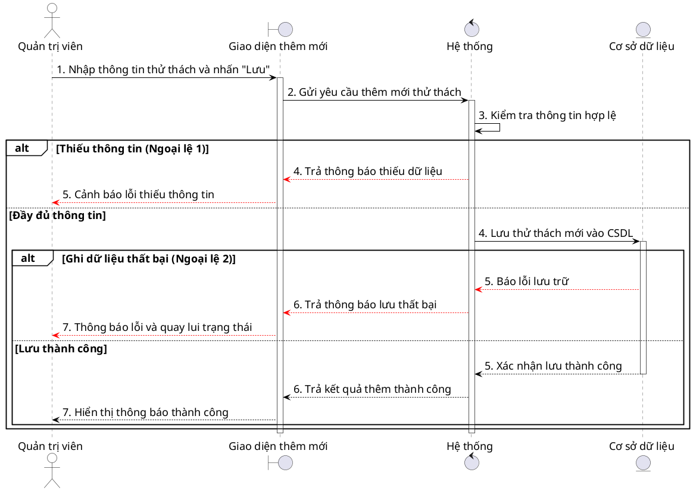

*Lưu ý cho việc vẽ sơ đồ:* Sơ đồ tuần tự tương ứng đã được khởi tạo và lưu dưới dạng tệp tin Draw.io tại đường dẫn [sequence_diagram_add_mission.drawio](file:///Users/mitie/tlu-app/KidX/docs/sequence_diagram_add_mission.drawio).

---

### 2.3.6 Mã UML (PlantUML) cho biểu đồ Sequence rút gọn chức năng sửa thử thách

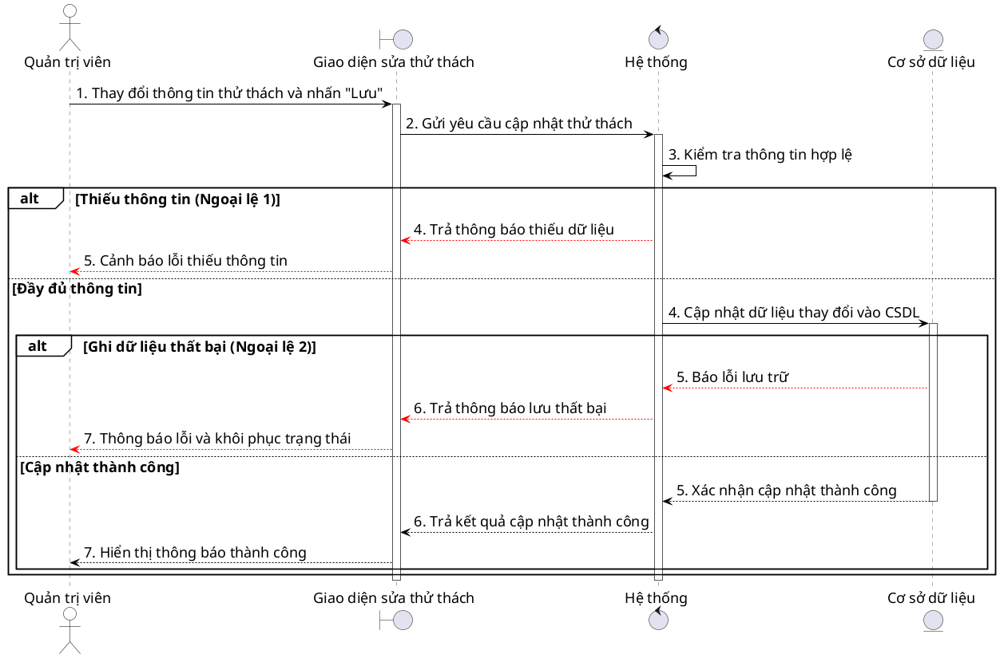

*Lưu ý cho việc vẽ sơ đồ:* Sơ đồ tuần tự tương ứng đã được khởi tạo và lưu dưới dạng tệp tin Draw.io tại đường dẫn [sequence_diagram_edit_mission.drawio](file:///Users/mitie/tlu-app/KidX/docs/sequence_diagram_edit_mission.drawio).

---

### 2.3.7 Mã UML (PlantUML) cho biểu đồ Sequence rút gọn chức năng xóa thử thách

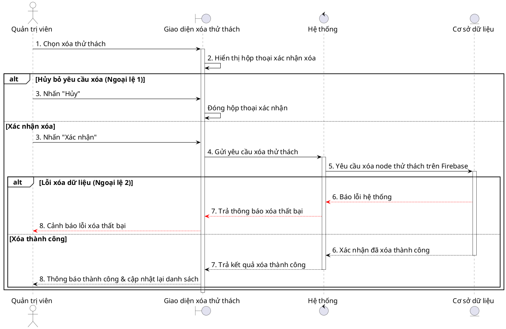

*Lưu ý cho việc vẽ sơ đồ:* Sơ đồ tuần tự tương ứng đã được khởi tạo và lưu dưới dạng tệp tin Draw.io tại đường dẫn [sequence_diagram_delete_mission.drawio](file:///Users/mitie/tlu-app/KidX/docs/sequence_diagram_delete_mission.drawio).
