# CHƯƠNG 2: PHÂN TÍCH VÀ THIẾT KẾ HỆ THỐNG

## 2.1 Khảo sát yêu cầu

### 2.1.1 Khảo sát hệ thống tương tự
Trong quá trình nghiên cứu phát triển ứng dụng **KidX**, tác giả đã tiến hành khảo sát và đánh giá một số ứng dụng giáo dục sớm dành cho trẻ em nổi bật trên thị trường hiện nay nhằm tìm ra những điểm ưu việt cần kế thừa cũng như các mặt hạn chế cần khắc phục:

1. **Monkey Junior / Monkey Stories:**
   - *Ưu điểm:* Cung cấp kho nội dung học tiếng Anh phong phú với truyện tranh tương tác song ngữ, giọng đọc bản xứ chuẩn và hình vẽ sinh động.
   - *Nhược điểm:* Sự tương tác chủ yếu là một chiều thông qua việc "chạm và nghe" hoặc chọn các câu hỏi trắc nghiệm đơn giản. Ứng dụng chưa tích hợp công nghệ trí tuệ nhân tạo để nhận diện tương tác thực tế từ thế giới xung quanh của trẻ. Bên cạnh đó, dung lượng cài đặt rất lớn và yêu cầu tài nguyên cao để lưu trữ video.
2. **Duolingo ABC:**
   - *Ưu điểm:* Ứng dụng cơ chế Game hóa (Gamification) rất tốt, giao diện lôi cuốn và kích thích sự ham học của trẻ thông qua các trò chơi ghép chữ, phát âm cơ bản.
   - *Nhược điểm:* Đòi hỏi kết nối internet để tải dữ liệu bài học liên tục. Ứng dụng chưa hỗ trợ dạy tư duy toán học và thiếu tính năng kết nối với camera để nhận diện các đồ vật thực tế xung quanh trẻ.
3. **Khan Academy Kids:**
   - *Ưu điểm:* Chương trình học hoàn toàn miễn phí, tích hợp cả toán, tiếng Anh và kỹ năng logic với hệ thống nhân vật hoạt hình dễ thương, độ tương tác cao.
   - *Nhược điểm:* Nội dung giảng dạy hoàn toàn bằng tiếng Anh, chưa được bản địa hóa tối ưu cho trẻ em Việt Nam bắt đầu làm quen với song ngữ. Đồng thời ứng dụng chưa tích hợp các mô hình AI chạy trực tiếp trên thiết bị (on-device).

**=> Giải pháp đề xuất của KidX:** 
Ứng dụng hướng tới sự kết hợp độc đáo giữa **Giáo dục sớm song ngữ (Anh - Việt)** và **Tư duy Toán học trực quan** dựa trên nền tảng **Trí tuệ nhân tạo chạy hoàn toàn ngoại tuyến (Offline-first AI)**. Trẻ không chỉ tương tác với màn hình mà còn tương tác trực tiếp với thế giới thực qua ống kính camera (Smart Vocabulary) và rèn luyện kỹ năng viết tay số học trên bảng vẽ thông minh (Digital Math Canvas). Điều này giúp ứng dụng vừa sinh động, vừa bảo mật tối đa dữ liệu của trẻ.

---

### 2.1.2 Thu thập yêu cầu phía người dùng
Qua khảo sát thực tế hành vi sử dụng thiết bị di động của trẻ em và mong muốn của các bậc phụ huynh, các yêu cầu của hệ thống được xác định cụ thể cho hai nhóm đối tượng chính:

#### 1. Yêu cầu đối với nhóm người dùng Trẻ em (User)
* **Yêu cầu giao diện (UI/UX):** Giao diện phải sinh động, rực rỡ, sử dụng các gam màu bắt mắt phù hợp với tâm lý trẻ em dưới 8 tuổi. Các nút bấm, khu vực tương tác cần thiết kế to, rõ ràng và có âm thanh phản hồi vui nhộn. Các hiệu ứng hoạt hình (animations) phải chuyển động mượt mà để duy trì sự chú ý của trẻ.
* **Yêu cầu tính năng:** 
  - Cho phép học từ vựng một cách trực quan qua thẻ học (Flashcards) có âm thanh phát âm song ngữ Anh - Việt.
  - Cho phép tham gia trò chơi "Săn tìm đồ vật" bằng cách cầm điện thoại chụp ảnh các vật thể thực tế trong nhà, hệ thống AI sẽ tự động phân tích và phản hồi xem trẻ đã tìm đúng hay chưa.
  - Cho phép luyện viết số tay trên bảng vẽ kỹ thuật số và tham gia giải các câu đố toán học nhanh bằng nét vẽ trực tiếp.

#### 2. Yêu cầu đối với nhóm người dùng Phụ huynh (Admin / Parent)
* **Cổng bảo mật phụ huynh (Parental Gate):** Ngăn chặn trẻ em tự ý thoát ra màn hình cài đặt hoặc thực hiện các tác vụ quản lý tài khoản. Phụ huynh cần vượt qua một bài toán xác minh nhỏ để truy cập vùng quản trị.
* **Yêu cầu thống kê và quản lý:**
  - Cho phép quản lý tài khoản (Đăng ký, Đăng nhập, Đăng xuất) và đồng bộ dữ liệu tiến trình học tập của con lên đám mây.
  - Xem biểu đồ thống kê kết quả học tập chi tiết của trẻ theo thời gian thực (số sao tích lũy, số từ vựng đã mở khóa, tiến độ hoàn thành các thử thách toán học).
  - Quản lý cấu hình và danh sách các nhiệm vụ học tập (Missions) đồng bộ từ Firebase.

---

### 2.1.3 Xác định các USE CASE chính của hệ thống
Hệ thống **KidX** được xây dựng dựa trên sự tương tác giữa hai tác nhân (Actors) chính: **Người dùng Trẻ em** (tương tác với các tính năng học tập, AI) và **Phụ huynh / Quản trị viên** (quản lý tài khoản, cấu hình dữ liệu và theo dõi thống kê).

Dưới đây là bảng danh sách mô tả chi tiết các Use Case chính của ứng dụng KidX:

#### Bảng 2.1: Danh sách các usecase chính trong ứng dụng KidX

| STT | Tác nhân | Tính năng chính | Chi tiết tính năng / Use Case |
| :---: | :--- | :--- | :--- |
| **1** | **Phụ huynh / Quản trị viên** | **Quản lý tài khoản** | - Đăng ký tài khoản mới. - Đăng nhập hệ thống (bằng Email hoặc Google Sign-In). - Đăng xuất tài khoản. - Đồng bộ và lưu trữ tiến trình học tập của trẻ lên Firebase. |
| | | **Cổng bảo mật (Parental Gate)** | - Yêu cầu xác minh phép tính số học dành riêng cho phụ huynh trước khi truy cập các tính năng quản lý. |
| | | **Quản lý dữ liệu nhiệm vụ học tập** | - Xem danh sách nhiệm vụ săn tìm đồ vật (Missions) được đồng bộ từ Firebase Realtime Database. - Cập nhật dữ liệu từ khóa nhận diện từ hệ thống. |
| | | **Xem thống kê & Báo cáo** | - Xem biểu đồ phân tích thời gian học tập của trẻ (DGCharts). - Xem thống kê số lượng từ vựng trẻ đã tìm thấy. - Xem tiến độ và tỷ lệ hoàn thành thử thách toán học theo tuần. |
| **2** | **Trẻ em (Người dùng)** | **Học từ vựng song ngữ (Flashcards)** | - Chọn chủ đề học từ vựng (Con vật, Trái cây, Đồ dùng...). - Nghe phát âm tiếng Anh - tiếng Việt chuẩn (AVFoundation). - Xem hình ảnh minh họa sinh động. |
| | | **Khám phá thế giới qua Camera AI** | - Nhận nhiệm vụ săn tìm đồ vật thực tế. - Sử dụng Camera chụp ảnh vật thể. - Mô hình AI (MobileNet) nhận diện và so khớp từ khóa để chấm điểm hoàn thành. |
| | | **Luyện viết số & Học toán (Math Canvas)** | - Thực hành viết số tay theo nét vẽ trên bảng vẽ thông minh. - Mô hình AI (mnistCNN) nhận diện nét vẽ số tự động. - Tham gia giải các phép tính cộng, trừ toán học bằng cách viết đáp án trực tiếp lên màn hình. |
| | | Xem bộ sưu tập và huy hiệu thành tích | - Xem danh sách các hình ảnh đồ vật thực tế bé đã tự tay chụp và nhận diện thành công. - Xem các huy hiệu danh dự đã đạt được (như Tráng sĩ Toán học, Nhà thám hiểm...) để thúc đẩy động lực học tập. |

---

### 2.1.4 Đặc tả Use Case "Quản lý nội dung học tập của Admin"

*   **Tên Use Case:** Quản lý nội dung học tập của Admin
*   **Tác nhân (Actor):** Quản trị viên (Admin / Phụ huynh)
*   **Mức:** 1 (Mức tóm tắt - Summary Goal)
*   **Mục tiêu (Goal):** Cho phép Quản trị viên quản trị toàn bộ học liệu học tập bao gồm bộ thẻ ghi nhớ song ngữ (Flashcard) và danh sách nhiệm vụ/thử thách săn tìm vật thể (Mission) trong hệ thống, nhằm kiểm soát chất lượng và đổi mới nội dung học của trẻ.
*   **Mô tả (Description):** Chức năng này bao gồm nhóm các tác vụ quản trị trực tiếp trên cơ sở dữ liệu học tập. Quản trị viên sau khi đăng nhập và xác thực thành công sẽ có quyền thực hiện các thao tác Thêm mới, Sửa đổi và Xóa bỏ đối với từng thẻ ghi nhớ song ngữ hoặc các thử thách săn tìm vật thể thực tế. Hệ thống tiếp nhận yêu cầu, cập nhật và đồng bộ tức thời kết quả lên Firebase để trẻ em sử dụng trong các bài học.
*   **Điều kiện tiên quyết:** Quản trị viên đã đăng nhập và vượt qua cổng bảo mật của phụ huynh (Parental Gate).
*   **Điều kiện kích hoạt:** Quản trị viên truy cập vào vùng quản trị của ứng dụng.
*   **Điều kiện thành công:** Dữ liệu học tập (thẻ ghi nhớ hoặc thử thách) được cập nhật thành công lên CSDL Firebase.
*   **Điều kiện thất bại:** Giao diện quản trị lỗi hoặc không thể cập nhật dữ liệu vào CSDL.
*   **Luồng sự kiện chính:**
    1. Hệ thống hiển thị bảng điều khiển quản lý nội dung học tập (gồm phân hệ Thẻ ghi nhớ và phân hệ Thử thách).
    2. Quản trị viên lựa chọn phân hệ muốn quản lý.
    3. Hệ thống truy vấn CSDL và hiển thị danh sách các học liệu hiện có.
    4. Quản trị viên thực hiện các thao tác quản trị chi tiết (Thêm mới, Sửa, Xóa).
    5. Hệ thống tiếp nhận thông tin thay đổi, xác thực tính hợp lệ và cập nhật vào Firebase Realtime Database.
    6. Hệ thống làm mới danh sách và hiển thị thông báo thao tác thành công.
*   **Luồng sự kiện ngoại lệ:**
    *   **Ngoại lệ 1: Truy cập thất bại do nhập sai bài toán xác thực (Parental Gate)**
        - Hệ thống phát hiện đáp án xác thực sai.
        - Hệ thống chặn không cho truy cập vùng quản trị và hiển thị thông báo lỗi.
        - Hệ thống yêu cầu thử lại bài toán khác.
    *   **Ngoại lệ 2: Mất kết nối CSDL khi cập nhật**
        - Hệ thống phát hiện lỗi mạng hoặc không thể kết nối Firebase.
        - Hệ thống hiển thị cảnh báo lỗi đồng bộ dữ liệu.
        - Hệ thống giữ nguyên trạng thái dữ liệu cục bộ và yêu cầu thực hiện lại.

---

### 2.1.5 Đặc tả chi tiết Use Case "Thêm mới thẻ ghi nhớ"

*   **Tên Use Case:** Thêm mới thẻ ghi nhớ
*   **Tác nhân (Actor):** Quản trị viên (Admin / Phụ huynh)
*   **Mức:** 2 (Mức người dùng - User Goal)
*   **Mục tiêu (Goal):** Cho phép Quản trị viên bổ sung thẻ từ vựng song ngữ (tiếng Anh, tiếng Việt kèm hình ảnh minh họa) mới vào kho học liệu của hệ thống, giúp mở rộng vốn từ cho trẻ học tập.
*   **Mô tả (Description):** Quản trị viên nhập các thông tin của thẻ ghi nhớ gồm từ tiếng Anh, từ tiếng Việt tương ứng và tải lên hình ảnh minh họa. Hệ thống kiểm tra tính hợp lệ (không trống, không trùng lặp) rồi lưu thông tin vào Firebase Realtime Database và Storage để hiển thị cho trẻ học.
*   **Điều kiện tiên quyết:** Quản trị viên đăng nhập vào hệ thống.
*   **Điều kiện kích hoạt:** Sau khi đã chọn một chủ đề, Quản trị viên chọn chức năng "Thêm mới thẻ ghi nhớ".
*   **Điều kiện thành công:** Thông tin của thẻ từ song ngữ mới được thêm vào CSDL.
*   **Điều kiện thất bại:** Hệ thống loại bỏ các thông tin đã thêm và quay lui lại bước trước.
*   **Chuỗi sự kiện chính:**
    1. Hệ thống hiển thị giao diện thêm mới thẻ ghi nhớ.
    2. Quản trị viên nhập thông tin thẻ ghi nhớ, gồm:
       - Từ tiếng Anh
       - Từ tiếng Việt
       - Ảnh minh họa
    3. Quản trị viên nhấn lưu.
    4. Hệ thống kiểm tra thông tin và xác nhận hợp lệ.
    5. Hệ thống nhập thông tin mới vào CSDL.
    6. Hệ thống thông báo đã thêm mới thành công.
*   **Luồng sự kiện ngoại lệ:**
    *   **Ngoại lệ 1: Thiếu thông tin hoặc ảnh minh họa**
        - Hệ thống phát hiện thông tin nhập vào bị trống.
        - Hệ thống hiển thị cảnh báo lỗi thiếu thông tin.
        - Hệ thống giữ nguyên dữ liệu đã nhập và yêu cầu bổ sung.
    *   **Ngoại lệ 2: Thẻ ghi nhớ đã tồn tại**
        - Hệ thống phát hiện từ vựng đã tồn tại trong CSDL.
        - Hệ thống hiển thị cảnh báo lỗi trùng lặp từ vựng.
        - Hệ thống giữ nguyên dữ liệu đã nhập và yêu cầu chỉnh sửa.
    *   **Ngoại lệ 3: Ghi dữ liệu vào CSDL thất bại**
        - Hệ thống phát hiện lỗi ghi dữ liệu hoặc lỗi kết nối.
        - Hệ thống hiển thị thông báo lưu thất bại.
        - Hệ thống hủy bỏ thông tin đã thêm và quay lui lại bước trước.

---

### 2.1.6 Đặc tả chi tiết Use Case "Sửa thẻ ghi nhớ"

**Tên Usecase**
Sửa thẻ ghi nhớ

**Tác nhân**
Quản trị viên

**Mức**
2

**Tiền điều kiện**
Quản trị viên đăng nhập vào hệ thống và đang ở màn hình danh sách thẻ ghi nhớ.

**Điều kiện thất bại**
Hệ thống giữ nguyên thông tin thẻ ghi nhớ cũ và hủy bỏ các thay đổi đã thực hiện.

**Đảm bảo thành công**
Thông tin thay đổi của thẻ ghi nhớ đã được cập nhật thành công vào CSDL.

**Kích hoạt**
Quản trị viên chọn một thẻ ghi nhớ cần chỉnh sửa và nhấn nút "Sửa thẻ ghi nhớ".

**Luồng sự kiện chính**
Hệ thống hiển thị giao diện sửa thẻ ghi nhớ kèm theo thông tin hiện tại của thẻ
Quản trị viên thay đổi các thông tin thẻ từ song ngữ, gồm:
- Từ tiếng anh mới (nếu có)
- Từ tiếng việt mới (nếu có)
- Ảnh minh hoạ mới (nếu có)
Quản trị viên nhấn lưu.
Hệ thống kiểm tra thông tin và xác nhận hợp lệ.
Hệ thống cập nhật thông tin thay đổi vào CSDL.
Hệ thống thông báo đã cập nhật thành công.

**Luồng sự kiện ngoại lệ**
*   **Ngoại lệ 1: Thiếu thông tin hoặc ảnh minh họa**
    - Hệ thống phát hiện thông tin nhập vào bị trống.
    - Hệ thống hiển thị cảnh báo lỗi thiếu thông tin.
    - Hệ thống giữ nguyên dữ liệu đã sửa và yêu cầu bổ sung.
*   **Ngoại lệ 2: Thẻ ghi nhớ bị trùng với từ vựng khác đã tồn tại**
    - Hệ thống phát hiện từ vựng sửa mới trùng lặp với một từ vựng khác trong CSDL.
    - Hệ thống hiển thị cảnh báo lỗi trùng lặp từ vựng.
    - Hệ thống giữ nguyên dữ liệu đã sửa và yêu cầu chỉnh sửa.
*   **Ngoại lệ 3: Ghi dữ liệu vào CSDL thất bại**
    - Hệ thống phát hiện lỗi ghi dữ liệu hoặc lỗi kết nối.
    - Hệ thống hiển thị thông báo lưu thất bại.
    - Hệ thống hủy bỏ các thông tin đã sửa và khôi phục lại trạng thái cũ của thẻ.

---

### 2.1.7 Đặc tả chi tiết Use Case "Xóa thẻ ghi nhớ"

**Tên Usecase**
Xóa thẻ ghi nhớ

**Tác nhân**
Quản trị viên

**Mức**
2

**Tiền điều kiện**
Quản trị viên đăng nhập vào hệ thống và đang ở màn hình danh sách thẻ ghi nhớ.

**Điều kiện thất bại**
Hệ thống không thực hiện xóa thẻ và giữ nguyên dữ liệu CSDL.

**Đảm bảo thành công**
Thông tin thẻ ghi nhớ được xóa khỏi CSDL và tệp hình ảnh được gỡ bỏ khỏi bộ nhớ thiết bị.

**Kích hoạt**
Quản trị viên chọn một thẻ ghi nhớ cần xóa và nhấn nút "Xóa thẻ ghi nhớ".

**Luồng sự kiện chính**
Hệ thống hiển thị hộp thoại xác nhận xóa thẻ ghi nhớ
Quản trị viên nhấn nút xác nhận xóa.
Hệ thống kiểm tra tính hợp lệ của yêu cầu xóa.
Hệ thống thực hiện xóa thông tin thẻ trong CSDL và gỡ bỏ tệp ảnh liên quan.
Hệ thống thông báo đã xóa thành công và cập nhật danh sách hiển thị.

**Luồng sự kiện ngoại lệ**
*   **Ngoại lệ 1: Quản trị viên hủy bỏ yêu cầu xóa**
    - Hệ thống phát hiện Quản trị viên nhấn nút "Hủy" trên hộp thoại xác nhận.
    - Hệ thống đóng hộp thoại xác nhận.
    - Hệ thống quay lui lại màn hình danh sách thẻ và giữ nguyên dữ liệu.
*   **Ngoại lệ 2: Lỗi xóa dữ liệu trong CSDL hoặc xóa ảnh thất bại**
    - Hệ thống phát hiện lỗi ghi dữ liệu hoặc lỗi kết nối.
    - Hệ thống hiển thị thông báo xóa thất bại.
    - Hệ thống khôi phục dữ liệu thẻ và quay lui lại trạng thái cũ.
---

### 2.1.8 Đặc tả chi tiết Use Case "Thêm mới thử thách"

**Tên Usecase**
Thêm mới thử thách

**Tác nhân**
Quản trị viên

**Mức**
2

**Tiền điều kiện**
Quản trị viên đăng nhập vào hệ thống quản lý.

**Điều kiện thất bại**
Hệ thống loại bỏ các thông tin đã nhập lỗi và quay lại giao diện quản lý danh sách thử thách.

**Đảm bảo thành công**
Thông tin thử thách mới (tiêu đề, mô tả bằng hai ngôn ngữ Anh-Việt, biểu tượng SF Symbol, mã màu và từ khóa nhận diện) được lưu thành công lên Firebase Realtime Database.

**Kích hoạt**
Quản trị viên chọn chức năng "Thêm mới thử thách" từ trang quản lý danh sách thử thách.

**Luồng sự kiện chính**
Hệ thống hiển thị giao diện thêm mới thử thách
Quản trị viên nhập thông tin thử thách mới, gồm:
- Tiêu đề (tiếng Anh và tiếng Việt)
- Mô tả chi tiết (tiếng Anh và tiếng Việt)
- Tên biểu tượng (SF Symbol) và Màu nền biểu tượng (Mã màu Hex)
- Các từ khóa nhận diện AI (Keywords)
Quản trị viên nhấn lưu.
Hệ thống kiểm tra thông tin và xác nhận hợp lệ.
Hệ thống nhập thông tin mới vào Firebase Realtime Database.
Hệ thống thông báo đã thêm mới thành công.

**Luồng sự kiện ngoại lệ**
*   **Ngoại lệ 1: Thiếu thông tin bắt buộc**
    - Hệ thống phát hiện thông tin nhập vào bị trống.
    - Hệ thống hiển thị cảnh báo lỗi thiếu thông tin.
    - Hệ thống giữ nguyên dữ liệu đã nhập và yêu cầu bổ sung.
*   **Ngoại lệ 2: Ghi dữ liệu vào Firebase thất bại**
    - Hệ thống phát hiện lỗi ghi dữ liệu hoặc lỗi kết nối.
    - Hệ thống hiển thị thông báo lưu thất bại.
    - Hệ thống hủy bỏ thông tin đã thêm và quay lui lại bước trước.

---

### 2.1.9 Đặc tả chi tiết Use Case "Sửa thử thách"

**Tên Usecase**
Sửa thử thách

**Tác nhân**
Quản trị viên

**Mức**
2

**Tiền điều kiện**
Quản trị viên đăng nhập vào hệ thống quản lý và đang ở giao diện danh sách thử thách.

**Điều kiện thất bại**
Hệ thống giữ nguyên thông tin thử thách cũ và hủy bỏ các thay đổi đã thực hiện.

**Đảm bảo thành công**
Thông tin thay đổi của thử thách (tiêu đề, mô tả bằng hai ngôn ngữ Anh-Việt, biểu tượng SF Symbol, mã màu và từ khóa nhận diện) được cập nhật thành công lên Firebase Realtime Database.

**Kích hoạt**
Quản trị viên chọn một thử thách từ danh sách và nhấn nút "Sửa thử thách".

**Luồng sự kiện chính**
Hệ thống hiển thị giao diện sửa thử thách kèm theo các thông tin hiện tại của thử thách
Quản trị viên thay đổi các thông tin cần thiết của thử thách, gồm:
- Tiêu đề mới (tiếng Anh và tiếng Việt - nếu có)
- Mô tả chi tiết mới (tiếng Anh và tiếng Việt - nếu có)
- Tên biểu tượng (SF Symbol - nếu có) và Màu nền biểu tượng (Mã màu Hex - nếu có)
- Các từ khóa nhận diện AI mới (Keywords - nếu có)
Quản trị viên nhấn lưu.
Hệ thống kiểm tra thông tin và xác nhận hợp lệ.
Hệ thống cập nhật thông tin đã thay đổi vào Firebase Realtime Database.
Hệ thống thông báo đã cập nhật thành công.

**Luồng sự kiện ngoại lệ**
*   **Ngoại lệ 1: Thiếu thông tin bắt buộc**
    - Hệ thống phát hiện thông tin nhập vào bị trống.
    - Hệ thống hiển thị cảnh báo lỗi thiếu thông tin.
    - Hệ thống giữ nguyên dữ liệu đã sửa và yêu cầu bổ sung.
*   **Ngoại lệ 2: Ghi dữ liệu vào Firebase thất bại**
    - Hệ thống phát hiện lỗi ghi dữ liệu hoặc lỗi kết nối.
    - Hệ thống hiển thị thông báo lưu thất bại.
    - Hệ thống hủy bỏ thông tin đã sửa và khôi phục lại trạng thái cũ của thử thách.

---

### 2.1.10 Đặc tả chi tiết Use Case "Xóa thử thách"

**Tên Usecase**
Xóa thử thách

**Tác nhân**
Quản trị viên

**Mức**
2

**Tiền điều kiện**
Quản trị viên đăng nhập vào hệ thống quản lý và đang ở giao diện danh sách thử thách.

**Điều kiện thất bại**
Hệ thống không thực hiện xóa thử thách và giữ nguyên dữ liệu CSDL.

**Đảm bảo thành công**
Thông tin thử thách được gỡ bỏ hoàn toàn khỏi Firebase Realtime Database.

**Kích hoạt**
Quản trị viên chọn một thử thách cần xóa từ danh sách và nhấn nút "Xóa thử thách".

**Luồng sự kiện chính**
Hệ thống hiển thị hộp thoại xác nhận xóa thử thách.
Quản trị viên nhấn nút xác nhận xóa.
Hệ thống kiểm tra tính hợp lệ của yêu cầu xóa.
Hệ thống thực hiện xóa node thông tin thử thách tương ứng trên Firebase Realtime Database.
Hệ thống thông báo đã xóa thử thách thành công và cập nhật lại giao diện danh sách hiển thị.

**Luồng sự kiện ngoại lệ**
*   **Ngoại lệ 1: Quản trị viên hủy bỏ yêu cầu xóa**
    - Hệ thống phát hiện Quản trị viên nhấn nút "Hủy" trên hộp thoại xác nhận.
    - Hệ thống đóng hộp thoại xác nhận.
    - Hệ thống quay lại màn hình danh sách thử thách và giữ nguyên dữ liệu.
*   **Ngoại lệ 2: Lỗi kết nối hoặc Firebase xóa thất bại**
    - Hệ thống phát hiện lỗi mạng hoặc Firebase Realtime Database từ chối quyền ghi/xóa.
    - Hệ thống hiển thị thông báo lỗi xóa thất bại.
    - Hệ thống khôi phục lại trạng thái hiển thị của thử thách trên danh sách và quay lui lại trạng thái cũ.

---

### 2.1.11 Đặc tả chi tiết Use Case "Học từ vựng qua thẻ ghi nhớ"

**Tên Usecase**
Học từ vựng qua thẻ ghi nhớ

**Tác nhân**
Người dùng

**Mức**
1

**Mục tiêu (Goal)**
Giúp người dùng trẻ em học từ vựng song ngữ Anh - Việt một cách chủ động và trực quan thông qua thao tác chạm lật thẻ và vuốt phân loại để tự ghi nhận tiến trình học tập.

**Mô tả (Description)**
Trẻ lựa chọn một chủ đề học từ vựng. Hệ thống tải danh sách các thẻ ghi nhớ (Flashcard) chứa hình ảnh minh họa, từ tiếng Anh và tiếng Việt. Trẻ thực hiện tương tác chạm để lật thẻ xem nghĩa/nghe phát âm chuẩn, vuốt phải nếu đã nhớ từ, hoặc vuốt trái nếu chưa nhớ. Khi hoàn thành toàn bộ thẻ, hệ thống lưu kết quả vào tiến trình học tập.

**Điều kiện tiên quyết**
Người dùng đã mở màn hình chọn chủ đề học tập.

**Điều kiện kích hoạt**
Người dùng chọn một chủ đề học tập cụ thể từ giao diện danh sách chủ đề.

**Điều kiện thành công**
Kết quả lượt học từ vựng (danh sách các từ đã thuộc và các từ cần ôn tập) được ghi nhận và lưu trữ thành công vào tiến trình học tập cục bộ của người dùng.

**Điều kiện thất bại**
Không tải được danh sách thẻ ghi nhớ.
Phiên học bị gián đoạn hoặc người dùng thoát giữa chừng khiến tiến trình học tập không được lưu.

**Luồng sự kiện chính**
Hệ thống hiển thị giao diện học từ vựng với thẻ ghi nhớ đầu tiên (hiển thị hình ảnh minh họa và từ tiếng Anh).
Người dùng tương tác học tập với thẻ ghi nhớ:
- Lật thẻ - xem khái niệm: Người dùng chạm vào thẻ ghi nhớ để lật mặt sau, xem nghĩa tiếng Việt tương ứng và nghe phát âm tiếng Việt.
- Vuốt trái - đánh dấu là không nhớ/ không biết: Người dùng vuốt thẻ ghi nhớ sang bên trái để hệ thống ghi nhận từ vựng này chưa thuộc và đưa vào danh sách ôn tập.
- Bấm nút phát âm thanh: Người dùng nhấn nút loa trên giao diện để hệ thống phát lại âm thanh tiếng Anh hoặc tiếng Việt của thẻ hiện tại (tùy thuộc mặt thẻ đang hiển thị).
- Vuốt phải - đánh dấu là nhớ/ đã biết: Người dùng vuốt thẻ ghi nhớ sang bên phải để hệ thống ghi nhận từ vựng này đã được thuộc lòng.
Hệ thống ghi nhận kết quả ghi nhớ của thẻ hiện tại và tự động chuyển sang thẻ tiếp theo trong danh sách.
Người dùng hoàn thành việc học toàn bộ thẻ trong chủ đề.
Hệ thống hiển thị màn hình báo cáo kết quả lượt học.
Hệ thống lưu tiến trình học tập của người dùng.

**Luồng sự kiện ngoại lệ**
*   **Ngoại lệ 1: Chủ đề chưa có dữ liệu bài học**
    - Hệ thống phát hiện danh sách thẻ ghi nhớ của chủ đề đã chọn trống.
    - Hệ thống hiển thị thông báo chưa có dữ liệu thẻ ghi nhớ.
    - Hệ thống quay lui lại màn hình chọn chủ đề học tập.
*   **Ngoại lệ 2: Người dùng thoát khi chưa hoàn thành**
    - Người dùng nhấn nút quay lại trước khi học hết số thẻ ghi nhớ.
    - Hệ thống hiển thị hộp thoại xác nhận hủy phiên học hiện tại.
    - Người dùng chọn đồng ý thoát: Hệ thống đóng giao diện học tập, hủy bỏ tiến trình lượt học hiện tại và quay về màn hình chọn chủ đề.

---

### 2.1.12 Đặc tả chi tiết Use Case "Tập viết theo mẫu các chữ cái"

*   **Tên Usecase:** Tập viết theo mẫu các chữ cái
*   **Tác nhân:** Người dùng (Trẻ em)
*   **Mức:** 1 (Mức người dùng - User Goal)
*   **Mục tiêu (Goal):** Giúp người dùng trẻ em làm quen với bảng chữ cái tiếng Việt thông qua hoạt động tập viết nét vẽ tay trực quan trên màn hình cảm ứng, hỗ trợ ghi nhớ mặt chữ và kiểu viết (in hoa, viết thường).
*   **Mô tả (Description):** Trẻ chọn một chữ cái từ danh sách. Hệ thống hiển thị bảng vẽ có sẵn nét đứt chữ mẫu. Trẻ di chuyển ngón tay tô theo nét chữ mẫu, tùy chỉnh màu sắc, độ dày bút vẽ, hoặc chuyển đổi giữa chữ in hoa và chữ viết thường. Khi hoàn thành, trẻ có thể quay lại giao diện danh sách.
*   **Điều kiện tiên quyết:** Người dùng đang ở giao diện danh sách chữ cái (ListAlphabet) và tiến hành chọn một chữ cái.
*   **Điều kiện kích hoạt:** Người dùng chạm vào thẻ chữ cái bất kỳ trên danh sách.
*   **Điều kiện thành công:** Người dùng hoàn thành quá trình luyện viết và quay lại màn hình danh sách với tiến trình được cập nhật (nếu có).
*   **Điều kiện thất bại:** Trình vẽ không thể hiển thị do lỗi tải tài nguyên mẫu chữ, hệ thống giữ nguyên trạng thái cũ của màn hình danh sách.

*   **Luồng sự kiện chính:**
    1. Hệ thống hiển thị giao diện tập viết với chữ mẫu tương ứng (mặc định hiển thị chữ in hoa, màu vẽ cam và nét vẽ cỡ trung bình).
    2. Người dùng thực hiện các tùy chọn thiết lập bảng vẽ (nếu muốn):
        - **Chọn loại ký tự (in hoa / viết thường):** Người dùng chạm vào Segmented Control để đổi kiểu chữ. Hệ thống xóa sạch toàn bộ nét vẽ hiện tại trên bảng vẽ và thay thế bằng khuôn mẫu tương ứng (chữ thường hoặc chữ hoa).
        - **Chọn màu vẽ hoặc kích thước nét vẽ:** Người dùng chạm chọn màu sắc mới trên khay màu hoặc thay đổi kích cỡ bút vẽ. Hệ thống ghi nhận thiết lập và áp dụng ngay lập tức cho nét vẽ tiếp theo.
        - **Xóa bảng vẽ:** Người dùng nhấn nút "Clear". Hệ thống xóa toàn bộ nét vẽ cũ để người dùng viết lại từ đầu.
    3. Người dùng di chuyển ngón tay trên bảng vẽ để tập viết theo khuôn chữ mẫu.
    4. Hệ thống liên tục nhận dạng cử chỉ vẽ và hiển thị nét vẽ thời gian thực trên màn hình theo màu sắc và kích thước nét vẽ đang cấu hình.
    5. Người dùng hoàn thành và nhấn nút quay lại (Back).
    6. Hệ thống đóng giao diện tập viết và đưa người dùng về giao diện danh sách chữ cái.

*   **Luồng sự kiện ngoại lệ:**
    *   **Ngoại lệ 1: Thiết bị không tải được tài nguyên hình ảnh chữ mẫu**
        - Hệ thống phát hiện lỗi không tìm thấy mẫu chữ tương ứng trong thư viện.
        - Hệ thống hiển thị cảnh báo lỗi tải dữ liệu.
        - Hệ thống tự động đóng giao diện tập viết và quay về màn hình danh sách chữ cái.

---

### 2.1.13 Đặc tả chi tiết Use Case "Tập viết chữ số 0 - 9"

*   **Tên Usecase:** Tập viết chữ số 0 - 9
*   **Tác nhân:** Người dùng
*   **Mức:** 1 (Mức người dùng - User Goal)
*   **Mục tiêu (Goal):** Giúp người dùng làm quen và ghi nhớ cách viết các chữ số từ 0 đến 9 thông qua bảng vẽ tay trực quan, đồng thời ứng dụng công nghệ AI để kiểm tra và nhận diện kết quả viết tay ngay trên thiết bị.
*   **Mô tả (Description):** Người dùng chọn chữ số cần tập viết từ 0 đến 9 và vẽ lên bảng đen kỹ thuật số. Khi nhấn nút "Kiểm tra", hệ thống chuyển dữ liệu nét vẽ qua mô hình AI (mnistCNN) để nhận diện và hiển thị kết quả phản hồi (đúng hoặc sai kèm lời chúc mừng/động viên).
*   **Điều kiện tiên quyết:** Người dùng đang ở màn hình chính của phần học tập.
*   **Điều kiện kích hoạt:** Người dùng chạm chọn thẻ "Luyện Viết Chữ Số" trên màn hình học tập.
*   **Điều kiện thành công:** Người dùng chọn được chữ số muốn tập viết, thực hiện vẽ lên bảng đen, hệ thống nhận diện nét vẽ bằng mô hình AI và hiển thị kết quả.
*   **Điều kiện thất bại:** Giao diện bảng vẽ tập viết số lỗi không thể khởi tạo.

*   **Luồng sự kiện chính:**
    1. Hệ thống hiển thị giao diện tập viết chữ số gồm:
        - Một bảng vẽ đen ở trạng thái trống.
        - Thanh chọn chữ số từ 0 đến 9, mặc định chọn số 0.
        - Nhãn hướng dẫn hiển thị yêu cầu mặc định: “Bé hãy viết số 0 lên bảng vẽ nhé”.
        - Các nút chức năng điều khiển bảng vẽ: nút "Kiểm tra” màu xanh lá và nút "Xóa” màu đỏ.
        - Nút "Quay lại".
    2. Người dùng thực hiện các tùy chọn tương tác thiết lập hoặc bổ sung (nếu muốn):
        - **Chọn số muốn tập viết:** Người dùng chạm chọn một nút số bất kỳ từ 0 đến 9 trên thanh chọn số. Hệ thống chuyển trạng thái kích hoạt sang số đó (đổi màu nền nút sang màu chủ đạo và chữ trắng), cập nhật nhãn hướng dẫn hiển thị số mới, đồng thời tự động xóa sạch bảng vẽ đen và ẩn kết quả kiểm tra trước đó.
        - **Xóa nét vẽ để viết lại:** Người dùng chạm chọn nút "Clear". Hệ thống xóa sạch toàn bộ nét vẽ hiện tại trên bảng vẽ, reset bộ nhớ đệm nhận dạng và ẩn khung hiển thị kết quả kiểm tra.
    3. Người dùng sử dụng ngón tay thực hiện thao tác vẽ nét chữ số đã chọn lên bảng vẽ đen.
    4. Hệ thống liên tục ghi nhận tọa độ di chuyển ngón tay của người dùng và hiển thị nét vẽ theo thời gian thực trên bảng vẽ đen.
    5. Người dùng chạm chọn nút "Kiểm tra" để thực hiện nhận diện nét vẽ chữ số:
        - **Trường hợp bảng vẽ trống:** Hệ thống bỏ qua yêu cầu kiểm tra (không thực hiện hành động nhận dạng).
        - **Trường hợp bảng vẽ có nét vẽ:** Hệ thống trích xuất dữ liệu hình ảnh nét vẽ gửi sang mô hình AI. Mô hình tiến hành nhận dạng và trả về kết quả dự đoán:
            - **Nhánh kết quả chính xác:** Hệ thống hiển thị chữ số nhận dạng được với màu xanh lá tại vùng kết quả, kèm theo thông báo chúc mừng: "Đúng rồi! Bé làm tốt lắm”.
            - **Nhánh kết quả chưa chính xác:** Hệ thống hiển thị chữ số nhận dạng được với màu đỏ tại vùng kết quả, kèm theo thông điệp động viên: "Chưa đúng lắm, bé hãy thử viết lại nhé”.
    6. Người dùng hoàn thành quá trình luyện viết và chạm chọn nút Quay lại.
    7. Hệ thống đóng giao diện tập viết chữ số và đưa người dùng quay trở lại giao diện màn hình học tập chính.

*   **Luồng sự kiện ngoại lệ:**
    *   **Ngoại lệ: Không thể nhận dạng do nét viết không rõ ràng hoặc không hợp lệ**
        - Hệ thống phát hiện mô hình AI trả về kết quả có độ tin cậy quá thấp hoặc nét chữ không đủ thông tin để nhận dạng chữ số.
        - Hệ thống hiển thị hộp thoại cảnh báo: "Không thể nhận dạng”.
        - Người dùng tương tác trên hộp thoại cảnh báo:
            - Nếu người dùng chọn "Viết lại”: Hệ thống tự động xóa sạch bảng vẽ đen, đóng hộp thoại và đưa người dùng về trạng thái viết mới.
            - Nếu người dùng chọn "Đóng”: Hệ thống đóng hộp thoại và giữ nguyên nét viết hiện tại trên bảng vẽ.

---

### 2.1.14 Đặc tả chi tiết Use Case "Thử thách truy tìm đồ vật"

*   **Tên Usecase:** Thử thách truy tìm đồ vật
*   **Tác nhân:** Người dùng
*   **Mức:** 1 (Mức người dùng - User Goal)
*   **Mục tiêu (Goal):** Khuyến khích người dùng tương tác với thế giới thực thông qua trò chơi săn tìm đồ vật (Gamification), kết hợp ứng dụng mô hình AI nhận diện vật thể để xác thực kết quả và tích lũy bộ sưu tập học tập.
*   **Mô tả (Description):** Người dùng nhận nhiệm vụ săn tìm các đồ vật thực tế theo từ khóa từ danh sách. Người dùng nạp ảnh đồ vật bằng cách chụp trực tiếp từ camera hoặc chọn ảnh từ thư viện. Hệ thống chuyển dữ liệu ảnh qua mô hình AI (MobileNet) để nhận diện, đối chiếu với từ khóa thử thách, và hiển thị kết quả chúc mừng/gợi ý thử lại.
*   **Điều kiện tiên quyết:** Người dùng đã đăng nhập hệ thống và đang ở màn hình khám phá (DiscoveryController).
*   **Điều kiện kích hoạt:** Người dùng chạm chọn thẻ "Game truy tìm kho báu" trên màn hình khám phá.
*   **Điều kiện thành công:** Người dùng hoàn thành thử thách bằng cách chụp ảnh hoặc tải ảnh vật thể chính xác; hệ thống ghi nhận trạng thái hoàn thành và lưu vật thể vào bộ sưu tập.
*   **Điều kiện thất bại:** Lỗi tải danh sách thử thách từ Firebase, hệ thống giữ nguyên giao diện cũ.

*   **Luồng sự kiện chính:**
    1. Hệ thống gửi yêu cầu và tải danh sách các thử thách truy tìm đồ vật (missions) từ Firebase Realtime Database.
    2. Hệ thống hiển thị giao diện danh sách thử thách (ListGameController) gồm:
        - Biểu ngữ tiến trình thống kê số thử thách đã hoàn thành trên tổng số thử thách.
        - Danh sách các thẻ thử thách chi tiết (màu nền, biểu tượng, tiêu đề và mô tả vật thể cần tìm).
        - Nút "Quay lại" (Back).
    3. Người dùng chạm chọn nút thực hiện trên một thẻ thử thách chưa hoàn thành.
    4. Hệ thống hiển thị hộp thoại lựa chọn phương thức nạp ảnh: "Chụp ảnh" (Camera) hoặc "Chọn từ thư viện" (Photo Library).
    5. Người dùng thực hiện phương thức nạp ảnh:
        - **Trường hợp chụp ảnh:** Người dùng chọn "Chụp ảnh", hệ thống mở camera thiết bị, người dùng chụp ảnh vật thể thực tế và xác nhận chọn ảnh.
        - **Trường hợp chọn từ thư viện:** Người dùng chọn "Chọn từ thư viện", hệ thống mở bộ sưu tập ảnh của thiết bị, người dùng chọn một ảnh vật thể có sẵn.
    6. Hệ thống thực hiện nạp ảnh, hiển thị màn hình tải (loading) và chuyển ảnh qua mô hình AI (MobileNet) để tiến hành nhận diện phân loại vật thể.
    7. Mô hình AI phân tích ảnh và trả về nhãn nhận diện có độ tin cậy cao nhất.
    8. Hệ thống đối chiếu nhãn nhận diện với danh sách từ khóa tương ứng của thử thách:
        - **Nhánh kết quả chính xác (Match):** Hệ thống ghi nhận thử thách đã hoàn thành, lưu trạng thái hoàn thành vào cơ sở dữ liệu cục bộ (UserDefaults), dịch nhãn nhận diện sang ngôn ngữ đã chọn và lưu ảnh vật thể vào bộ sưu tập chung (SavedObjectsManager). Hệ thống hiển thị hộp thoại kết quả thành công (DetectResultView) kèm thông điệp chúc mừng: "Congratulations! You found the [Tên vật thể]!" (Chúc mừng! Bé đã tìm thấy [Tên vật thể]!).
        - **Nhánh kết quả chưa chính xác (Not Match):** Hệ thống hiển thị hộp thoại kết quả thất bại (DetectResultView) kèm hình ảnh và thông báo: "Oops! This looks like [Vật thể nhận dạng]. Try again!" (Ôi! Vật thể này trông giống [Vật thể nhận dạng]. Bé hãy thử lại nhé!). Người dùng chọn nút "Thử lại" (Retry) để quay lại bước 4 hoặc chọn "Đóng" (Close) để tắt hộp thoại.
    9. Hệ thống cập nhật lại tiến trình hoàn thành và làm mới giao diện danh sách thử thách.
    10. Người dùng chạm chọn nút Quay lại (Back).
    11. Hệ thống đóng giao diện danh sách thử thách, đưa người dùng quay lại màn hình khám phá chính.

*   **Luồng sự kiện ngoại lệ:**
    *   **Ngoại lệ 1: Lỗi nạp dữ liệu danh sách thử thách từ Firebase**
        - Hệ thống phát hiện sự cố kết nối mạng hoặc lỗi Firebase.
        - Hệ thống tắt màn hình tải và hiển thị thông báo lỗi tải dữ liệu.
    *   **Ngoại lệ 2: Hệ thống không thể nhận diện được hình ảnh**
        - Hệ thống gặp lỗi phân tích ảnh hoặc mô hình AI không trả về dự đoán nào.
        - Hệ thống tắt màn hình tải, hiển thị thông báo lỗi: "Unable to recognize this image." (Không thể nhận dạng hình ảnh này.) và quay về giao diện danh sách thử thách.
    *   **Ngoại lệ 3: Người dùng hủy bỏ thao tác nhập ảnh**
        - Người dùng nhấn nút hủy bỏ (Cancel) khi camera hoặc thư viện ảnh đang mở.
        - Hệ thống đóng màn hình camera/thư viện ảnh và quay về màn hình danh sách thử thách.

---

### 2.1.15 Đặc tả chi tiết Use Case "Thử thách giải toán nhanh"

*   **Tên Usecase:** Thử thách giải toán nhanh
*   **Tác nhân:** Người dùng
*   **Mức:** 1 (Mức người dùng - User Goal)
*   **Mục tiêu (Goal):** Giúp người dùng nâng cao tư duy toán học thông qua các phép tính cộng, trừ ngẫu nhiên ở hai chế độ chơi (Cơ bản và Nâng cao), kết hợp với tương tác viết tay câu trả lời trực tiếp trên màn hình và nhận diện kết quả tự động bằng mô hình AI.
*   **Mô tả (Description):** Người dùng lựa chọn chế độ Cơ bản (10 cấp độ phép tính có 1 chữ số, không giới hạn thời gian) hoặc Nâng cao (10 cấp độ phép tính có 2 chữ số, giới hạn 180 giây). Người dùng vẽ đáp án (chữ số đơn từ 0 đến 9) lên bảng vẽ kỹ thuật số. Hệ thống chuyển dữ liệu nét viết sang mô hình AI (mnistCNN) để nhận diện, đối chiếu với đáp án đúng và phản hồi kết quả trực quan (đổi màu xanh/đỏ, phát hiệu ứng). Khi hoàn thành toàn bộ 10 cấp độ, hệ thống lưu tiến trình học tập và thông báo kết quả.
*   **Điều kiện tiên quyết:** Người dùng đang ở màn hình học tập chính.
*   **Điều kiện kích hoạt:** Người dùng chọn "Phép tính vui nhộn" / "Thử thách hôm nay" trên màn hình học tập chính.
*   **Điều kiện thành công:** Người dùng giải chính xác toàn bộ 10 cấp độ thử thách phép toán. Hệ thống ghi nhận thành tích và cập nhật tiến trình thành công.
*   **Điều kiện thất bại:** Hết thời gian làm bài ở chế độ nâng cao mà người dùng chưa hoàn thành, hoặc người dùng thoát giữa chừng khiến tiến trình bị hủy bỏ.

*   **Luồng sự kiện chính:**
    1. Người dùng chọn chế độ thử thách:
        - **Chế độ cơ bản:** Hệ thống khởi tạo ngẫu nhiên danh sách 10 cấp độ, mỗi cấp độ gồm phép toán cộng hoặc trừ giữa các chữ số từ 0 đến 9, sao cho kết quả là số có 1 chữ số (từ 0 đến 9). Chế độ này không giới hạn thời gian làm bài.
        - **Chế độ Nâng cao:** Hệ thống khởi tạo ngẫu nhiên danh sách 10 cấp độ, mỗi cấp độ gồm phép toán cộng hoặc trừ giữa hai số có 2 chữ số, sao cho kết quả là số có 1 chữ số (từ 0 đến 9) để phù hợp nhận diện AI. Hệ thống kích hoạt đồng hồ đếm ngược thời gian làm bài là 180 giây.
    2. Hệ thống hiển thị giao diện thử thách bao gồm:
        - Đề bài phép tính dạng biểu thức khuyết kết quả (ví dụ: "7 + 2 =", "15 - 8 =").
        - Hộp kết quả chứa dấu hỏi chấm ("?").
        - Chỉ số cấp độ hiện tại (từ Cấp độ 1 đến Cấp độ 10).
        - Bảng vẽ viết tay kỹ thuật số ở trạng thái trống kèm bút vẽ hướng dẫn.
        - Bộ nút thao tác: "Kiểm tra" màu xanh lá, "Xóa" màu đỏ và nút "Quay lại".
        - Nhãn hiển thị đếm ngược thời gian dạng MM:SS (chỉ hiển thị ở chế độ Nâng cao).
    3. Người dùng sử dụng ngón tay để vẽ câu trả lời (là chữ số đơn từ 0 đến 9) trực tiếp lên bảng vẽ đen.
    4. Hệ thống ghi nhận tọa độ di chuyển ngón tay của người dùng và hiển thị nét vẽ thời gian thực trên bảng vẽ.
    5. Người dùng chạm chọn nút "Kiểm tra" để xác minh câu trả lời:
        - Hệ thống hiển thị hiệu ứng xoay tải dữ liệu.
        - Hệ thống trích xuất dữ liệu hình ảnh nét chữ số chuyển sang mô hình AI nhận diện chữ số.
        - Mô hình AI thực hiện nhận dạng chữ viết tay và trả về chữ số dự đoán dạng chuỗi.
        - Hệ thống so sánh chữ số dự đoán với kết quả đúng của phép tính:
            - **Nhánh kết quả chính xác:** Hệ thống cập nhật chữ số dự đoán hiển thị màu xanh lá cây vào hộp kết quả, lưu trạng thái hoàn thành cấp độ hiện tại vào CSDL cục bộ và hiển thị nút "Tiếp theo", đồng thời phát hiệu ứng thành công.
            - **Nhánh kết quả sai:** Hệ thống so sánh chữ số dự đoán từ mô hình AI với kết quả đúng của phép tính và phát hiện không trùng khớp. Hệ thống cập nhật chữ số dự đoán hiển thị màu đỏ vào hộp kết quả, đồng thời kích hoạt hiệu ứng rung lắc trên dấu hỏi chấm để cảnh báo sai. Sau 1.2 giây, hệ thống tự động xóa sạch bảng vẽ đen, đặt lại hộp kết quả hiển thị "?" như ban đầu để người dùng thực hiện vẽ lại.
    6. Người dùng chạm chọn nút "Tiếp theo".
    7. Hệ thống chuyển sang cấp độ tiếp theo trong danh sách, tự động xóa sạch bảng vẽ đen, khôi phục hộp kết quả về dạng ẩn dấu hỏi "?" và lặp lại từ bước 2.
    8. Người dùng hoàn thành cấp độ thứ 10.
    9. Hệ thống dừng bộ đếm thời gian (nếu ở chế độ Nâng cao), kích hoạt hiệu ứng pháo hoa chúc mừng, ghi nhận thêm thành tích học toán vào hệ thống chung và hiển thị hộp thoại thông báo hoàn thành trò chơi.
    10. Người dùng tương tác với hộp thoại hoàn thành:
        - **Nếu chọn "Chơi lại":** Hệ thống xóa toàn bộ dữ liệu tiến trình học toán của chế độ hiện tại trong CSDL cục bộ, nạp lại danh sách 10 phép tính ngẫu nhiên mới và quay về Cấp độ 1.
        - **Nếu chọn "Đóng":** Hệ thống đóng hộp thoại và đưa người dùng trở lại giao diện học tập chính.

*   **Luồng sự kiện ngoại lệ:**
    *   **Ngoại lệ 1: Người dùng nhấn nút "Kiểm tra" khi bảng vẽ chưa có nét vẽ**
        - Hệ thống phát hiện bảng vẽ trống.
        - Hệ thống hiển thị thông báo nhắc nhở: "Bé hãy vẽ câu trả lời trước khi kiểm tra!".
        - Hệ thống giữ nguyên trạng thái giao diện hiện tại để người dùng tiếp tục vẽ.
    *   **Ngoại lệ 2: Hết thời gian làm bài ở chế độ Nâng cao**
        - Bộ đếm thời gian đếm ngược về 0 giây.
        - Hệ thống dừng đếm, lưu thời gian còn lại vào CSDL cục bộ và hiển thị thông báo: "Hết giờ rồi! Bé hãy thử lại nhé!".
        - Người dùng nhấn nút xác nhận trên thông báo.
        - Hệ thống tự động đóng màn hình thử thách và đưa người dùng quay lại giao diện học tập chính.
    *   **Ngoại lệ 3: Người dùng hủy phiên học giữa chừng**
        - Người dùng chạm chọn nút "Quay lại" trên giao diện khi chưa hoàn thành 10 cấp độ.
        - Hệ thống dừng đếm thời gian, lưu trữ thời gian còn lại (đối với chế độ Nâng cao) vào CSDL cục bộ, đóng giao diện thử thách và đưa người dùng quay về màn hình học tập chính.

---

### 2.1.16 Đặc tả chi tiết Use Case "Xem thống kê tiến độ học"

*   **Tên Usecase:** Xem thống kê tiến độ học
*   **Tác nhân:** Người dùng
*   **Mức:** 1 (Mức tóm tắt - Summary Goal)
*   **Mục tiêu (Goal):** Giúp người dùng theo dõi trực quan và tổng quát tiến trình học tập, thời gian ôn luyện, số lượng sao tích lũy và các huy hiệu thành tích đã đạt được để nắm bắt hiệu quả học tập.
*   **Mô tả (Description):** Người dùng truy cập màn hình Thành tích. Hệ thống sẽ tự động tổng hợp dữ liệu học tập thực tế từ cơ sở dữ liệu cục bộ bao gồm: tổng thời gian học (phút), số sao tích lũy, phần trăm hoàn thành mục tiêu, cấp độ hiện tại (Level) và danh sách các huy hiệu danh dự đã đạt được. Hệ thống hiển thị các thông tin này dưới dạng các thẻ chỉ số và biểu đồ cột sinh động. Người dùng có thể chọn phạm vi xem số liệu "Hôm nay" hoặc "Hàng tuần".
*   **Điều kiện tiên quyết:** Người dùng ở màn hình chính của phần học tập hoặc khám phá.
*   **Điều kiện kích hoạt:** Người dùng chạm chọn biểu tượng/nút "Thành tích" (Achieve) trên thanh điều hướng chính.
*   **Điều kiện thành công:** Hệ thống hiển thị đầy đủ các chỉ số thống kê thực tế và biểu đồ cột tiến độ hoạt động.
*   **Điều kiện thất bại:** Lỗi tải dữ liệu thống kê từ CSDL cục bộ (UserDefaults).

*   **Luồng sự kiện chính:**
    1. Người dùng chạm chọn nút "Thành tích" trên thanh điều hướng chính.
    2. Hệ thống tải dữ liệu snapshot từ `AchievementStatsService` (được đọc từ `UserDefaults`).
    3. Hệ thống tính toán cấp độ (Level) hiện tại của người dùng dựa trên số sao tích lũy tuần (Level = 1 + stars / 18, tối đa Level 99).
    4. Hệ thống hiển thị màn hình Thành tích với:
        - Bảng tóm tắt cấp độ hiện tại và phần trăm hoàn thành mục tiêu tuần.
        - Khung các thẻ chỉ số (Thời gian học, Số sao tích lũy, % hoàn thành).
        - Khung danh sách các huy hiệu thành tích đã đạt được (Math Hero, Little Bookworm, Explorer).
        - Khung biểu đồ cột thống kê tiến độ (mặc định hiển thị dữ liệu "Hôm nay").
    5. Người dùng có thể chạm chọn nút "Hôm nay" hoặc "Hàng tuần" để xem thống kê theo phạm vi tương ứng.
    6. Người dùng nhấn nút "Quay lại" (Back) để đóng màn hình thành tích.

*   **Luồng sự kiện ngoại lệ:**
    *   **Ngoại lệ: Không có dữ liệu học tập (Mới sử dụng ứng dụng)**
        - Hệ thống phát hiện dữ liệu thống kê trống (completedTasks == 0).
        - Hệ thống sử dụng tập dữ liệu giả lập (Demo data baseline) để hiển thị giao diện minh họa trực quan thay vì màn hình trống.

---

### 2.1.17 Đặc tả chi tiết Use Case "Xem thống kê hàng ngày"

*   **Tên Usecase:** Xem thống kê hàng ngày
*   **Tác nhân:** Người dùng
*   **Mức:** 2 (Mức người dùng - User Goal)
*   **Mục tiêu (Goal):** Cung cấp báo cáo chi tiết các chỉ số học tập tích lũy riêng biệt trong ngày hôm nay.
*   **Mô tả (Description):** Khi người dùng chọn chế độ xem "Hôm nay", hệ thống truy vấn và hiển thị các thông số học tập của ngày hiện tại bao gồm: tổng số phút học, số sao kiếm được, phần trăm hoàn thành và số lượng nhiệm vụ/bài học đã hoàn thành trong ngày hôm nay.
*   **Điều kiện tiên quyết:** Người dùng đang ở màn hình Thành tích (AchieveController).
*   **Điều kiện kích hoạt:** Người dùng chạm chọn nút "Hôm nay" trên thanh chuyển đổi phạm vi thống kê.
*   **Điều kiện thành công:** Hệ thống hiển thị đúng các số liệu tích lũy của ngày hiện tại.
*   **Điều kiện thất bại:** Giao diện bị đơ hoặc không cập nhật số liệu mới.

*   **Luồng sự kiện chính:**
    1. Người dùng chạm chọn nút "Hôm nay" trên thanh chuyển đổi phạm vi.
    2. Hệ thống thiết lập phạm vi hiển thị là `.today` trong ViewModel.
    3. Hệ thống tải dữ liệu thống kê của ngày hôm nay từ CSDL cục bộ (`DailyAchievementStats` ứng với ngày hiện tại).
    4. Hệ thống cập nhật các nhãn văn bản:
        - Số phút học ngày hôm nay (minutes).
        - Số sao đạt được ngày hôm nay (stars).
        - Phần trăm hoàn thành ngày hôm nay (completionPercent = tasks * 12 + rememberedCards * 3, tối đa 100%).
    5. Hệ thống làm mới vòng tròn tiến độ hoàn thành tương ứng với số % vừa tính được.

---

### 2.1.18 Đặc tả chi tiết Use Case "Xem thống kê hàng tuần"

*   **Tên Usecase:** Xem thống kê hàng tuần
*   **Tác nhân:** Người dùng
*   **Mức:** 2 (Mức người dùng - User Goal)
*   **Mục tiêu (Goal):** Cung cấp báo cáo hoạt động và phân tích tiến độ học tập tích lũy trong suốt tuần hiện tại dưới dạng biểu đồ cột.
*   **Mô tả (Description):** Khi người dùng chọn chế độ xem "Hàng tuần", hệ thống tổng hợp chỉ số của 7 ngày trong tuần hiện tại (từ Thứ Hai đến Chủ Nhật). Hệ thống cập nhật các chỉ số tổng hợp tuần, vẽ biểu đồ cột thể hiện số lượng nhiệm vụ hoàn thành qua từng ngày (T2-CN), và hiển thị danh hiệu/huy hiệu tương ứng mà người dùng đạt được dựa trên kết quả tích lũy tuần.
*   **Điều kiện tiên quyết:** Người dùng đang ở màn hình Thành tích (AchieveController).
*   **Điều kiện kích hoạt:** Người dùng chạm chọn nút "Hàng tuần" trên thanh chuyển đổi phạm vi thống kê.
*   **Điều kiện thành công:** Hệ thống hiển thị chính xác các số liệu tổng hợp tuần và vẽ biểu đồ cột hoạt động hàng tuần thành công.
*   **Điều kiện thất bại:** Biểu đồ không tải được dữ liệu hoặc hiển thị sai mốc ngày.

*   **Luồng sự kiện chính:**
    1. Người dùng chạm chọn nút "Hàng tuần" trên thanh chuyển đổi phạm vi.
    2. Hệ thống thiết lập phạm vi hiển thị là `.week` trong ViewModel.
    3. Hệ thống truy vấn và cộng dồn dữ liệu của các ngày từ Thứ Hai đến Chủ Nhật trong tuần hiện tại.
    4. Hệ thống cập nhật các nhãn chỉ số tuần: tổng số phút học tuần, tổng số sao tuần và phần trăm hoàn thành mục tiêu tuần.
    5. Hệ thống trích xuất số lượng nhiệm vụ hoàn thành mỗi ngày (`completedTasks` của từng ngày trong tuần) để làm nguồn dữ liệu (`BarChartData`) cấp cho biểu đồ cột (`BarChartView`).
    6. Hệ thống vẽ biểu đồ cột thể hiện sự phân bổ nhiệm vụ hoàn thành qua các ngày từ T2 đến CN.
    7. Hệ thống cập nhật danh hiệu huy hiệu:
        - Badge "Explorer" sẽ sáng/đạt được nếu tổng số nhiệm vụ tuần đạt từ 10 trở lên (`backgroundHex` đổi thành màu xanh dương tươi sáng `0x35ADFF`).

---

### 2.1.19 Biểu đồ hoạt động (Activity Diagram)

#### 1. Biểu đồ hoạt động tính năng "Thêm mới thẻ ghi nhớ"
Biểu đồ hoạt động mô tả quy trình các bước nghiệp vụ diễn ra tuyến tính khi Quản trị viên thêm một thẻ từ vựng song ngữ mới vào ứng dụng:
- Bắt đầu: Quản trị viên chọn chức năng "Thêm mới thẻ ghi nhớ".
- Hệ thống hiển thị biểu mẫu trống.
- Quản trị viên nhập từ tiếng Anh, tiếng Việt và chọn ảnh minh họa từ camera hoặc thư viện thiết bị.
- Quản trị viên nhấn Lưu.
- Hệ thống thực hiện kiểm tra nghiệp vụ và xác thực dữ liệu hợp lệ.
- Hệ thống tải tệp ảnh lên bộ nhớ cục bộ (`FileManager`) và lưu metadata vào CSDL (`UserDefaults`).
- Hệ thống hiển thị thông báo thành công và kết thúc luồng.

*Lưu ý:* File thiết kế chi tiết đã được lưu tại [activity_diagram_add_flashcard.drawio](file:///Users/mitie/tlu-app/KidX/docs/activity_diagram_add_flashcard.drawio).

#### 2. Biểu đồ hoạt động tính năng "Sửa thẻ ghi nhớ"
Quy trình hoạt động chỉnh sửa thông tin thẻ từ song ngữ cũ diễn ra tuần tự như sau:
- Bắt đầu: Quản trị viên chọn một thẻ ghi nhớ hiện có trên danh sách và nhấn nút "Sửa".
- Hệ thống tải dữ liệu hiện tại và hiển thị biểu mẫu chỉnh sửa.
- Quản trị viên thay đổi từ tiếng Anh, tiếng Việt hoặc cập nhật ảnh minh họa mới.
- Quản trị viên nhấn Lưu.
- Hệ thống kiểm tra tính hợp lệ của dữ liệu đã sửa.
- Hệ thống lưu các thay đổi mới vào CSDL (cập nhật thông tin và tệp ảnh).
- Hệ thống thông báo cập nhật thành công và kết thúc luồng.

*Lưu ý:* File thiết kế chi tiết đã được lưu tại [activity_diagram_edit_flashcard.drawio](file:///Users/mitie/tlu-app/KidX/docs/activity_diagram_edit_flashcard.drawio).

#### 3. Biểu đồ hoạt động tính năng "Xóa thẻ ghi nhớ"
Quy trình hoạt động xóa thẻ ghi nhớ song ngữ được thực hiện tuần tự như sau:
- Bắt đầu: Quản trị viên chọn một thẻ ghi nhớ hiện có trên danh sách và nhấn nút "Xóa".
- Hệ thống hiển thị hộp thoại cảnh báo và yêu cầu xác nhận xóa thẻ.
- Quản trị viên nhấn nút xác nhận đồng ý xóa.
- Hệ thống kiểm tra và thực hiện xóa thông tin thẻ khỏi CSDL, đồng thời gỡ bỏ tệp tin hình ảnh tương ứng trên thiết bị di động.
- Hệ thống hiển thị thông báo xóa thành công, tự động cập nhật lại danh sách trên màn hình giao diện chính và kết thúc luồng.

*Lưu ý:* File thiết kế chi tiết đã được lưu tại [activity_diagram_delete_flashcard.drawio](file:///Users/mitie/tlu-app/KidX/docs/activity_diagram_delete_flashcard.drawio).

#### 4. Biểu đồ hoạt động tính năng "Thêm mới thử thách"
Quy trình hoạt động khi Quản trị viên khởi tạo và xuất bản một thử thách săn tìm đồ vật mới lên hệ thống:
- Bắt đầu: Quản trị viên chọn chức năng "Thêm mới thử thách" từ giao diện quản trị.
- Hệ thống hiển thị biểu mẫu trống.
- Quản trị viên nhập các thông tin của thử thách mới (tiêu đề, mô tả bằng hai ngôn ngữ Anh-Việt, mã màu nền và các từ khóa AI tương ứng để MobileNet đối chiếu).
- Quản trị viên nhấn Lưu.
- Hệ thống thực hiện kiểm tra và xác nhận tính hợp lệ của dữ liệu đầu vào.
- Hệ thống lưu thông tin thử thách mới vào cơ sở dữ liệu.
- Hệ thống thông báo thêm mới thành công, hiển thị thử thách mới lên màn hình danh sách và kết thúc luồng.

*Lưu ý:* File thiết kế chi tiết đã được lưu tại [activity_diagram_add_mission.drawio](file:///Users/mitie/tlu-app/KidX/docs/activity_diagram_add_mission.drawio).

#### 5. Biểu đồ hoạt động tính năng "Sửa thử thách"
Quy trình hoạt động khi Quản trị viên cập nhật thông tin thử thách đã tồn tại trên hệ thống:
- Bắt đầu: Quản trị viên chọn một thử thách cần chỉnh sửa từ danh sách và nhấn nút "Sửa".
- Hệ thống tải dữ liệu hiện tại của thử thách và hiển thị biểu mẫu chỉnh sửa.
- Quản trị viên thay đổi các thông tin mong muốn (tiêu đề, mô tả, biểu tượng/mã màu nền hoặc các từ khóa AI).
- Quản trị viên nhấn Lưu.
- Hệ thống thực hiện kiểm tra và xác nhận tính hợp lệ của dữ liệu đầu vào.
- Hệ thống cập nhật các thay đổi mới vào Firebase Realtime Database.
- Hệ thống thông báo cập nhật thành công, tự động cập nhật lại danh sách trên màn hình giao diện quản lý và kết thúc luồng.

*Lưu ý:* File thiết kế chi tiết đã được lưu tại [activity_diagram_edit_mission.drawio](file:///Users/mitie/tlu-app/KidX/docs/activity_diagram_edit_mission.drawio).

#### 6. Biểu đồ hoạt động tính năng "Xóa thử thách"
Quy trình hoạt động khi Quản trị viên thực hiện xóa một thử thách khỏi hệ thống:
- Bắt đầu: Quản trị viên chọn một thử thách cần xóa từ danh sách và nhấn nút "Xóa".
- Hệ thống hiển thị hộp thoại cảnh báo và yêu cầu xác nhận xóa thử thách.
- Quản trị viên nhấn nút xác nhận đồng ý xóa.
- Hệ thống thực hiện xóa node thông tin thử thách tương ứng trên Firebase Realtime Database.
- Hệ thống hiển thị thông báo xóa thành công, tự động cập nhật lại danh sách trên giao diện quản trị và kết thúc luồng.

*Lưu ý:* File thiết kế chi tiết đã được lưu tại [activity_diagram_delete_mission.drawio](file:///Users/mitie/tlu-app/KidX/docs/activity_diagram_delete_mission.drawio).

#### 7. Biểu đồ hoạt động tính năng "Học từ vựng qua thẻ ghi nhớ"
Quy trình hoạt động khi Người dùng (bé) học từ vựng qua thẻ ghi nhớ:
- Bắt đầu: Người dùng chọn một chủ đề học tập từ giao diện danh sách chủ đề.
- Hệ thống hiển thị thẻ ghi nhớ đầu tiên (hình ảnh minh họa + từ tiếng Anh) và tự động phát âm thanh tiếng Anh.
- Người dùng tương tác học tập (lật thẻ để xem khái niệm nghĩa tiếng Việt, nghe lại phát âm thanh).
- Người dùng vuốt thẻ (vuốt trái: chưa thuộc/ ôn tập, vuốt phải: đã thuộc) để hệ thống đánh dấu trạng thái ghi nhớ.
- Hệ thống ghi nhận kết quả và tự động chuyển sang thẻ tiếp theo trong hàng đợi cho đến hết danh sách thẻ.
- Hệ thống hiển thị màn hình báo cáo kết quả lượt học (thống kê số thẻ đã nhớ và cần ôn tập).
- Hệ thống lưu kết quả tiến trình học tập cục bộ của người dùng và kết thúc luồng.

*Lưu ý:* File thiết kế chi tiết đã được lưu tại [activity_diagram_learn_flashcard.drawio](file:///Users/mitie/tlu-app/KidX/docs/activity_diagram_learn_flashcard.drawio).

#### 8. Biểu đồ hoạt động tính năng "Tập viết theo mẫu các chữ cái"
Quy trình hoạt động tập viết theo mẫu chữ cái của Người dùng (bé) diễn ra như sau:
- Bắt đầu: Người dùng chọn thẻ chữ cái bất kỳ trên danh sách.
- Hệ thống thực hiện kiểm tra nạp dữ liệu mẫu chữ.
- Nếu tải thất bại: Hệ thống hiển thị cảnh báo lỗi tải dữ liệu, tự động đóng giao diện tập viết và quay về màn hình danh sách.
- Nếu tải thành công: Hệ thống hiển thị màn hình tập viết với chữ mẫu tương ứng (mặc định in hoa, màu vẽ cam, nét bút cỡ trung).
- Người dùng thực hiện các tùy chọn thiết lập bảng vẽ (chọn in hoa/thường, chọn màu/nét vẽ, hoặc nhấn xóa bảng vẽ) hoặc thực hiện nét vẽ trên bảng đen.
- Hệ thống áp dụng thiết lập tương ứng hoặc ghi nhận tọa độ vẽ và hiển thị nét vẽ theo thời gian thực.
- Người dùng nhấn nút quay lại (Back).
- Hệ thống đóng giao diện tập viết chữ cái, trở về màn hình danh sách chữ cái và kết thúc luồng.

*Lưu ý:* File thiết kế chi tiết đã được lưu tại [activity_diagram_draw_letter.drawio](file:///Users/mitie/ios-base-app/KidX/docs/activity_diagram_draw_letter.drawio).

#### 9. Biểu đồ hoạt động tính năng "Tập viết chữ số 0 - 9"
Quy trình hoạt động tập viết chữ số từ 0 đến 9 của Người dùng (bé) diễn ra theo cơ chế vòng lặp tương tác như sau:
- Bắt đầu: Người dùng chọn thẻ "Luyện Viết Chữ Số" trên màn hình học tập.
- Hệ thống hiển thị giao diện tập viết số (mặc định chọn số 0, bảng vẽ trống, hiển thị hướng dẫn viết số 0).
- Hệ thống đi vào điểm quyết định lựa chọn tương tác của người dùng:
  - **Chọn số mới:** Người dùng chọn một nút số từ 0 đến 9. Hệ thống cập nhật chữ số chọn, nhãn hướng dẫn mới, đổi màu nút kích hoạt, tự động xóa sạch bảng vẽ đen và ẩn kết quả cũ. Luồng quay lại điểm chọn tương tác.
  - **Nhấn nút Clear:** Người dùng chạm chọn nút "Clear". Hệ thống xóa sạch toàn bộ nét vẽ hiện tại trên bảng vẽ, reset trạng thái nhận dạng và ẩn khung kết quả. Luồng quay lại điểm chọn tương tác.
  - **Vẽ và nhấn Kiểm tra:** Người dùng vẽ nét số trên bảng vẽ đen và chọn "Kiểm tra". Hệ thống trích xuất pixel buffer nét vẽ chuyển qua mô hình AI (mnistCNN) để nhận diện:
    - Nếu kết quả nhận dạng không tin cậy (độ tin cậy quá thấp): Hệ thống hiển thị cảnh báo "Không thể nhận dạng". Người dùng chọn "Viết lại" (hệ thống xóa bảng vẽ, đóng cảnh báo và quay lại điểm chọn tương tác) hoặc chọn "Đóng" (hệ thống đóng cảnh báo, giữ nguyên nét vẽ và quay lại điểm chọn tương tác).
    - Nếu kết quả nhận dạng hợp lệ: Hệ thống so khớp với chữ số đang chọn. Nếu khớp (Đúng), hiển thị số màu xanh lá kèm thông điệp chúc mừng. Nếu không khớp (Sai), hiển thị số màu đỏ kèm thông điệp động viên. Luồng quay lại điểm chọn tương tác.
  - **Nhấn Quay lại:** Người dùng chạm chọn nút Quay lại (Back). Hệ thống đóng màn hình tập viết và đưa người dùng trở lại giao diện học tập chính.
- Kết thúc luồng.

*Lưu ý:* File thiết kế chi tiết đã được lưu tại [activity_diagram_draw_number.drawio](file:///Users/mitie/ios-base-app/KidX/docs/activity_diagram_draw_number.drawio).

#### 10. Biểu đồ hoạt động tính năng "Thử thách truy tìm đồ vật"
Quy trình hoạt động trong thử thách truy tìm kho báu của Người dùng (bé) diễn ra theo cơ chế vòng lặp tương tác như sau:
- Bắt đầu: Người dùng chọn thẻ "Game truy tìm kho báu" trên giao diện khám phá.
- Hệ thống tải dữ liệu nhiệm vụ từ Firebase và hiển thị giao diện danh sách thử thách (biểu ngữ tiến trình và danh sách nhiệm vụ).
- Hệ thống đi vào điểm quyết định lựa chọn tương tác của người dùng:
  - **Thực hiện thử thách:** Người dùng chọn một thẻ thử thách chưa hoàn thành và tiến hành chụp ảnh hoặc chọn ảnh vật thể. Hệ thống nhận ảnh, chuyển qua mô hình AI (MobileNet) để nhận diện và so khớp với từ khóa của thử thách:
    - Nếu khớp (Đúng): Hệ thống đánh dấu hoàn thành nhiệm vụ, lưu tiến trình học tập, lưu vật thể vào bộ sưu tập và hiển thị popup chúc mừng thành công. Luồng quay lại điểm chọn tương tác.
    - Nếu không khớp (Sai): Hệ thống hiển thị popup thông báo chưa chính xác và gợi ý thử lại. Luồng quay lại điểm chọn tương tác.
  - **Nhấn Quay lại:** Người dùng chạm chọn nút Quay lại. Hệ thống đóng giao diện danh sách thử thách, đưa người dùng trở lại giao diện khám phá chính và kết thúc luồng.

*Lưu ý:* File thiết kế chi tiết đã được lưu tại [activity_diagram_treasure_hunt.drawio](file:///Users/mitie/ios-base-app/KidX/docs/activity_diagram_treasure_hunt.drawio).

---

## 2.2 Tạo biểu đồ lớp phân tích (Analysis Class Diagram)

### 2.2.1 Giới thiệu về lớp phân tích
Trong phân tích và thiết kế hệ thống hướng đối tượng theo mô hình Robustness Analysis, các lớp của hệ thống được phân chia thành 3 nhóm chức năng chính (Stereotypes):
1. **Lớp Biên (Boundary Class - «boundary»):** Đại diện cho các thành phần giao diện người dùng (UI) tương tác trực tiếp với Tác nhân (Actor). Lớp biên tiếp nhận các sự kiện đầu vào từ người dùng và hiển thị kết quả xử lý từ hệ thống.
2. **Lớp Điều khiển (Control Class - «control»):** Chứa logic nghiệp vụ, điều phối luồng thông tin giữa lớp biên và lớp thực thể. Lớp này chịu trách nhiệm kiểm tra tính hợp lệ của dữ liệu, gọi các service lưu trữ và xử lý logic của Use Case.
3. **Lớp Thực thể (Entity Class - «entity»):** Đại diện cho các đối tượng dữ liệu lõi của hệ thống được lưu trữ lâu dài trong cơ sở dữ liệu (ví dụ: thông tin thẻ ghi nhớ, kết quả học tập).

### 2.2.2 Biểu đồ lớp phân tích Use Case "Thêm mới thẻ ghi nhớ"

---

title: 2.2.2. Biểu đồ lớp phân tích chức năng thêm mới thẻ ghi nhớ

---

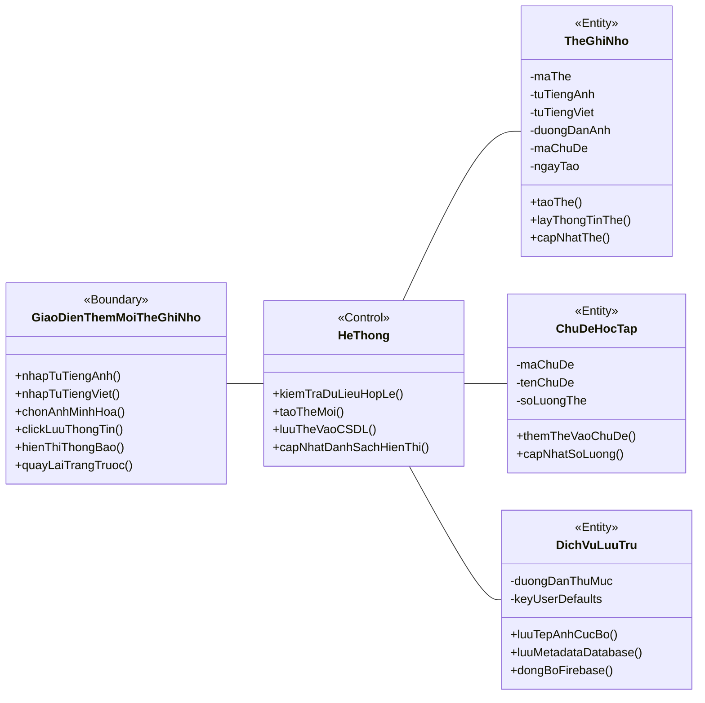
```mermaid
classDiagram
direction LR

%% Mau BCE: Boundary la GiaoDien, Control la HeThong, Entity gom du lieu va dich vu ngoai

class GiaoDienThemMoiTheGhiNho {
  <<Boundary>>
  +nhapTuTiengAnh()
  +nhapTuTiengViet()
  +chonAnhMinhHoa()
  +clickLuuThongTin()
  +hienThiThongBao()
  +quayLaiTrangTruoc()
}

class HeThong {
  <<Control>>
  +kiemTraDuLieuHopLe()
  +taoTheMoi()
  +luuTheVaoCSDL()
  +capNhatDanhSachHienThi()
}

class TheGhiNho {
  <<Entity>>
  -maThe
  -tuTiengAnh
  -tuTiengViet
  -duongDanAnh
  -maChuDe
  -ngayTao
  +taoThe()
  +layThongTinThe()
  +capNhatThe()
}

class ChuDeHocTap {
  <<Entity>>
  -maChuDe
  -tenChuDe
  -soLuongThe
  +themTheVaoChuDe()
  +capNhatSoLuong()
}

class DichVuLuuTru {
  <<Entity>>
  -duongDanThuMuc
  -keyUserDefaults
  +luuTepAnhCucBo()
  +luuMetadataDatabase()
  +dongBoFirebase()
}

GiaoDienThemMoiTheGhiNho -- HeThong
HeThong -- TheGhiNho
HeThong -- ChuDeHocTap
HeThong -- DichVuLuuTru
```

*Lưu ý cho việc vẽ sơ đồ:* Sơ đồ lớp phân tích chi tiết đã được cập nhật và đồng bộ dưới dạng tệp tin Draw.io tại đường dẫn [analysis_class_diagram.drawio](file:///Users/mitie/tlu-app/KidX/docs/analysis_class_diagram.drawio) tương ứng với cấu trúc trên. Người dùng có thể kéo thả tệp này vào trang Web `draw.io` để xuất ảnh đồ họa chèn vào báo cáo.

---

### 2.2.3 Biểu đồ lớp phân tích Use Case "Sửa thẻ ghi nhớ"

---

title: 2.2.3. Biểu đồ lớp phân tích chức năng sửa thẻ ghi nhớ

---

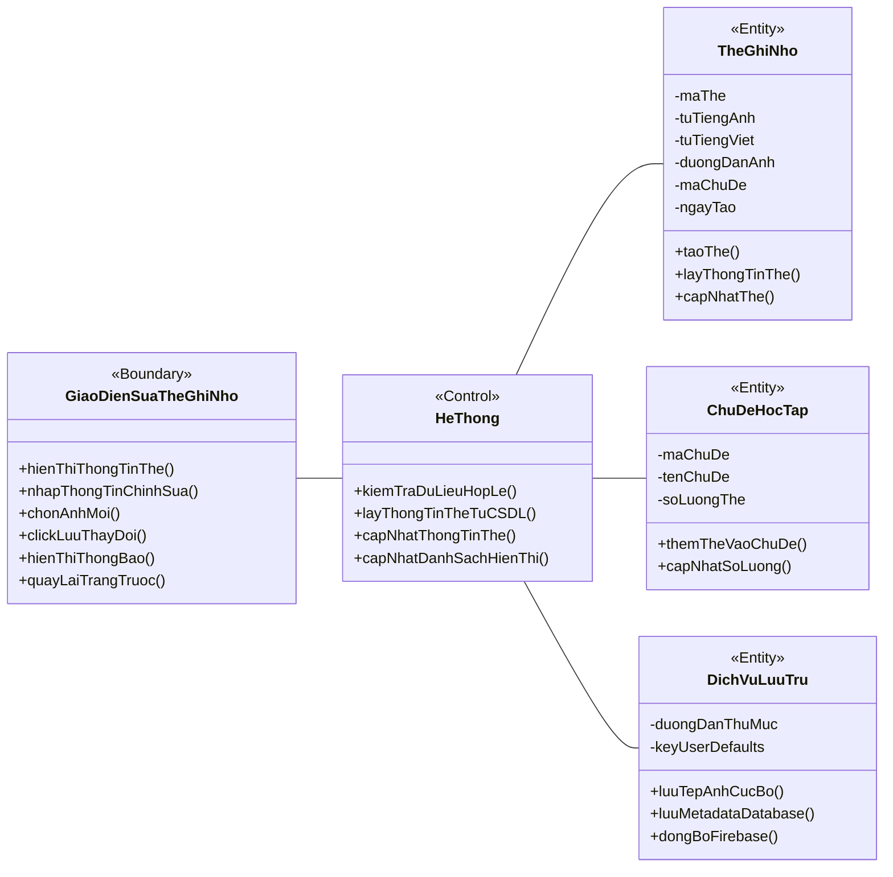
```mermaid
classDiagram
direction LR

%% Mau BCE: Boundary la GiaoDien, Control la HeThong, Entity gom du lieu va dich vu ngoai

class GiaoDienSuaTheGhiNho {
  <<Boundary>>
  +hienThiThongTinThe()
  +nhapThongTinChinhSua()
  +chonAnhMoi()
  +clickLuuThayDoi()
  +hienThiThongBao()
  +quayLaiTrangTruoc()
}

class HeThong {
  <<Control>>
  +kiemTraDuLieuHopLe()
  +layThongTinTheTuCSDL()
  +capNhatThongTinThe()
  +capNhatDanhSachHienThi()
}

class TheGhiNho {
  <<Entity>>
  -maThe
  -tuTiengAnh
  -tuTiengViet
  -duongDanAnh
  -maChuDe
  -ngayTao
  +taoThe()
  +layThongTinThe()
  +capNhatThe()
}

class ChuDeHocTap {
  <<Entity>>
  -maChuDe
  -tenChuDe
  -soLuongThe
  +themTheVaoChuDe()
  +capNhatSoLuong()
}

class DichVuLuuTru {
  <<Entity>>
  -duongDanThuMuc
  -keyUserDefaults
  +luuTepAnhCucBo()
  +luuMetadataDatabase()
  +dongBoFirebase()
}

GiaoDienSuaTheGhiNho -- HeThong
HeThong -- TheGhiNho
HeThong -- ChuDeHocTap
HeThong -- DichVuLuuTru
```

*Lưu ý cho việc vẽ sơ đồ:* Sơ đồ lớp phân tích chi tiết đã được khởi tạo và lưu dưới dạng tệp tin Draw.io tại đường dẫn [analysis_class_diagram_edit.drawio](file:///Users/mitie/tlu-app/KidX/docs/analysis_class_diagram_edit.drawio). Người dùng có thể kéo thả tệp này vào trang Web `draw.io` để xuất ảnh đồ họa chèn vào báo cáo.

---

### 2.2.4 Biểu đồ lớp phân tích Use Case "Xóa thẻ ghi nhớ"

---

title: 2.2.4. Biểu đồ lớp phân tích chức năng xóa thẻ ghi nhớ

---

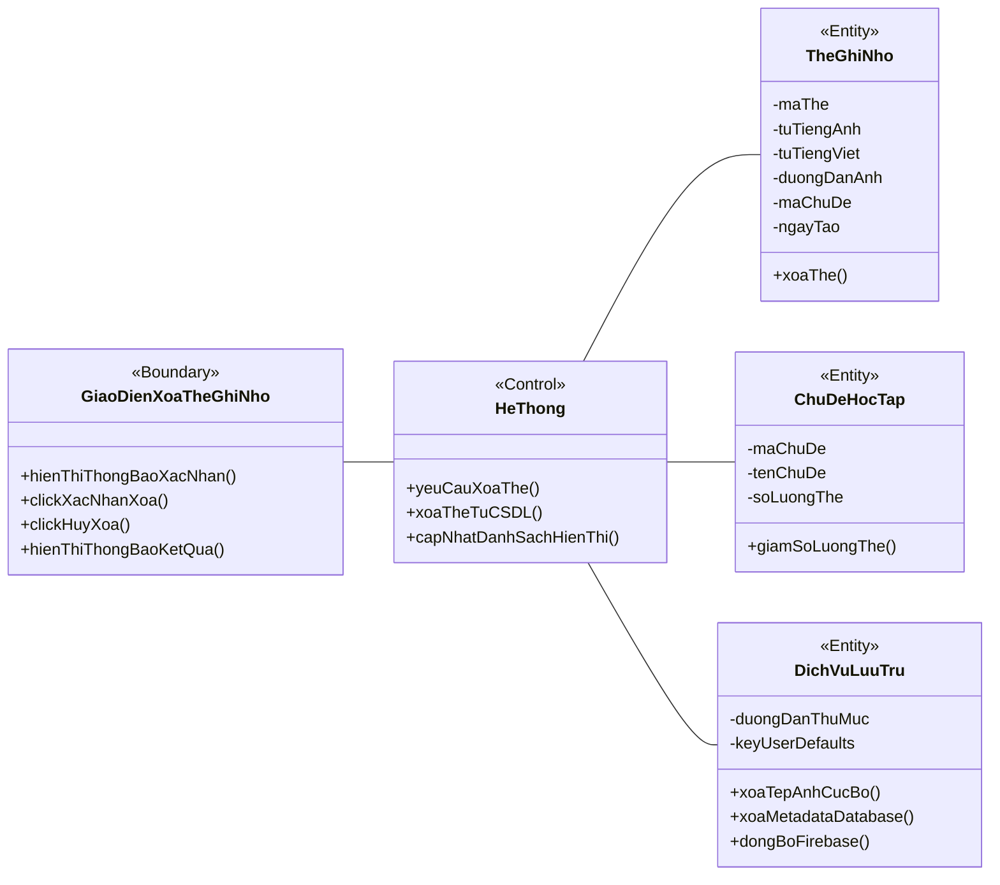
```mermaid
classDiagram
direction LR

%% Mau BCE: Boundary la GiaoDien, Control la HeThong, Entity gom du lieu va dich vu ngoai

class GiaoDienXoaTheGhiNho {
  <<Boundary>>
  +hienThiThongBaoXacNhan()
  +clickXacNhanXoa()
  +clickHuyXoa()
  +hienThiThongBaoKetQua()
}

class HeThong {
  <<Control>>
  +yeuCauXoaThe()
  +xoaTheTuCSDL()
  +capNhatDanhSachHienThi()
}

class TheGhiNho {
  <<Entity>>
  -maThe
  -tuTiengAnh
  -tuTiengViet
  -duongDanAnh
  -maChuDe
  -ngayTao
  +xoaThe()
}

class ChuDeHocTap {
  <<Entity>>
  -maChuDe
  -tenChuDe
  -soLuongThe
  +giamSoLuongThe()
}

class DichVuLuuTru {
  <<Entity>>
  -duongDanThuMuc
  -keyUserDefaults
  +xoaTepAnhCucBo()
  +xoaMetadataDatabase()
  +dongBoFirebase()
}

GiaoDienXoaTheGhiNho -- HeThong
HeThong -- TheGhiNho
HeThong -- ChuDeHocTap
HeThong -- DichVuLuuTru
```

*Lưu ý cho việc vẽ sơ đồ:* Sơ đồ lớp phân tích chi tiết đã được khởi tạo và lưu dưới dạng tệp tin Draw.io tại đường dẫn [analysis_class_diagram_delete.drawio](file:///Users/mitie/tlu-app/KidX/docs/analysis_class_diagram_delete.drawio). Người dùng có thể kéo thả tệp này vào trang Web `draw.io` để xuất ảnh đồ họa chèn vào báo cáo.

---

### 2.2.5 Biểu đồ lớp phân tích Use Case "Thêm mới thử thách"

---

title: 2.2.5. Biểu đồ lớp phân tích chức năng thêm mới thử thách

---

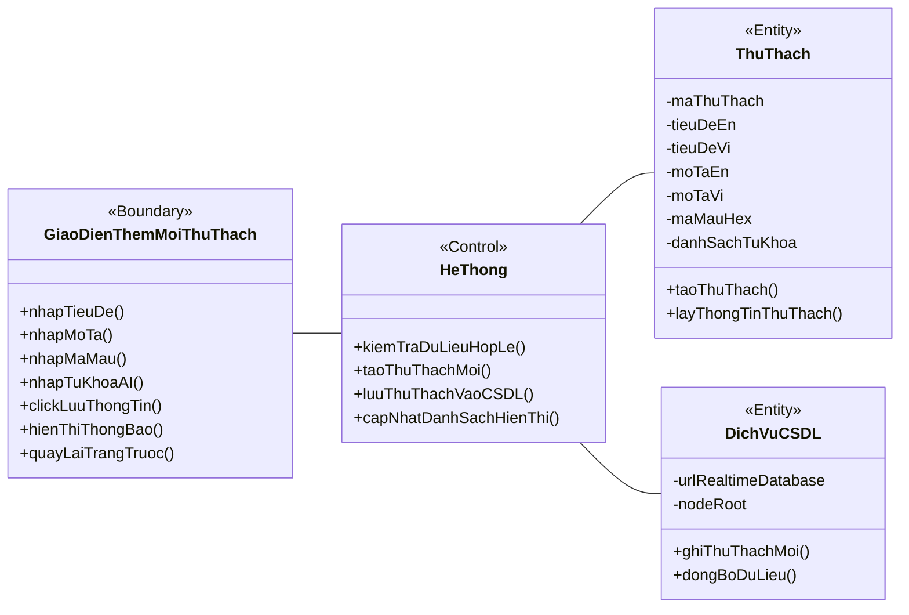
```mermaid
classDiagram
direction LR

%% Mau BCE: Boundary la GiaoDien, Control la HeThong, Entity gom du lieu va dich vu ngoai

class GiaoDienThemMoiThuThach {
  <<Boundary>>
  +nhapTieuDe()
  +nhapMoTa()
  +nhapMaMau()
  +nhapTuKhoaAI()
  +clickLuuThongTin()
  +hienThiThongBao()
  +quayLaiTrangTruoc()
}

class HeThong {
  <<Control>>
  +kiemTraDuLieuHopLe()
  +taoThuThachMoi()
  +luuThuThachVaoCSDL()
  +capNhatDanhSachHienThi()
}

class ThuThach {
  <<Entity>>
  -maThuThach
  -tieuDeEn
  -tieuDeVi
  -moTaEn
  -moTaVi
  -maMauHex
  -danhSachTuKhoa
  +taoThuThach()
  +layThongTinThuThach()
}

class DichVuCSDL {
  <<Entity>>
  -urlRealtimeDatabase
  -nodeRoot
  +ghiThuThachMoi()
  +dongBoDuLieu()
}

GiaoDienThemMoiThuThach -- HeThong
HeThong -- ThuThach
HeThong -- DichVuCSDL
```

*Lưu ý cho việc vẽ sơ đồ:* Sơ đồ lớp phân tích chi tiết đã được khởi tạo và lưu dưới dạng tệp tin Draw.io tại đường dẫn [analysis_class_diagram_add_mission.drawio](file:///Users/mitie/tlu-app/KidX/docs/analysis_class_diagram_add_mission.drawio). Người dùng có thể kéo thả tệp này vào trang Web `draw.io` để xuất ảnh đồ họa chèn vào báo cáo.

---

### 2.2.6 Biểu đồ lớp phân tích Use Case "Sửa thử thách"

---

title: 2.2.6. Biểu đồ lớp phân tích chức năng sửa thử thách

---

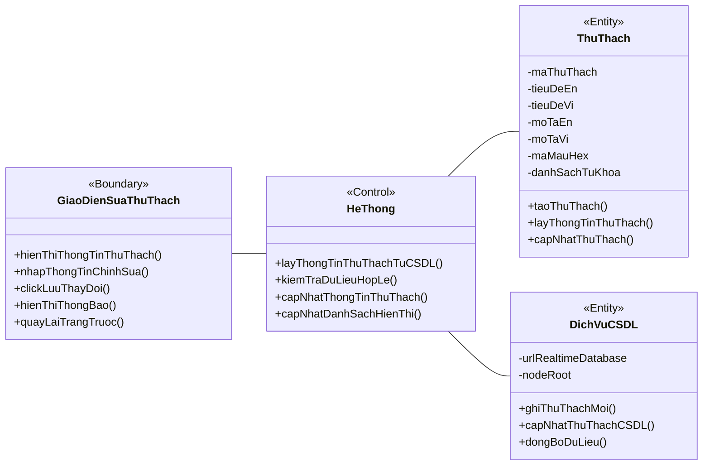
```mermaid
classDiagram
direction LR

%% Mau BCE: Boundary la GiaoDien, Control la HeThong, Entity gom du lieu va dich vu ngoai

class GiaoDienSuaThuThach {
  <<Boundary>>
  +hienThiThongTinThuThach()
  +nhapThongTinChinhSua()
  +clickLuuThayDoi()
  +hienThiThongBao()
  +quayLaiTrangTruoc()
}

class HeThong {
  <<Control>>
  +layThongTinThuThachTuCSDL()
  +kiemTraDuLieuHopLe()
  +capNhatThongTinThuThach()
  +capNhatDanhSachHienThi()
}

class ThuThach {
  <<Entity>>
  -maThuThach
  -tieuDeEn
  -tieuDeVi
  -moTaEn
  -moTaVi
  -maMauHex
  -danhSachTuKhoa
  +taoThuThach()
  +layThongTinThuThach()
  +capNhatThuThach()
}

class DichVuCSDL {
  <<Entity>>
  -urlRealtimeDatabase
  -nodeRoot
  +ghiThuThachMoi()
  +capNhatThuThachCSDL()
  +dongBoDuLieu()
}

GiaoDienSuaThuThach -- HeThong
HeThong -- ThuThach
HeThong -- DichVuCSDL
```

*Lưu ý cho việc vẽ sơ đồ:* Sơ đồ lớp phân tích chi tiết đã được khởi tạo và lưu dưới dạng tệp tin Draw.io tại đường dẫn [analysis_class_diagram_edit_mission.drawio](file:///Users/mitie/tlu-app/KidX/docs/analysis_class_diagram_edit_mission.drawio). Người dùng có thể kéo thả tệp này vào trang Web `draw.io` để xuất ảnh đồ họa chèn vào báo cáo.

---

### 2.2.7 Biểu đồ lớp phân tích Use Case "Xóa thử thách"

---

title: 2.2.7. Biểu đồ lớp phân tích chức năng xóa thử thách

---

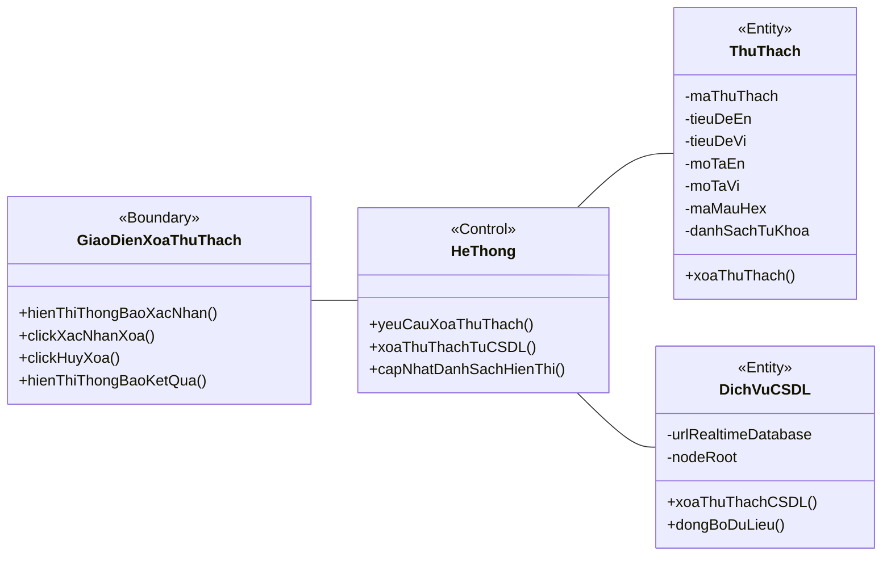
```mermaid
classDiagram
direction LR

%% Mau BCE: Boundary la GiaoDien, Control la HeThong, Entity gom du lieu va dich vu ngoai

class GiaoDienXoaThuThach {
  <<Boundary>>
  +hienThiThongBaoXacNhan()
  +clickXacNhanXoa()
  +clickHuyXoa()
  +hienThiThongBaoKetQua()
}

class HeThong {
  <<Control>>
  +yeuCauXoaThuThach()
  +xoaThuThachTuCSDL()
  +capNhatDanhSachHienThi()
}

class ThuThach {
  <<Entity>>
  -maThuThach
  -tieuDeEn
  -tieuDeVi
  -moTaEn
  -moTaVi
  -maMauHex
  -danhSachTuKhoa
  +xoaThuThach()
}

class DichVuCSDL {
  <<Entity>>
  -urlRealtimeDatabase
  -nodeRoot
  +xoaThuThachCSDL()
  +dongBoDuLieu()
}

GiaoDienXoaThuThach -- HeThong
HeThong -- ThuThach
HeThong -- DichVuCSDL
```

*Lưu ý cho việc vẽ sơ đồ:* Sơ đồ lớp phân tích chi tiết đã được khởi tạo và lưu dưới dạng tệp tin Draw.io tại đường dẫn [analysis_class_diagram_delete_mission.drawio](file:///Users/mitie/tlu-app/KidX/docs/analysis_class_diagram_delete_mission.drawio). Người dùng có thể kéo thả tệp này vào trang Web `draw.io` để xuất ảnh đồ họa chèn vào báo cáo.

---

### 2.2.8 Biểu đồ lớp phân tích Use Case "Tập viết theo mẫu các chữ cái"

---

title: 2.2.8. Biểu đồ lớp phân tích chức năng tập viết theo mẫu các chữ cái

---

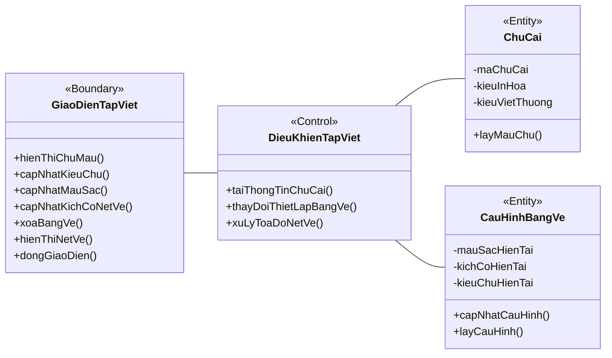
```mermaid
classDiagram
direction LR

class GiaoDienTapViet {
  <<Boundary>>
  +hienThiChuMau()
  +capNhatKieuChu()
  +capNhatMauSac()
  +capNhatKichCoNetVe()
  +xoaBangVe()
  +hienThiNetVe()
  +dongGiaoDien()
}

class DieuKhienTapViet {
  <<Control>>
  +taiThongTinChuCai()
  +thayDoiThietLapBangVe()
  +xuLyToaDoNetVe()
}

class ChuCai {
  <<Entity>>
  -maChuCai
  -kieuInHoa
  -kieuVietThuong
  +layMauChu()
}

class CauHinhBangVe {
  <<Entity>>
  -mauSacHienTai
  -kichCoHienTai
  -kieuChuHienTai
  +capNhatCauHinh()
  +layCauHinh()
}

GiaoDienTapViet -- DieuKhienTapViet
DieuKhienTapViet -- ChuCai
DieuKhienTapViet -- CauHinhBangVe
```

*Lưu ý cho việc vẽ sơ đồ:* Sơ đồ lớp phân tích chi tiết đã được khởi tạo và lưu dưới dạng tệp tin Draw.io tại đường dẫn [analysis_class_diagram_draw_letter.drawio](file:///Users/mitie/ios-base-app/KidX/docs/AC/analysis_class_diagram_draw_letter.drawio). Người dùng có thể kéo thả tệp này vào trang Web `draw.io` để xuất ảnh đồ họa chèn vào báo cáo.

---

### 2.2.9 Biểu đồ lớp phân tích Use Case "Tập viết chữ số 0 - 9"

---

title: 2.2.9. Biểu đồ lớp phân tích chức năng tập viết chữ số 0 - 9

---

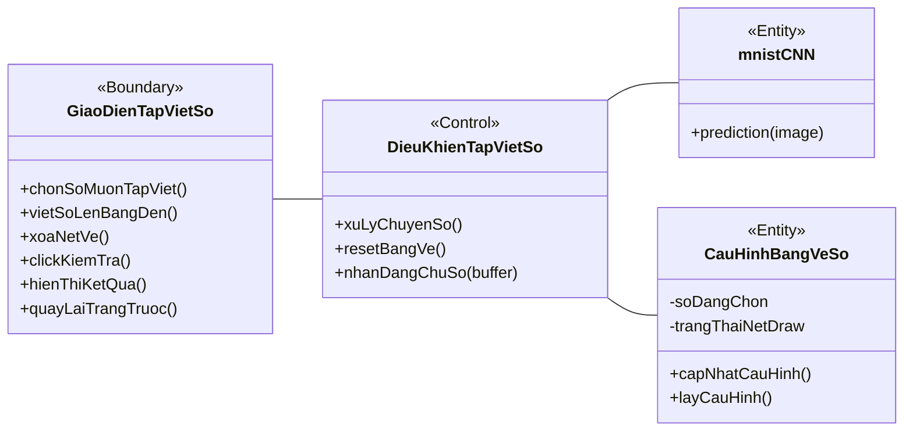
```mermaid
classDiagram
direction LR

class GiaoDienTapVietSo {
  <<Boundary>>
  +chonSoMuonTapViet()
  +vietSoLenBangDen()
  +xoaNetVe()
  +clickKiemTra()
  +hienThiKetQua()
  +quayLaiTrangTruoc()
}

class DieuKhienTapVietSo {
  <<Control>>
  +xuLyChuyenSo()
  +resetBangVe()
  +nhanDangChuSo(buffer)
}

class mnistCNN {
  <<Entity>>
  +prediction(image)
}

class CauHinhBangVeSo {
  <<Entity>>
  -soDangChon
  -trangThaiNetDraw
  +capNhatCauHinh()
  +layCauHinh()
}

GiaoDienTapVietSo -- DieuKhienTapVietSo
DieuKhienTapVietSo -- mnistCNN
DieuKhienTapVietSo -- CauHinhBangVeSo
```

*Lưu ý cho việc vẽ sơ đồ:* Sơ đồ lớp phân tích chi tiết đã được khởi tạo và lưu dưới dạng tệp tin Draw.io tại đường dẫn [analysis_class_diagram_draw_number.drawio](file:///Users/mitie/ios-base-app/KidX/docs/AC/analysis_class_diagram_draw_number.drawio). Người dùng có thể kéo thả tệp này vào trang Web `draw.io` để xuất ảnh đồ họa chèn vào báo cáo.

---

### 2.2.10 Biểu đồ lớp phân tích Use Case "Thử thách truy tìm đồ vật"

---

title: 2.2.10. Biểu đồ lớp phân tích chức năng thử thách truy tìm đồ vật

---

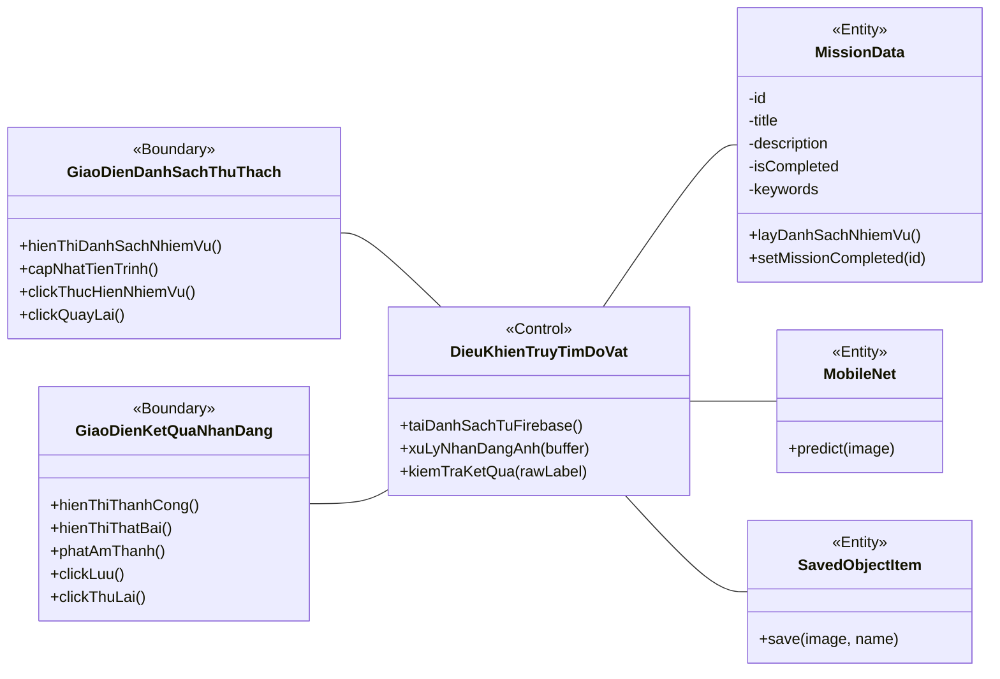
```mermaid
classDiagram
direction LR

class GiaoDienDanhSachThuThach {
  <<Boundary>>
  +hienThiDanhSachNhiemVu()
  +capNhatTienTrinh()
  +clickThucHienNhiemVu()
  +clickQuayLai()
}

class GiaoDienKetQuaNhanDang {
  <<Boundary>>
  +hienThiThanhCong()
  +hienThiThatBai()
  +phatAmThanh()
  +clickLuu()
  +clickThuLai()
}

class DieuKhienTruyTimDoVat {
  <<Control>>
  +taiDanhSachTuFirebase()
  +xuLyNhanDangAnh(buffer)
  +kiemTraKetQua(rawLabel)
}

class MissionData {
  <<Entity>>
  -id
  -title
  -description
  -isCompleted
  -keywords
  +layDanhSachNhiemVu()
  +setMissionCompleted(id)
}

class MobileNet {
  <<Entity>>
  +predict(image)
}

class SavedObjectItem {
  <<Entity>>
  +save(image, name)
}

GiaoDienDanhSachThuThach -- DieuKhienTruyTimDoVat
GiaoDienKetQuaNhanDang -- DieuKhienTruyTimDoVat
DieuKhienTruyTimDoVat -- MissionData
DieuKhienTruyTimDoVat -- MobileNet
DieuKhienTruyTimDoVat -- SavedObjectItem
```

*Lưu ý cho việc vẽ sơ đồ:* Sơ đồ lớp phân tích chi tiết đã được khởi tạo và lưu dưới dạng tệp tin Draw.io tại đường dẫn [analysis_class_diagram_treasure_hunt.drawio](file:///Users/mitie/ios-base-app/KidX/docs/AC/analysis_class_diagram_treasure_hunt.drawio). Người dùng có thể kéo thả tệp này vào trang Web `draw.io` để xuất ảnh đồ họa chèn vào báo cáo.

---

### 2.3.2 Mã UML (PlantUML) cho biểu đồ Sequence rút gọn

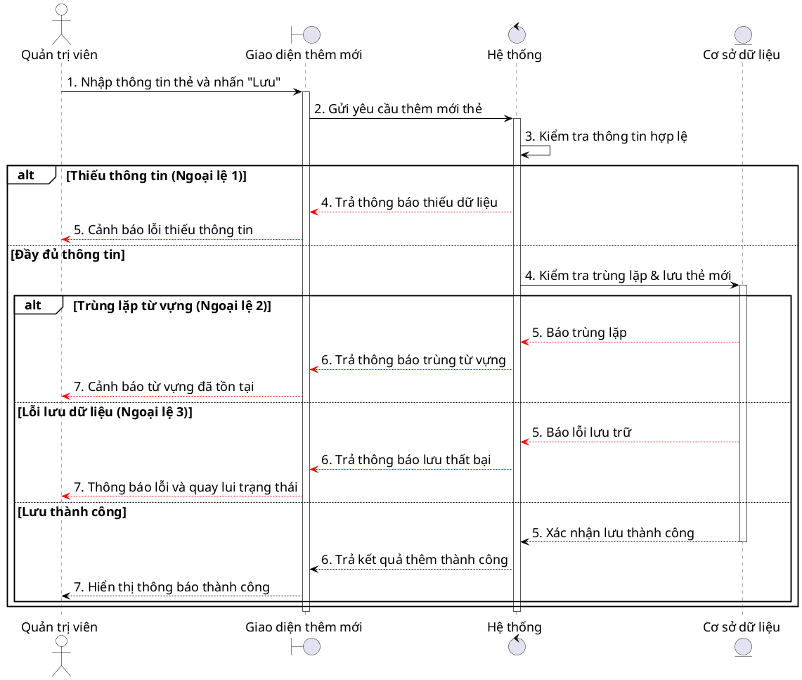
```plantuml
@startuml SD_ThemMoiTheGhiNho
skinparam defaultFontName Arial
skinparam defaultFontSize 18
skinparam shadowing false

skinparam sequence {
  ParticipantBorderColor Black
  ParticipantBackgroundColor White
  ActorBorderColor Black
  ActorBackgroundColor White
  LifeLineBorderColor #555555
  LifeLineBackgroundColor White
  ArrowColor Black
  GroupBorderColor Black
  GroupBackgroundColor White
  ActivationBorderColor Black
  ActivationBackgroundColor #EEEEEE
}

actor "Quản trị viên" as Admin
boundary "Giao diện thêm mới" as UI
control "Hệ thống" as Controller
entity "Cơ sở dữ liệu" as CSDL

Admin -> UI : 1. Nhập thông tin thẻ và nhấn "Lưu"
activate UI

UI -> Controller : 2. Gửi yêu cầu thêm mới thẻ
activate Controller

Controller -> Controller : 3. Kiểm tra thông tin hợp lệ

alt Thiếu thông tin (Ngoại lệ 1)
  Controller --[#red]> UI : 4. Trả thông báo thiếu dữ liệu
  UI --[#red]> Admin : 5. Cảnh báo lỗi thiếu thông tin

else Đầy đủ thông tin
  Controller -> CSDL : 4. Kiểm tra trùng lặp & lưu thẻ mới
  activate CSDL
  
  alt Trùng lặp từ vựng (Ngoại lệ 2)
    CSDL --[#red]> Controller : 5. Báo trùng lặp
    Controller --[#red]> UI : 6. Trả thông báo trùng từ vựng
    UI --[#red]> Admin : 7. Cảnh báo từ vựng đã tồn tại
    
  else Lỗi lưu dữ liệu (Ngoại lệ 3)
    CSDL --[#red]> Controller : 5. Báo lỗi lưu trữ
    Controller --[#red]> UI : 6. Trả thông báo lưu thất bại
    UI --[#red]> Admin : 7. Thông báo lỗi và quay lui trạng thái
    
  else Lưu thành công
    CSDL --> Controller : 5. Xác nhận lưu thành công
    deactivate CSDL
    Controller --> UI : 6. Trả kết quả thêm thành công
    UI --> Admin : 7. Hiển thị thông báo thành công
  end
end

deactivate Controller
deactivate UI
@enduml
```

*Lưu ý cho việc vẽ sơ đồ:* Sơ đồ tuần tự tương ứng đã được cập nhật và lưu dưới dạng tệp tin Draw.io tại đường dẫn [sequence_diagram_add_flashcard.drawio](file:///Users/mitie/tlu-app/KidX/docs/sequence_diagram_add_flashcard.drawio).

---

### 2.3.3 Mã UML (PlantUML) cho biểu đồ Sequence rút gọn chức năng sửa thẻ ghi nhớ

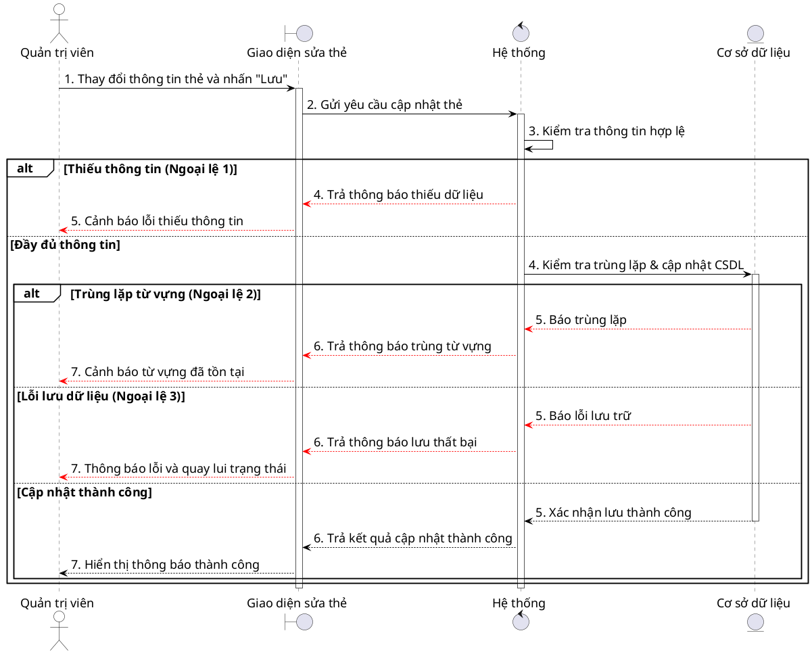
```plantuml
@startuml SD_SuaTheGhiNho
skinparam defaultFontName Arial
skinparam defaultFontSize 18
skinparam shadowing false

skinparam sequence {
  ParticipantBorderColor Black
  ParticipantBackgroundColor White
  ActorBorderColor Black
  ActorBackgroundColor White
  LifeLineBorderColor #555555
  LifeLineBackgroundColor White
  ArrowColor Black
  GroupBorderColor Black
  GroupBackgroundColor White
  ActivationBorderColor Black
  ActivationBackgroundColor #EEEEEE
}

actor "Quản trị viên" as Admin
boundary "Giao diện sửa thẻ" as UI
control "Hệ thống" as Controller
entity "Cơ sở dữ liệu" as CSDL

Admin -> UI : 1. Thay đổi thông tin thẻ và nhấn "Lưu"
activate UI

UI -> Controller : 2. Gửi yêu cầu cập nhật thẻ
activate Controller

Controller -> Controller : 3. Kiểm tra thông tin hợp lệ

alt Thiếu thông tin (Ngoại lệ 1)
  Controller --[#red]> UI : 4. Trả thông báo thiếu dữ liệu
  UI --[#red]> Admin : 5. Cảnh báo lỗi thiếu thông tin

else Đầy đủ thông tin
  Controller -> CSDL : 4. Kiểm tra trùng lặp & cập nhật CSDL
  activate CSDL
  
  alt Trùng lặp từ vựng (Ngoại lệ 2)
    CSDL --[#red]> Controller : 5. Báo trùng lặp
    Controller --[#red]> UI : 6. Trả thông báo trùng từ vựng
    UI --[#red]> Admin : 7. Cảnh báo từ vựng đã tồn tại
    
  else Lỗi lưu dữ liệu (Ngoại lệ 3)
    CSDL --[#red]> Controller : 5. Báo lỗi lưu trữ
    Controller --[#red]> UI : 6. Trả thông báo lưu thất bại
    UI --[#red]> Admin : 7. Thông báo lỗi và quay lui trạng thái
    
  else Cập nhật thành công
    CSDL --> Controller : 5. Xác nhận lưu thành công
    deactivate CSDL
    Controller --> UI : 6. Trả kết quả cập nhật thành công
    UI --> Admin : 7. Hiển thị thông báo thành công
  end
end

deactivate Controller
deactivate UI
@enduml
```

*Lưu ý cho việc vẽ sơ đồ:* Sơ đồ tuần tự tương ứng đã được khởi tạo và lưu dưới dạng tệp tin Draw.io tại đường dẫn [sequence_diagram_edit_flashcard.drawio](file:///Users/mitie/tlu-app/KidX/docs/sequence_diagram_edit_flashcard.drawio).

---

### 2.3.4 Mã UML (PlantUML) cho biểu đồ Sequence rút gọn chức năng xóa thẻ ghi nhớ

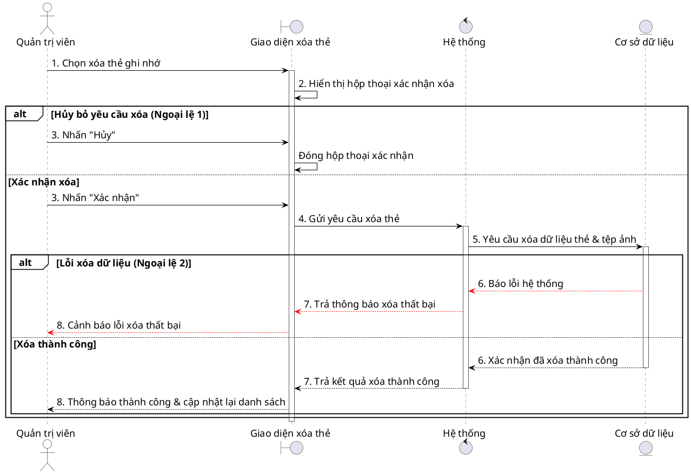
```plantuml
@startuml SD_XoaTheGhiNho
skinparam defaultFontName Arial
skinparam defaultFontSize 18
skinparam shadowing false

skinparam sequence {
  ParticipantBorderColor Black
  ParticipantBackgroundColor White
  ActorBorderColor Black
  ActorBackgroundColor White
  LifeLineBorderColor #555555
  LifeLineBackgroundColor White
  ArrowColor Black
  GroupBorderColor Black
  GroupBackgroundColor White
  ActivationBorderColor Black
  ActivationBackgroundColor #EEEEEE
}

actor "Quản trị viên" as Admin
boundary "Giao diện xóa thẻ" as UI
control "Hệ thống" as Controller
entity "Cơ sở dữ liệu" as CSDL

Admin -> UI : 1. Chọn xóa thẻ ghi nhớ
activate UI

UI -> UI : 2. Hiển thị hộp thoại xác nhận xóa

alt Hủy bỏ yêu cầu xóa (Ngoại lệ 1)
  Admin -> UI : 3. Nhấn "Hủy"
  UI -> UI : Đóng hộp thoại xác nhận

else Xác nhận xóa
  Admin -> UI : 3. Nhấn "Xác nhận"
  UI -> Controller : 4. Gửi yêu cầu xóa thẻ
  activate Controller

  Controller -> CSDL : 5. Yêu cầu xóa dữ liệu thẻ & tệp ảnh
  activate CSDL
  
  alt Lỗi xóa dữ liệu (Ngoại lệ 2)
    CSDL --[#red]> Controller : 6. Báo lỗi hệ thống
    Controller --[#red]> UI : 7. Trả thông báo xóa thất bại
    UI --[#red]> Admin : 8. Cảnh báo lỗi xóa thất bại
    
  else Xóa thành công
    CSDL --> Controller : 6. Xác nhận đã xóa thành công
    deactivate CSDL
    Controller --> UI : 7. Trả kết quả xóa thành công
    deactivate Controller
    UI --> Admin : 8. Thông báo thành công & cập nhật lại danh sách
  end
end

deactivate UI
@enduml
```

*Lưu ý cho việc vẽ sơ đồ:* Sơ đồ tuần tự tương ứng đã được khởi tạo và lưu dưới dạng tệp tin Draw.io tại đường dẫn [sequence_diagram_delete_flashcard.drawio](file:///Users/mitie/tlu-app/KidX/docs/sequence_diagram_delete_flashcard.drawio).

---

### 2.3.5 Mã UML (PlantUML) cho biểu đồ Sequence rút gọn chức năng thêm mới thử thách

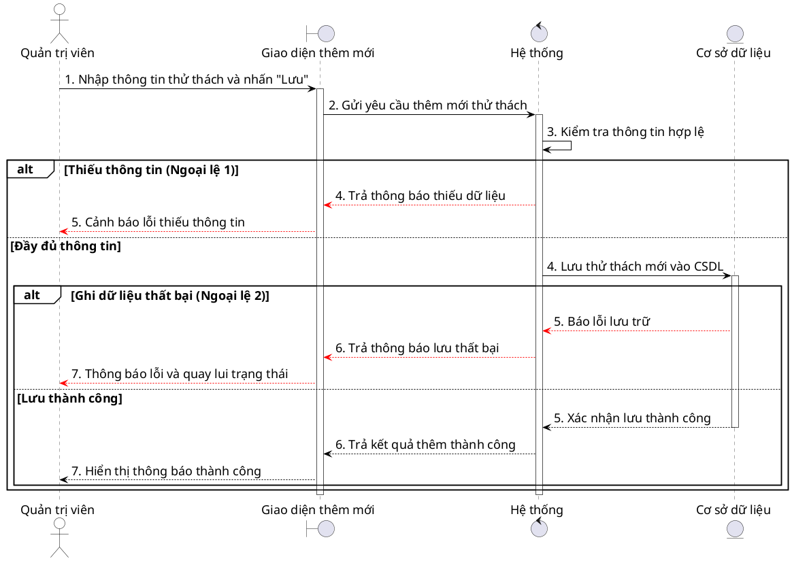
```plantuml
@startuml SD_ThemMoiThuThach
skinparam defaultFontName Arial
skinparam defaultFontSize 18
skinparam shadowing false

skinparam sequence {
  ParticipantBorderColor Black
  ParticipantBackgroundColor White
  ActorBorderColor Black
  ActorBackgroundColor White
  LifeLineBorderColor #555555
  LifeLineBackgroundColor White
  ArrowColor Black
  GroupBorderColor Black
  GroupBackgroundColor White
  ActivationBorderColor Black
  ActivationBackgroundColor #EEEEEE
}

actor "Quản trị viên" as Admin
boundary "Giao diện thêm mới" as UI
control "Hệ thống" as Controller
entity "Cơ sở dữ liệu" as CSDL

Admin -> UI : 1. Nhập thông tin thử thách và nhấn "Lưu"
activate UI

UI -> Controller : 2. Gửi yêu cầu thêm mới thử thách
activate Controller

Controller -> Controller : 3. Kiểm tra thông tin hợp lệ

alt Thiếu thông tin (Ngoại lệ 1)
  Controller --[#red]> UI : 4. Trả thông báo thiếu dữ liệu
  UI --[#red]> Admin : 5. Cảnh báo lỗi thiếu thông tin

else Đầy đủ thông tin
  Controller -> CSDL : 4. Lưu thử thách mới vào CSDL
  activate CSDL
  
  alt Ghi dữ liệu thất bại (Ngoại lệ 2)
    CSDL --[#red]> Controller : 5. Báo lỗi lưu trữ
    Controller --[#red]> UI : 6. Trả thông báo lưu thất bại
    UI --[#red]> Admin : 7. Thông báo lỗi và quay lui trạng thái
    
  else Lưu thành công
    CSDL --> Controller : 5. Xác nhận lưu thành công
    deactivate CSDL
    Controller --> UI : 6. Trả kết quả thêm thành công
    UI --> Admin : 7. Hiển thị thông báo thành công
  end
end

deactivate Controller
deactivate UI
@enduml
```

*Lưu ý cho việc vẽ sơ đồ:* Sơ đồ tuần tự tương ứng đã được khởi tạo và lưu dưới dạng tệp tin Draw.io tại đường dẫn [sequence_diagram_add_mission.drawio](file:///Users/mitie/tlu-app/KidX/docs/sequence_diagram_add_mission.drawio).

---

### 2.3.6 Mã UML (PlantUML) cho biểu đồ Sequence rút gọn chức năng sửa thử thách

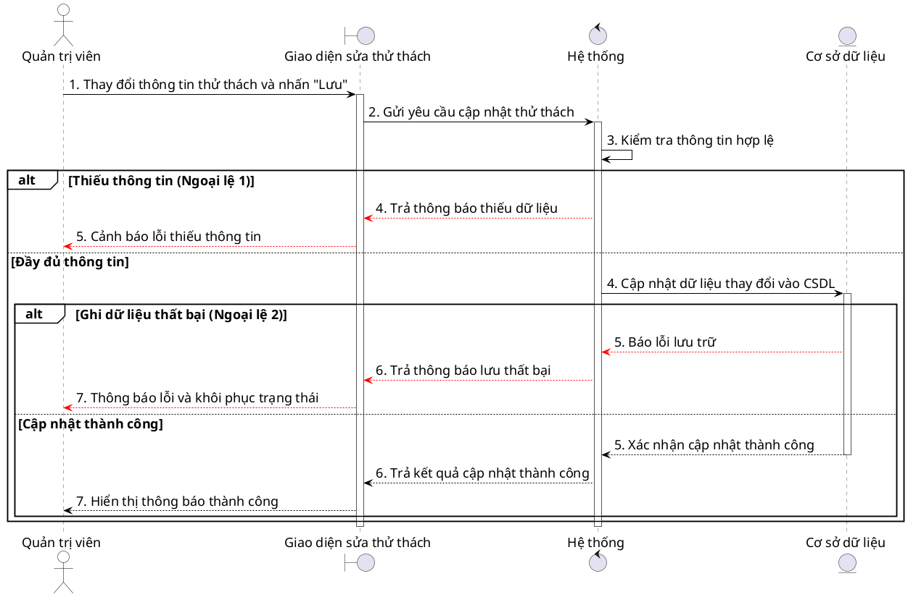
```plantuml
@startuml SD_SuaThuThach
skinparam defaultFontName Arial
skinparam defaultFontSize 18
skinparam shadowing false

skinparam sequence {
  ParticipantBorderColor Black
  ParticipantBackgroundColor White
  ActorBorderColor Black
  ActorBackgroundColor White
  LifeLineBorderColor #555555
  LifeLineBackgroundColor White
  ArrowColor Black
  GroupBorderColor Black
  GroupBackgroundColor White
  ActivationBorderColor Black
  ActivationBackgroundColor #EEEEEE
}

actor "Quản trị viên" as Admin
boundary "Giao diện sửa thử thách" as UI
control "Hệ thống" as Controller
entity "Cơ sở dữ liệu" as CSDL

Admin -> UI : 1. Thay đổi thông tin thử thách và nhấn "Lưu"
activate UI

UI -> Controller : 2. Gửi yêu cầu cập nhật thử thách
activate Controller

Controller -> Controller : 3. Kiểm tra thông tin hợp lệ

alt Thiếu thông tin (Ngoại lệ 1)
  Controller --[#red]> UI : 4. Trả thông báo thiếu dữ liệu
  UI --[#red]> Admin : 5. Cảnh báo lỗi thiếu thông tin

else Đầy đủ thông tin
  Controller -> CSDL : 4. Cập nhật dữ liệu thay đổi vào CSDL
  activate CSDL
  
  alt Ghi dữ liệu thất bại (Ngoại lệ 2)
    CSDL --[#red]> Controller : 5. Báo lỗi lưu trữ
    Controller --[#red]> UI : 6. Trả thông báo lưu thất bại
    UI --[#red]> Admin : 7. Thông báo lỗi và khôi phục trạng thái
    
  else Cập nhật thành công
    CSDL --> Controller : 5. Xác nhận cập nhật thành công
    deactivate CSDL
    Controller --> UI : 6. Trả kết quả cập nhật thành công
    UI --> Admin : 7. Hiển thị thông báo thành công
  end
end

deactivate Controller
deactivate UI
@enduml
```

*Lưu ý cho việc vẽ sơ đồ:* Sơ đồ tuần tự tương ứng đã được khởi tạo và lưu dưới dạng tệp tin Draw.io tại đường dẫn [sequence_diagram_edit_mission.drawio](file:///Users/mitie/tlu-app/KidX/docs/sequence_diagram_edit_mission.drawio).

---

### 2.3.7 Mã UML (PlantUML) cho biểu đồ Sequence rút gọn chức năng xóa thử thách

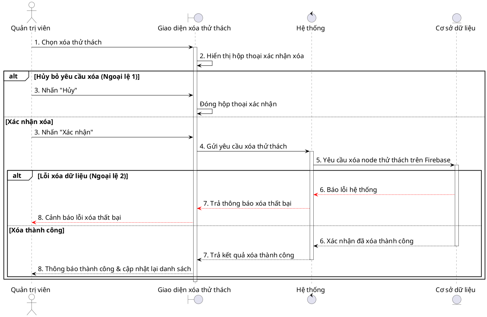
```plantuml
@startuml SD_XoaThuThach
skinparam defaultFontName Arial
skinparam defaultFontSize 18
skinparam shadowing false

skinparam sequence {
  ParticipantBorderColor Black
  ParticipantBackgroundColor White
  ActorBorderColor Black
  ActorBackgroundColor White
  LifeLineBorderColor #555555
  LifeLineBackgroundColor White
  ArrowColor Black
  GroupBorderColor Black
  GroupBackgroundColor White
  ActivationBorderColor Black
  ActivationBackgroundColor #EEEEEE
}

actor "Quản trị viên" as Admin
boundary "Giao diện xóa thử thách" as UI
control "Hệ thống" as Controller
entity "Cơ sở dữ liệu" as CSDL

Admin -> UI : 1. Chọn xóa thử thách
activate UI

UI -> UI : 2. Hiển thị hộp thoại xác nhận xóa

alt Hủy bỏ yêu cầu xóa (Ngoại lệ 1)
  Admin -> UI : 3. Nhấn "Hủy"
  UI -> UI : Đóng hộp thoại xác nhận

else Xác nhận xóa
  Admin -> UI : 3. Nhấn "Xác nhận"
  UI -> Controller : 4. Gửi yêu cầu xóa thử thách
  activate Controller

  Controller -> CSDL : 5. Yêu cầu xóa node thử thách trên Firebase
  activate CSDL
  
  alt Lỗi xóa dữ liệu (Ngoại lệ 2)
    CSDL --[#red]> Controller : 6. Báo lỗi hệ thống
    Controller --[#red]> UI : 7. Trả thông báo xóa thất bại
    UI --[#red]> Admin : 8. Cảnh báo lỗi xóa thất bại
    
  else Xóa thành công
    CSDL --> Controller : 6. Xác nhận đã xóa thành công
    deactivate CSDL
    Controller --> UI : 7. Trả kết quả xóa thành công
    deactivate Controller
    UI --> Admin : 8. Thông báo thành công & cập nhật lại danh sách
  end
end

deactivate UI
@enduml
```

*Lưu ý cho việc vẽ sơ đồ:* Sơ đồ tuần tự tương ứng đã được khởi tạo và lưu dưới dạng tệp tin Draw.io tại đường dẫn [sequence_diagram_delete_mission.drawio](file:///Users/mitie/tlu-app/KidX/docs/sequence_diagram_delete_mission.drawio).

---

### 2.3.8 Mã UML (PlantUML) cho biểu đồ Sequence rút gọn chức năng tập viết theo mẫu các chữ cái

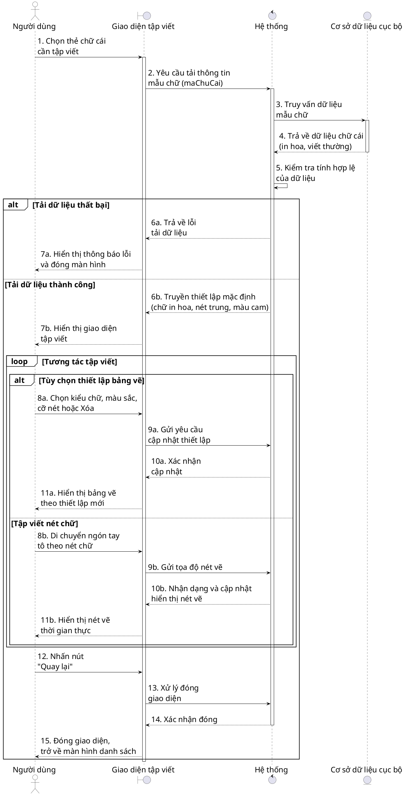
```plantuml
@startuml SD_TapVietChuCai
skinparam defaultFontName Arial
skinparam defaultFontSize 24
skinparam shadowing false
skinparam ParticipantPadding 10
skinparam BoxPadding 5

skinparam sequence {
  ParticipantBorderColor Black
  ParticipantBackgroundColor White
  ActorBorderColor Black
  ActorBackgroundColor White
  LifeLineBorderColor Black
  LifeLineBorderThickness 2
  LifeLineBackgroundColor White
  ArrowColor Black
  GroupBorderColor Black
  GroupBackgroundColor White
  ActivationBorderColor Black
  ActivationBackgroundColor #EEEEEE
}

actor "Người dùng" as User
boundary "Giao diện tập viết" as UI
control "Hệ thống" as Controller
entity "Cơ sở dữ liệu cục bộ" as DB

User -> UI : 1. Chọn thẻ chữ cái\ncần tập viết
activate UI
||20||

UI -> Controller : 2. Yêu cầu tải thông tin\nmẫu chữ (maChuCai)
activate Controller
||20||

Controller -> DB : 3. Truy vấn dữ liệu\nmẫu chữ
activate DB
||20||
DB --> Controller : 4. Trả về dữ liệu chữ cái\n(in hoa, viết thường)
deactivate DB
||20||

Controller -> Controller : 5. Kiểm tra tính hợp lệ\ncủa dữ liệu
||20||

alt Tải dữ liệu thất bại
  Controller --> UI : 6a. Trả về lỗi\ntải dữ liệu
  ||20||
  UI --> User : 7a. Hiển thị thông báo lỗi\nvà đóng màn hình
  ||20||
else Tải dữ liệu thành công
  Controller --> UI : 6b. Truyền thiết lập mặc định\n(chữ in hoa, nét trung, màu cam)
  ||20||
  UI --> User : 7b. Hiển thị giao diện\ntập viết
  ||20||
  
  loop Tương tác tập viết
    alt Tùy chọn thiết lập bảng vẽ
      User -> UI : 8a. Chọn kiểu chữ, màu sắc,\ncỡ nét hoặc Xóa
      ||20||
      UI -> Controller : 9a. Gửi yêu cầu\ncập nhật thiết lập
      ||20||
      Controller --> UI : 10a. Xác nhận\ncập nhật
      ||20||
      UI --> User : 11a. Hiển thị bảng vẽ\ntheo thiết lập mới
      ||20||
    else Tập viết nét chữ
      User -> UI : 8b. Di chuyển ngón tay\ntô theo nét chữ
      ||20||
      UI -> Controller : 9b. Gửi tọa độ nét vẽ
      ||20||
      Controller --> UI : 10b. Nhận dạng và cập nhật\nhiển thị nét vẽ
      ||20||
      UI --> User : 11b. Hiển thị nét vẽ\nthời gian thực
      ||20||
    end
  end
  
  User -> UI : 12. Nhấn nút\n"Quay lại"
  ||20||
  UI -> Controller : 13. Xử lý đóng\ngiao diện
  ||20||
  Controller --> UI : 14. Xác nhận đóng
  deactivate Controller
  ||20||
  UI --> User : 15. Đóng giao diện,\ntrở về màn hình danh sách
end

deactivate UI
@enduml
```

*Lưu ý cho việc vẽ sơ đồ:* Sơ đồ tuần tự tương ứng đã được khởi tạo và lưu dưới dạng tệp tin Draw.io tại đường dẫn [sequence_diagram_draw_letter.drawio](file:///Users/mitie/ios-base-app/KidX/docs/SD/sequence_diagram_draw_letter.puml).

---

### 2.3.9 Mã UML (PlantUML) cho biểu đồ Sequence rút gọn chức năng tập viết chữ số 0 - 9

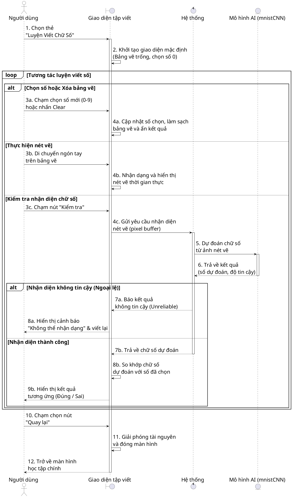
```plantuml
@startuml SD_TapVietChuSo
skinparam defaultFontName Arial
skinparam defaultFontSize 24
skinparam shadowing false
skinparam ParticipantPadding 10
skinparam BoxPadding 5

skinparam sequence {
  ParticipantBorderColor Black
  ParticipantBackgroundColor White
  ActorBorderColor Black
  ActorBackgroundColor White
  LifeLineBorderColor Black
  LifeLineBorderThickness 2
  LifeLineBackgroundColor White
  ArrowColor Black
  GroupBorderColor Black
  GroupBackgroundColor White
  ActivationBorderColor Black
  ActivationBackgroundColor #EEEEEE
}

actor "Người dùng" as User
boundary "Giao diện tập viết" as UI
control "Hệ thống" as Controller
entity "Mô hình AI (mnistCNN)" as AI

User -> UI : 1. Chọn thẻ\n"Luyện Viết Chữ Số"
activate UI
||20||

UI -> UI : 2. Khởi tạo giao diện mặc định\n(Bảng vẽ trống, chọn số 0)
||20||

loop Tương tác luyện viết số
  alt Chọn số hoặc Xóa bảng vẽ
    User -> UI : 3a. Chạm chọn số mới (0-9)\nhoặc nhấn Clear
    ||20||
    UI -> UI : 4a. Cập nhật số chọn, làm sạch\nbảng vẽ và ẩn kết quả
    ||20||
  
  else Thực hiện nét vẽ
    User -> UI : 3b. Di chuyển ngón tay\ntrên bảng vẽ
    ||20||
    UI -> UI : 4b. Nhận dạng và hiển thị\nnét vẽ thời gian thực
    ||20||
  
  else Kiểm tra nhận diện chữ số
    User -> UI : 3c. Chạm nút "Kiểm tra"
    ||20||
    UI -> Controller : 4c. Gửi yêu cầu nhận diện\nnét vẽ (pixel buffer)
    activate Controller
    ||20||
    
    Controller -> AI : 5. Dự đoán chữ số\ntừ ảnh nét vẽ
    activate AI
    ||20||
    AI --> Controller : 6. Trả về kết quả\n(số dự đoán, độ tin cậy)
    deactivate AI
    ||20||
    
    alt Nhận diện không tin cậy (Ngoại lệ)
      Controller --> UI : 7a. Báo kết quả\nkhông tin cậy (Unreliable)
      ||20||
      UI --> User : 8a. Hiển thị cảnh báo\n"Không thể nhận dạng" & viết lại
      ||20||
      
    else Nhận diện thành công
      Controller --> UI : 7b. Trả về chữ số dự đoán
      deactivate Controller
      ||20||
      UI -> UI : 8b. So khớp chữ số\ndự đoán với số đã chọn
      ||20||
      UI --> User : 9b. Hiển thị kết quả\ntương ứng (Đúng / Sai)
      ||20||
    end
  end
end

User -> UI : 10. Chạm chọn nút\n"Quay lại"
||20||
UI -> UI : 11. Giải phóng tài nguyên\nvà đóng màn hình
||20||
UI --> User : 12. Trở về màn hình\nhọc tập chính
deactivate UI
@enduml
```

*Lưu ý cho việc vẽ sơ đồ:* Sơ đồ tuần tự tương ứng đã được khởi tạo và lưu dưới dạng tệp tin Draw.io tại đường dẫn [sequence_diagram_draw_number.drawio](file:///Users/mitie/ios-base-app/KidX/docs/SD/sequence_diagram_draw_number.puml).

---

### 2.3.10 Mã UML (PlantUML) cho biểu đồ Sequence rút gọn chức năng thử thách truy tìm đồ vật

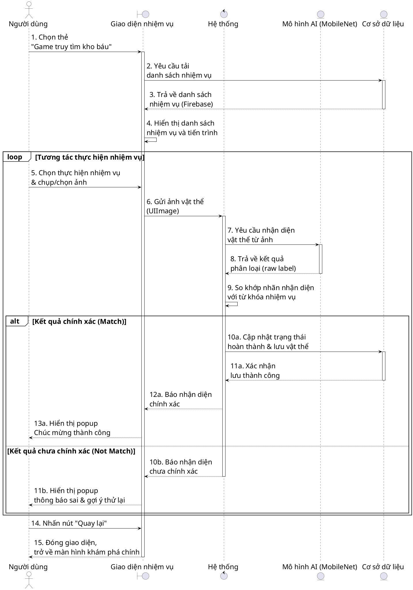
```plantuml
@startuml SD_TruyTimDoVat
skinparam defaultFontName Arial
skinparam defaultFontSize 24
skinparam shadowing false
skinparam ParticipantPadding 10
skinparam BoxPadding 5

skinparam sequence {
  ParticipantBorderColor Black
  ParticipantBackgroundColor White
  ActorBorderColor Black
  ActorBackgroundColor White
  LifeLineBorderColor Black
  LifeLineBorderThickness 2
  LifeLineBackgroundColor White
  ArrowColor Black
  GroupBorderColor Black
  GroupBackgroundColor White
  ActivationBorderColor Black
  ActivationBackgroundColor #EEEEEE
}

actor "Người dùng" as User
boundary "Giao diện nhiệm vụ" as UI
control "Hệ thống" as Controller
entity "Mô hình AI (MobileNet)" as AI
entity "Cơ sở dữ liệu" as CSDL

User -> UI : 1. Chọn thẻ\n"Game truy tìm kho báu"
activate UI
||20||

UI -> CSDL : 2. Yêu cầu tải\ndanh sách nhiệm vụ
activate CSDL
||20||
CSDL --> UI : 3. Trả về danh sách\nnhiệm vụ (Firebase)
deactivate CSDL
||20||

UI -> UI : 4. Hiển thị danh sách\nnhiệm vụ và tiến trình
||20||

loop Tương tác thực hiện nhiệm vụ
  User -> UI : 5. Chọn thực hiện nhiệm vụ\n& chụp/chọn ảnh
  ||20||
  UI -> Controller : 6. Gửi ảnh vật thể\n(UIImage)
  activate Controller
  ||20||
  
  Controller -> AI : 7. Yêu cầu nhận diện\nvật thể từ ảnh
  activate AI
  ||20||
  AI --> Controller : 8. Trả về kết quả\nphân loại (raw label)
  deactivate AI
  ||20||
  
  Controller -> Controller : 9. So khớp nhãn nhận diện\nvới từ khóa nhiệm vụ
  ||20||
  
  alt Kết quả chính xác (Match)
    Controller -> CSDL : 10a. Cập nhật trạng thái\nhoàn thành & lưu vật thể
    activate CSDL
    ||20||
    CSDL --> Controller : 11a. Xác nhận\nlưu thành công
    deactivate CSDL
    ||20||
    Controller --> UI : 12a. Báo nhận diện\nchính xác
    ||20||
    UI --> User : 13a. Hiển thị popup\nChúc mừng thành công
    ||20||
    
  else Kết quả chưa chính xác (Not Match)
    Controller --> UI : 10b. Báo nhận diện\nchưa chính xác
    deactivate Controller
    ||20||
    UI --> User : 11b. Hiển thị popup\nthông báo sai & gợi ý thử lại
    ||20||
  end
end

User -> UI : 14. Nhấn nút "Quay lại"
||20||
UI --> User : 15. Đóng giao diện,\ntrở về màn hình khám phá chính
deactivate UI
@enduml
```

*Lưu ý cho việc vẽ sơ đồ:* Sơ đồ tuần tự tương ứng đã được khởi tạo và lưu dưới dạng tệp tin Draw.io tại đường dẫn [sequence_diagram_draw_number.drawio](file:///Users/mitie/ios-base-app/KidX/docs/SD/sequence_diagram_treasure_hunt.puml).

